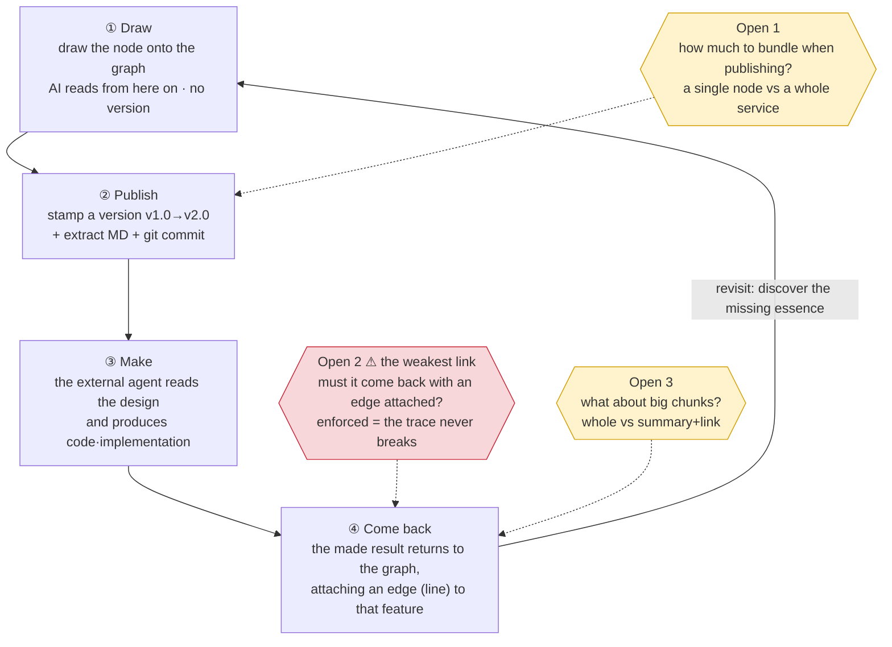
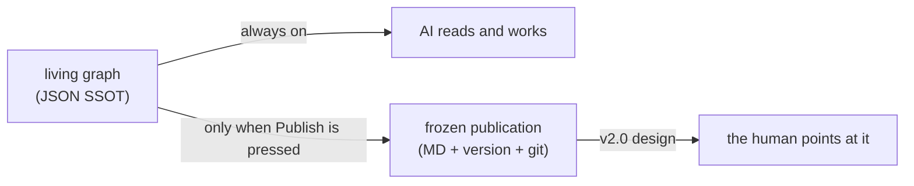

# Artifact flow — a temporary sketch

> For temporary discussion. Once agreed, pin it into `storage-publish.md` + a `DECISIONS.md` `D-` entry and delete this file.
> Written: 2026-06-21 session. prep = [`artifact-management-prep.md`](./artifact-management-prep.md).

## Lifecycle (loop)

## The two faces of an artifact

## Three things to decide (the dotted lines in the chart above)

| # | Fork | Where | Note |
|---|---|---|---|
| 1 | Publish depth — node vs container | ② Publish | directly tied to prep open 2 |
| 2 | Return invariant — enforce the edge? | ④ Come back | **the weakest link** · prep open 5 |
| 3 | Big chunk — whole vs summary+link | ④ Come back | prep open 4 · premised on big projects |
