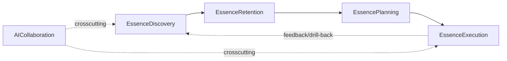

# Bounded contexts (domain) — shared conceptual model

> **Canon (shared concept, `D-2026-06-28-B`).** The single source for the domain model both products — the
> open MIT engine (`novel-ai/` plugins) and the commercial app — follow. *Where* code lives
> (per-context code homes · code-to-domain gaps · code-level term mappings) is held by the engine
> [`mashbill/docs/DOMAIN.md`](../../plugins/mashbill/docs/DOMAIN.md). kind/canvas *meaning* =
> [`../concepts/`](../concepts/), parent essence = [`../VISION.md`](../VISION.md).

## Why this file exists

Picking where new behaviour lives ad-hoc each time — the way the cursor saga spun through six rounds —
makes the next bug surface in yet another ad-hoc spot. This file gives every concern an explicit home. Before
implementing, classify which **phase** the behaviour belongs to, look up its **context** here, then place the
code accordingly.

## 5 contexts = VISION 3 phases + 1 crosscutting

| # | Context | Phase | Owns (canvas/kind) |
|---|---|---|---|
| 1 | **EssenceDiscovery** | Discovery | Foundation canvas (`mission`/`core_value`/`identity`); coach prompts |
| 2 | **EssenceRetention** | Retention | synthetic anchor (all primary canvases); **Foundation references = service inspector chips** (core_value+identity). [`mission_ref`/`value_ref`/`identity_ref` kinds retired] |
| 3 | **EssencePlanning** | Execution (planning) | Actors canvas; Services overview (`category`/`service`/`feature`); actor hierarchy + 2 edge kinds; service 5-field references. **No service↔service edge.** Entities canvas (`entity`, project-wide concept map) |
| 4 | **EssenceExecution** | Execution (build) | Feature canvas (`step`/`decision`/flow edge/`note`/`rule`/`actor_ref`); MCP tools (read/extend/reshape). **Does not own the app code itself** (the external agent's part). [`metric`/`content`/`group` retired] |
| 5 | **AICollaboration** | crosscutting | MCP server entry point; coach·interview flow; skills·agents |

> `entity`/Entities emerge during Execution work but are project-wide concepts, so they are **placed in
> Planning** (provisional — exact context attribution confirmed at implementation).

### Conceptual boundary of each context (owns / does not own)

**1. EssenceDiscovery — finds the essence.**
- *Surfaces:* Foundation canvas (mission/core_value/identity), the inspector's reduced fields, the
  per-canvas coach that draws the essence out (every node is built through discussion — no blank form, no
  silent auto-fill).
- *Owns:* the coach prompts that elicit the user's essence-language (discover → filter), per-kind field
  meaning, the ⚠ badge that flags missing content.
- *Does not own:* how the discovered essence is shown on later canvases (→Retention), or the *design* of
  services derived from it (→Planning).

**2. EssenceRetention — keeps it visible.**
- *Surfaces:* the synthetic project anchor injected on every primary canvas, the **Foundation references
  carried as service-inspector chips** (core_value+identity, picked like actors), cross-canvas link meaning.
- *Owns:* anchor placement (`ProjectDoc.anchors`), anchor visual differentiation (border, not outline), the
  dedicated anchor-change routing, the read-side resolution of the service inspector's Foundation chips. The
  per-node `*_ref` kinds are retired — references live on the service inspector, not as canvas nodes.
- *Does not own:* the anchor's edit inspector (= Discovery's typed text), anchor-click behaviour (TBD by spec).

**3. EssencePlanning — designs the value-creation machinery.**
- *Surfaces:* Actors canvas (who participates — relational roles in a hierarchy), Services overview
  (category/service/feature; selecting a service shows its 5-field inspector, a feature drills), value-flow toggle.
- *Owns:* actor/service/category/feature kinds, the actor hierarchy + its two edge types (hierarchy "is-a-kind-of"
  vs directed value arrow), the service inspector's references (actors/core_values/identities) + "why needed /
  what improves", the value-flow visual, auto-layout (the "see the structure of the planned essence" gesture).
  There is no service↔service edge concept.
- *Does not own:* how an individual feature is decomposed (→Execution/Feature canvas), how free-form
  connections become formal exchange relationships (a future skill).

**4. EssenceExecution — turns plans into reality.**
- *Surfaces:* the Feature canvas (drill target = a feature, not a service) as an actor-anchored behaviour
  flowchart, the step/decision/flow-edge/note/rule/actor_ref primitives, the MCP tools (read/extend/reshape)
  that open the sketch graph to Claude as a collaborator.
- *Owns:* the Feature canvas and its behaviour-flowchart primitives, actor_ref decomposition, the MCP tool
  surface exposing sketches to agents. The old metric/content/group are retired; rule is a per-feature
  operational constraint.
- *Does not own:* the actual application code being built (outside Novel). Novel's job ends at "Claude has the
  right context to write the code." Internal implementation logic (storage/queries/render) is below
  action-altitude — the user's AI agent's job.

**5. AICollaboration — crosscutting (interview/suggest/verify).**
- *Surfaces:* the MCP server entry points, Sampling-driven interview flows (future), auto-suggest (future),
  the Novel-side skill·agent definitions.
- *Owns:* the *patterns* by which Claude participates — when to interview, anchor, propose, verify — and the
  Novel-side enforcement of those patterns (skills + hooks + sub-agents).
- *Does not own:* the user's model choice, the conversation transcript (Claude Code's), the canvas data
  itself (owned by the other four contexts).

## Dependency direction rule

Code may depend **only on lower-numbered contexts** (Execution may read Discovery; Discovery cannot reach
Execution). This keeps the phase cycle's drill-back semantics correct. AICollaboration may import anything.

- **Forbidden imports:** ① an EssenceExecution file importing a sibling Execution feature directly without
  going through Planning/Retention. ② EssenceDiscovery reading EssencePlanning data (Foundation must not
  depend on which services exist — go via Retention).

## Entity vs Value Object

| | example | identity |
|---|---|---|
| **Entity** | `Project` (uuid) · `Canvas` ((project_id, kind)) · `SketchNode` ((canvas_id, id)) · `SketchEdge` ((canvas_id, id)) | own id |
| **Value Object** | `AnchorPlacement` (`ProjectDoc.anchors`) · `Shape` (enum) · `ValueForm` (enum array) · `MdWarning` · `Direction` (runtime) | no id, embedded in another |

> Caution: "Entity" here (a DDD domain object with an identifier) is a **different layer** from the product
> domain kind `entity` (article·comment·user). The former is the domain model of Novel's code, the latter is the
> data concept the user designs ([`../concepts/kinds.md`](../concepts/kinds.md) `entity`).

## Core vocabulary (shared by both products — one word = one meaning)

When the same word means different things in different places, rename the loser. Deep per-kind meaning =
[`../concepts/kinds.md`](../concepts/kinds.md); **code-level term distinctions** (`Node` vs `rf-node`, the
`useNodesMemo` boundary, etc.) are in the engine [`DOMAIN.md`](../../plugins/mashbill/docs/DOMAIN.md).

| Term | Meaning in Novel | Confusion to avoid |
|---|---|---|
| **Canvas** | a canvas kind (foundation/actors/services/entities + feature drill) | not the HTML canvas element |
| **Anchor** | the synthetic project node injected at the centre of primary canvases. Holds the name only | lives outside `canvas.json` (`ProjectDoc.anchors`) |
| **Service** | one coherent human outcome and its capabilities (5-field inspector) | not a REST/microservice, screen, or internal process |
| **Feature** | a capability that helps reach its service outcome — the drill target | does not own a separate outcome |
| **Actor** | a relational *role* in a hierarchy (not a person) | not an Akka actor, not a persona |
| **Note** | edgeless canvas-global context (read by human + AI) | not a content node; never gains an edge |
| **Entity** | a project-wide data object on the AI-maintained Entities canvas (name + one line) | not an ERD table (no fields/FK) |
| **Essence** | the mission/core_value/identity Foundation holds | not a generic "vision/purpose" |
| **Hub** | a service node (PHILOSOPHY P5) | not a synonym for "anchor" |
| **Drill** | drill into a **feature** to open its detail (behaviour-flowchart) canvas | selecting a service shows only the inspector — no longer drills |
| **Discovery/Retention/Execution** | the three phases of the VISION cycle | not generic SW-dev phases |
