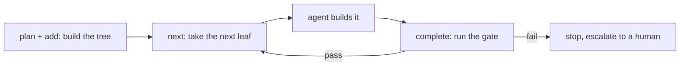

# Solera

**A slim harness for AI-driven work.**

Solera plans work into a **tree of WorkItems**, runs deterministic **gates** for
agent-built results, and orders the steps an external AI agent executes. It
**supervises rather than builds**: the agent (Claude Code, Codex) does the work;
Solera plans it, hands over one agent-built leaf at a time, and records how each
item's result is accepted.

It works **standalone** over a plain-file `.noory/solera/` workspace, with or
without [Novel](https://github.com/noory-code/novel-ai/tree/main/plugins/mashbill).

## The loop



- **WorkItem** — split as deep as its results need. `level` is a free label with
  no fixed names; its ID prefix carries no meaning. A child is part of its
  parent's result. Work that only has to happen first is an `--after` waiting
  link, not a child.
- **Acceptance** — every item records who accepts its result: `gate` runs a
  deterministic check for a result an agent builds; `children` rolls up the
  children's results; `person` waits for a person to try a promised result or
  make a choice only they can make. Do not invent a gate for a `person` item or
  split it to make it gated. An agent-built leaf fits in one context.
- **Gate** — deterministic verification (a test, a build, a content check). Not
  an LLM step — the harness must be able to trust the verdict.
- **Retrospective / Feedback** — neutral, ID-tagged notes a human folds back into
  the design.

## Install (Claude Code)

```text
/plugin marketplace add noory-code/novel-ai
/plugin install solera@novel-ai
```

Then use the skills: **solera-plan**, **solera-run**, **solera-retro**,
**solera-feedback** (start with **solera-help**).

Codex installs the same package with `codex plugin add solera@novel-ai` after
adding the repository marketplace. Gemini CLI receives the Solera MCP server
through the repository's root extension. See the
[host support matrix](../../docs/HOST_SUPPORT.md).

## CLI

The skills drive a small CLI. Run it from the project directory; `.noory/solera/`
lives under it and gates run there:

```bash
solera --root "$PWD" plan "Ship the feature." --level work --accept person
solera --root "$PWD" add WORK-001 "Add the endpoint" --level work --gate "pytest -q tests/test_api.py"
solera --root "$PWD" next        # mark the next leaf doing, print its instruction
#   ... agent does the work ...
solera --root "$PWD" complete    # run the gate; pass -> done + rollup, fail -> stop
solera --root "$PWD" ready       # leaves that can start now, and blocked ones
solera --root "$PWD" status      # pointer + completion percent + tree-integrity audit
solera --root "$PWD" retro WORK-001 "The plan under-sized the migration step."
solera --root "$PWD" feedback FB-001 "Blocked: the spec is ambiguous about auth."
```

## Design

- **Standalone first.** Solera never imports mashbill and never path-references it.
  When the two connect, they share a neutral format and stable ids *by value*,
  never a code dependency (guarded by `tests/test_independence.py`).
- **Files are the state.** WorkItems, the progress pointer, and notes are
  Markdown with YAML frontmatter under `.noory/solera/`. Identity lives in the
  path; parsers fail fast on a malformed file.
- **Deterministic where it matters.** Planning helpers, the gate-runner, and the
  audit are plain code, not LLM steps, so the harness's mechanics are trustworthy.

Artifact-home rules are in [`docs/ARTIFACT_HOMES.md`](docs/ARTIFACT_HOMES.md).
The localhost HTTP and WebSocket API is specified in [`docs/HTTP.md`](docs/HTTP.md).

## Development

```bash
cd plugins/solera
uv sync
uv run pytest      # tests
uv run mypy solera/ tests/
uv run ruff check solera/ tests/
```

MIT licensed.
