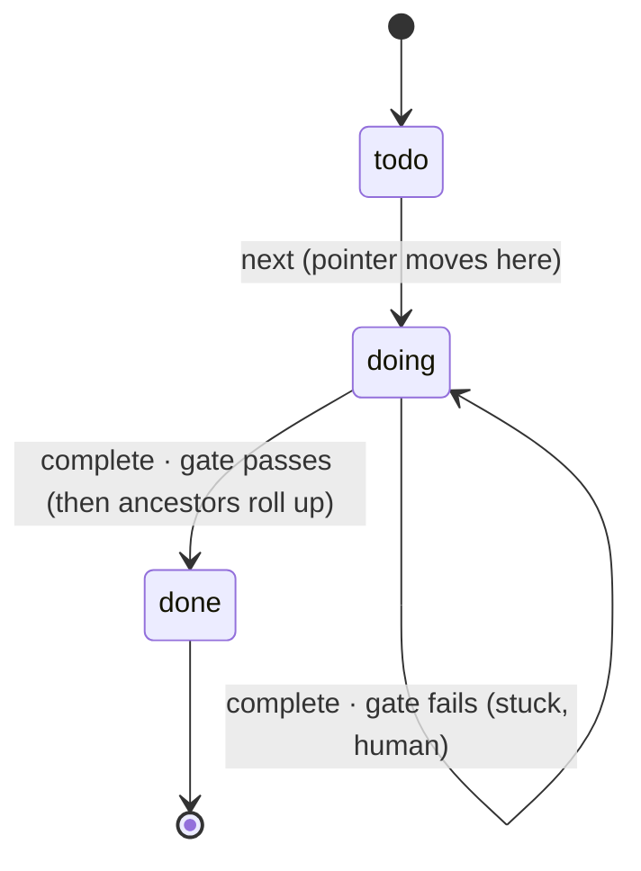
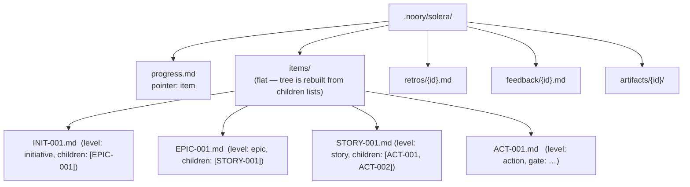

# How Solera works

The operational spec of the slim core. SSOT for *behaviour* is the code under
`solera/`; this document is the public map. The private design notes that preceded
this specification are historical context, not a runtime or contributor dependency.

## Essence

Solera does not build anything. It **plans** work into a tree, **hands** the
agent one leaf at a time, and **verifies** each leaf with a deterministic gate.
The building is done by an external agent (Claude Code / Codex). Solera is the
harness around it and runs standalone, with or without Novel.

## The WorkItem tree

Work is one tree of **WorkItems**. A WorkItem is any rung — `initiative`,
`epic`, `story`, or `action` (`level` is a free label, so depth and taxonomy are
not fixed). The executable invariant:

- a **leaf** carries a `gate` and no children — the unit an agent finishes in one
  context, verified by one command;
- a **container** carries children and no gate — it just rolls up their status;
- an item may have **neither** yet (a container awaiting decomposition), but never
  both.

Size is therefore an *altitude*, not a number: the leaf stays one-context +
one-gate, and everything above is grouping and rollup.

## Components

| Module | Role | Harness axis |
|---|---|---|
| `formats` / `workspace` | read/write/validate the `.noory/solera/` files (id in the path) | state |
| `planning` | create and edit WorkItems and their tree/order links | S (plan) |
| `supervisor` | walk the tree to the next open leaf, branch on the gate, roll up | L (order) |
| `graph` | order links (`after`), readiness, deadlock check, completion percent | L (order) |
| `gate` | run one command with `shell=False`; exit 0 == pass | V (verify) |
| `audit` | cross-file tree integrity | guard |
| `cli` / `skills` | the surface the agent drives | — |

## The loop

```mermaid
sequenceDiagram
    participant U as Human
    participant A as External agent
    participant S as Solera (supervisor)
    participant G as Gate (subprocess)

    U->>S: plan + add (build the tree)
    loop until no open leaf
        A->>S: next
        S->>A: instruction (the next leaf's goal + gate)
        A->>A: build it
        A->>S: complete
        S->>G: run the leaf's gate (shell=False)
        G-->>S: exit code
        alt exit 0 (pass)
            S->>S: leaf done; roll up ancestors (done when all children are)
        else exit != 0 (fail)
            S-->>A: FAIL — leaf stays doing
            A->>U: write feedback, stop for a human
        end
    end
```

`next` **resumes a stuck `doing` leaf before starting any `todo`** — one active
leaf at a time, never skipped. Otherwise it starts the first `todo` leaf, in
depth-first declaration order, whose order links are satisfied. If `todo`
leaves remain but none can start, `next` fails and names what each one waits
for; it never reports that as nothing open. `ready` lists every `todo` leaf that
can start now and every blocked one with what it waits for. Ready leaves never
wait on each other, so they can be worked on together.

### Order links

A WorkItem may list `after`: ids of items that must be `done` before it starts.
Links may cross parents and point at any level. A leaf can start when every id
in its own `after` and in each ancestor's `after` is `done`; a container is
`done` only by rollup, so waiting on a container waits for everything under it.
`after` gates **start** only: a link never reopens or pauses an item that is
already `doing` or `done`. `plan`, `add` and `after` reject an id that does not
exist and any link that could never be satisfied — a cycle of links, a leaf
waiting on its own ancestor, or a container waiting on its own descendant. A
file without `after` has no links, and the key is written only when non-empty.

### Design connectedness

When the workspace contains at least one imported format F design, a `todo`
leaf can start only if it or any ancestor has a non-empty `realizes` list. The
leaf thereby reaches a published design node (D-2026-10-01-G). `plan` and `add`
may still create work without `realizes`; the person must name the node it
serves before starting it. This rule does not apply to standalone workspaces
with no imported design, and an already `doing` leaf is resumed unchanged.

## Leaf state machine



A container's status is **derived**: it becomes `done` when all its children
are. The `progress.md` pointer names the single active leaf; `next` moves it and
clears it to `null` when nothing is open.

Its completion percent is derived the same way: of the items under it that have
no children (gated leaves and items not yet decomposed), the share that is
`done`, rounded down. It is 100 exactly when the container is `done`.
`workspace_status` returns it per container as `progress: {id: {done, total,
percent}}`; clients display it and do not recompute it.

## File layout



Each item is YAML frontmatter (machine) + body (goal). **Identity is the file
name**, not a frontmatter field (SSOT, no drift). Storage is flat; the tree is
reconstructed from each item's `children` list, so depth and re-parenting cost
nothing. A malformed file is rejected immediately (`FormatError`).

## CLI

```text
solera --root <project> plan "goal" [--level story] [--after <id>]...   -> STORY-001  (a root)
                        add <parent> "goal" [--level action] [--gate "<cmd>"] [--after <id>]...  -> ACT-001
                        after <item> [<id> ...]   # replace the item's order links; no ids clears them
                        goal <item> "goal"        # replace goal text
                        realizes <item> [<slug> ...]  # replace realizes; no slugs clears them
                        move <item> [--parent <id>] [--index <n>]
                                    # omit --parent to make a root; omit --index for sibling-list end
                        link <item> <predecessor>    # idempotently add one order link
                        unlink <item> <predecessor>  # idempotently remove one order link
                        ready       # leaves that can start now, and blocked leaves with what they wait for
                        next        # next open leaf -> doing, print its instruction
                        complete    # run the active leaf's gate; pass -> done + rollup
                        status      # pointer + completion percent per container + tree-integrity audit
                        retro <item> "what was learned"
                        feedback <id> "blocker"
                        repin <old> <new> [--apply <proposal_id>]
                                    # propose, or apply the exact human-approved proposal
```

`repin` reads the service and project manifests of two imported labels. They
must be adjacent vS releases of the same service; skipped releases must be
imported and compared one step at a time. It reports the service ID-diff, the
project ID-diff when `based_on` changes, whether refs changed, and per-item
reasons.

A changed project element affects service work only when the old or new refs
points to it. A refs-only change also makes work realizing an old or new service
element stale. Work that realizes a removed service or project element
**escalates**, as does work that already realizes an `added` service ID (a
possible delete/re-add). Escalation takes precedence over stale.

Without `--apply`, repin is read-only and prints `proposal: <proposal_id>` with
the proposed stale and escalation sets. A human reviews that proposal. After
approval, `--apply <proposal_id>` recalculates the proposal and applies it only
when the ID still matches. A mismatch means the manifests or realizing work
changed: repin writes nothing and requires a new proposal and approval. A
matching apply reopens only the stale set (`status → todo`). Escalated items are
never auto-reopened.

Import preserves release identity across labels. Different manifest content for
the same `(service, vS)` or for the same `based_on` vP is rejected, while the
same immutable manifests may be copied under another label.

`--root` is the project directory; gates run there.

### Moving work

`move` reparents an item and optionally places it at a zero-based position among
the destination parent's children; omitting `--index` puts it last. Roots have
no stored order: traversal visits them in item-ID order, so a root move rejects
`--index`. A move rejects unknown IDs, a negative or out-of-range index, moving
under the item itself or one of its descendants, moving under a gated leaf, and
any would-be tree that introduces an order-link problem. It writes nothing on
these rejections. Moving open work into a done container reopens that container
and its affected ancestors; removing the last open child lets the old branch
roll up when all remaining children are done.

## Invariants

1. **Standalone.** No Novel import or path reference (`tests/test_independence.py`).
2. **The gate is not an LLM step.** A deterministic subprocess; the verdict is trustworthy.
3. **State is the files.** Solera holds none of its own.
4. **One active leaf.** A gate failure leaves the leaf `doing`; `next` resumes it.
5. **Leaf xor container.** A WorkItem never has both a gate and children — only
   leaves are executed, only containers roll up.
6. **Order links gate start only.** `after` decides which `todo` leaf may start;
   it never changes the status of an item already started or done.
