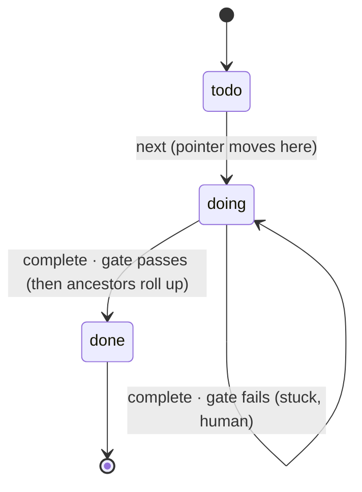
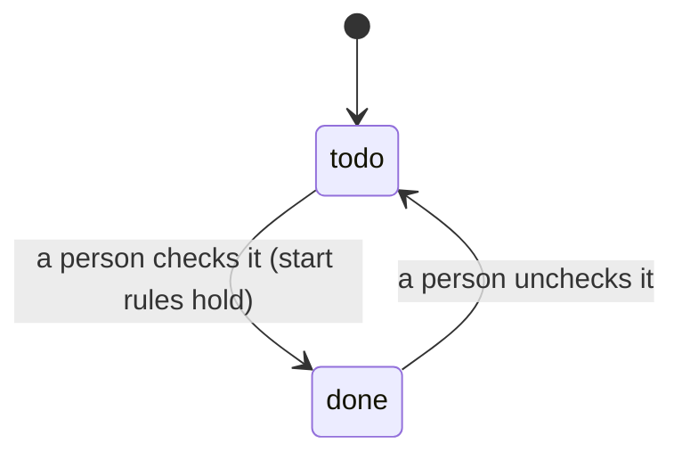
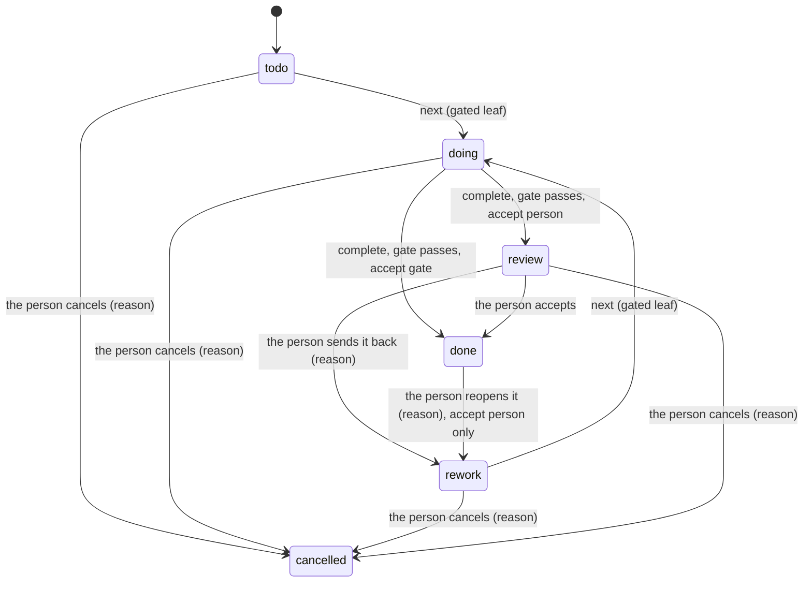
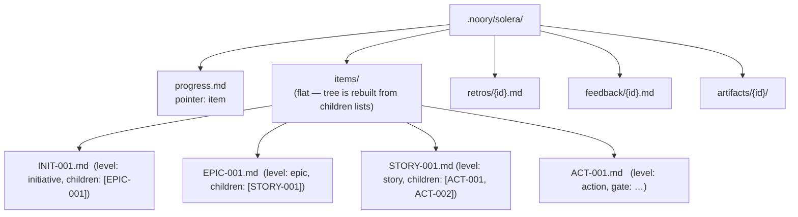

# How Solera works

The operational spec of the slim core. SSOT for *behaviour* is the code under
`solera/`; this document is the public map. The private design notes that preceded
this specification are historical context, not a runtime or contributor dependency.
The separate localhost engine surface is canonicalized in [HTTP.md](HTTP.md).

## Essence

Solera does not build anything. It **plans** work into a tree, **hands** the
agent one leaf at a time, and **verifies** each leaf with a deterministic gate.
The building is done by an external agent (Claude Code / Codex). Solera is the
harness around it and runs standalone, with or without Novel.

## The WorkItem tree

Work is one tree of **WorkItems**, split as deep as its results need. `level` is
a free label with no fixed taxonomy (D-2026-10-04-A drops the fixed
initiative → epic → story → action ladder). A child is part of its parent's
result; work that only has to happen first is an order link (`after`), not a
child. The executable invariant:

- a **leaf** carries a `gate` and no children — the unit an agent finishes in one
  context, verified by one command;
- a **container** carries children and no gate;
- an item may have **neither** — a container awaiting decomposition, or an item a
  person finishes (picking a design, signing a contract) — but never both.

Which of these an item is, and who finishes it, is recorded in `accept`
(§Who accepts a result), so an item with neither a gate nor children is never
ambiguous.

## Components

| Module | Role | Harness axis |
|---|---|---|
| `formats` / `workspace` | read/write/validate the `.noory/solera/` files (id in the path) | state |
| `planning` | create and edit WorkItems and their tree/order links | S (plan) |
| `supervisor` | walk the tree to the next open leaf, branch on the gate, roll up | L (order) |
| `graph` | order links (`after`), readiness, deadlock check, completion percent | L (order) |
| `gate` | run one command with `shell=False`; exit 0 == pass | V (verify) |
| `audit` | cross-file tree integrity | guard |
| `cli` / `skills` | the surface the agent drives | — |

## The loop

```mermaid
sequenceDiagram
    participant U as Human
    participant A as External agent
    participant S as Solera (supervisor)
    participant G as Gate (subprocess)

    U->>S: plan + add (build the tree)
    loop until no open leaf
        A->>S: next
        S->>A: instruction (the next leaf's goal + gate)
        A->>A: build it
        A->>S: complete
        S->>G: run the leaf's gate (shell=False)
        G-->>S: exit code
        alt exit 0 (pass)
            S->>S: leaf done; roll up ancestors (done when all children are)
        else exit != 0 (fail)
            S-->>A: FAIL — leaf stays doing
            A->>U: write feedback, stop for a human
        end
    end
```

`next` **resumes a stuck `doing` leaf before starting any `todo`** — one active
leaf at a time, never skipped. Otherwise it starts the first `todo` leaf, in
depth-first declaration order, whose order links are satisfied. If `todo`
leaves remain but none can start, `next` fails and names what each one waits
for; it never reports that as nothing open. `ready` lists every `todo` leaf that
can start now and every blocked one with what it waits for. Ready leaves never
wait on each other, so they can be worked on together.

### Order links

A WorkItem may list `after`: ids of items that must be `done` before it starts.
Links may cross parents and point at any level. A leaf can start when every id
in its own `after` and in each ancestor's `after` is `done`; a container is
`done` only by rollup, so waiting on a container waits for everything under it.
`after` gates **start** only: a link never reopens or pauses an item that is
already `doing` or `done`. `plan`, `add` and `after` reject an id that does not
exist and any link that could never be satisfied — a cycle of links, a leaf
waiting on its own ancestor, or a container waiting on its own descendant. A
file without `after` has no links, and the key is written only when non-empty.

### Design connectedness

When the workspace contains at least one imported format F design, a `todo`
leaf can start only if it or any ancestor has a non-empty `realizes` list. The
leaf thereby reaches a published design node (D-2026-10-01-G). `plan` and `add`
may still create work without `realizes`; the person must name the node it
serves before starting it. This rule does not apply to standalone workspaces
with no imported design, and an already `doing` leaf is resumed unchanged.

## Leaf state machine



A container's status is **derived** from its children and its `accept`
(§Who accepts a result). The `progress.md` pointer names the single active leaf;
`next` moves it and clears it to `null` when nothing is open.

Its completion is counted over the lowest items under it (items with no
children), leaving out `cancelled` ones: `done` of them out of `total`.
`workspace_status` returns it per container as `progress: {id: {done, total,
percent}}`; clients display it and do not recompute it. Clients show it as
`done/total` ("9/10 accepted"), not as a percent (D-2026-10-04-B (1)): the count
says how many known pieces are accepted, not how complete the container's result
is. `percent` stays in the response for older clients.

### Items a person confirms

An `accept: person` leaf without a gate is never handed to an agent: `next` and
`ready` deal only in gated leaves (status `todo` or `rework`). A person finishes
it by checking it through the HTTP surface ([HTTP.md](HTTP.md) §Checking an
item; D-2026-10-02-D). The check obeys the start rules of `next` (order links,
design connectedness), marks it `done`, and rolls up its ancestors; unchecking
returns it to `todo` and reopens ancestors that were `done` or `review` only
because of it. Checking a gated leaf there runs its gate and marks it `done` only
on a pass — the person who pressed check is the one accepting, so a passing
`accept: person` leaf goes straight to `done`, while the same pass reached through
an agent's `complete` stops at `review`. An `accept: children` item cannot be
checked.



## Who accepts a result

Decisions: D-2026-10-04-A and D-2026-10-04-B (public
`plugins/mashbill/docs/DECISIONS.md`). A gate's pass is evidence; the result a
person was promised is finished only when that person accepts it, and no agent
surface can finish, un-finish or rewrite it.

### `accept`

Every WorkItem records who finishes it:

| `accept` | Shape | Finished when |
|---|---|---|
| `gate` | a leaf with a gate | its gate passes |
| `children` | a container, or one awaiting decomposition | every child is finished (`done` or `cancelled`) and at least one is `done` |
| `person` | a leaf with or without a gate, or a container | a person accepts it through the HTTP surface |

- **Creating.** `plan`, `add`, the MCP create tools and `POST /api/work/items`
  take `accept`. An item with a gate may omit it (it is then `gate`); an item
  without a gate must name `children` or `person` — creation never guesses,
  because guessing `person` would make a person judge every grouping an agent
  makes, and guessing `children` would let an agent finish a person's item.
- **Validity.** `gate` requires a gate. `children` forbids a gate (leaf xor
  container). `person` takes either; on a `person` leaf the gate is evidence.
- **Reading older files.** A file written before `accept` existed reads as
  `gate` when it has a gate, `children` when it has children, and `person`
  otherwise; a gated `done` item reads `gate_passed: true`. Every status and
  shape an older file could hold is read as it is, without rewriting it, so its
  behaviour does not change.
- **Changing.** Only the HTTP surface (a person) changes `accept` on an existing
  item, and only while the item is `todo`, `doing` or `rework`. Changing it never
  finishes a leaf (a gate still has to pass); on a container, the ordinary rollup
  then applies.

### Statuses

`todo`, `doing`, `review` (waiting for the person's judgment), `rework` (sent
back by the person), `done`, `cancelled`.

- **Startable** means status `todo` or `rework`. `next`, `ready`, `blocked` and a
  person's `check` all use this one definition, together with the order-link and
  design-connectedness rules.
- **Finished** means status `done` or `cancelled`.



- **`complete`** runs the gate only of the item the pointer names, and only when
  that item is `doing` and gated. Otherwise it changes nothing and says why.
- **Rollup.** When every child of a container is finished and at least one is
  `done`, an `accept: children` container becomes `done` and an `accept: person`
  container becomes `review`. A container whose children are all `cancelled`
  does not roll up; the person decides it. A container in `rework` leaves it only
  through a rollup caused by one of its children finishing *after* the rework
  began — re-deriving the same finished children never returns it to `review`.
- **Reopening downward.** A child leaving `done` (`uncheck`, `reopen`, `repin`)
  returns every ancestor that was `done` or `review` only because of it to
  `todo`, as before — except that an `accept: person` ancestor that is `done` is
  never reopened by anything but the person (§Protected items).
- **`cancelled` is final.** Rollup never rewrites it. A cancelled container's
  subtree is frozen: `next` and `ready` skip it, completion does not count it,
  and nothing under it rolls up past it. Cancelling clears the `progress.md`
  pointer when it names the cancelled item or anything under it. A cancelled item
  does not satisfy an order link: work waiting on it stays blocked, and the
  reason names the cancelled item, until the link is changed (by a person or by
  an agent re-planning with `after`/`unlink`).
- **Judgment record.** `judgments` is an append-only list of
  `{action, reason, at}` — one entry for every `accept`, `reject`, `reopen`,
  `cancel`, `check` and `uncheck` a person makes. `reason` is required for
  `reject`, `reopen` and `cancel`, and empty for the others (`uncheck` is the
  quick undo of a mis-click on a checkbox, D-2026-10-02-D). Nothing removes or
  rewrites an entry.
- **`gate_passed`** is set the first time an item's gate passes and is never
  cleared. It is history only: no status is derived from it, and a `todo` gated
  item becomes `done` only by its gate passing again.

### Protected items

An `accept: person` item that is `review` or `done` is protected: no agent
surface (CLI, MCP) changes its `goal` or `realizes`, adds or moves a child into
or out of it, moves it, or changes its status — `repin` included. Where `repin`
would reopen such an item or an item under it, it **escalates** that item
instead (§CLI, repin), so a person decides: reject or reopen it with a reason, or
keep the acceptance and create new work (D-2026-10-04-B (5)). Through the HTTP
surface the person first sends a `review` item back (`reject`) or reopens a
`done` one (`reopen`), and may then edit it.

### Progress phase

An item may carry `phase` — `exploring` (what to do is not yet known) or
`executing` (the work is known and being done) — and a one-line `phase_note`
(what is still unknown, or what important work remains). Both are optional and
empty by default (D-2026-10-04-B (7)). An agent sets them with the CLI `phase`
command or the MCP `set_work_item_phase` tool; a person through `PATCH`. Setting
them changes no status and is allowed on every item except a protected or
`cancelled` one.

### Person-only actions

Through the HTTP surface only ([HTTP.md](HTTP.md) §Judging a result): `accept`
(`review` → `done`), `reject` (`review` → `rework`), `reopen` (`done` → `rework`),
`cancel` (any unfinished status → `cancelled`), `check` and `uncheck`
(§Items a person confirms), and changing `accept`. `accept`, `reject` and
`reopen` apply to `accept: person` items only. No CLI command or MCP tool offers
any of these.

## File layout



Each item is YAML frontmatter (machine) + body (goal). **Identity is the file
name**, not a frontmatter field (SSOT, no drift). Storage is flat; the tree is
reconstructed from each item's `children` list, so depth and re-parenting cost
nothing. A malformed file is rejected immediately (`FormatError`).

## CLI

```text
solera --root <project> plan "goal" [--level story] [--accept children|person] [--after <id>]...   -> STORY-001  (a root)
                        add <parent> "goal" [--level action] [--gate "<cmd>"] [--accept gate|children|person] [--after <id>]...  -> ACT-001
                                    # --accept is required when there is no --gate (§Who accepts a result)
                        phase <item> exploring|executing|none ["note"]  # record the progress phase; changes no status
                        after <item> [<id> ...]   # replace the item's order links; no ids clears them
                        goal <item> "goal"        # replace goal text
                        realizes <item> [<slug> ...]  # replace realizes; no slugs clears them
                        move <item> [--parent <id>] [--index <n>]
                                    # omit --parent to make a root; omit --index for sibling-list end
                        link <item> <predecessor>    # idempotently add one order link
                        unlink <item> <predecessor>  # idempotently remove one order link
                        ready       # leaves that can start now, and blocked leaves with what they wait for
                        next        # next open leaf -> doing, print its instruction
                        complete    # run the active leaf's gate; pass -> done + rollup
                        status      # pointer + "done/total accepted" per container + tree-integrity audit
                        retro <item> "what was learned"
                        feedback <id> "blocker"
                        repin <old> <new> [--apply <proposal_id>]
                                    # propose, or apply the exact human-approved proposal
```

`repin` reads the service and project manifests of two imported labels. They
must be adjacent vS releases of the same service; skipped releases must be
imported and compared one step at a time. It reports the service ID-diff, the
project ID-diff when `based_on` changes, whether refs changed, and per-item
reasons.

A changed project element affects service work only when the old or new refs
points to it. A refs-only change also makes work realizing an old or new service
element stale. Work that realizes a removed service or project element
**escalates**, as does work that already realizes an `added` service ID (a
possible delete/re-add). Escalation takes precedence over stale. A protected item (an
`accept: person` item that is `review` or `done`, §Protected items) and any item
under it escalate instead of going stale, so `repin` never reopens a result a
person accepted.

Without `--apply`, repin is read-only and prints `proposal: <proposal_id>` with
the proposed stale and escalation sets. A human reviews that proposal. After
approval, `--apply <proposal_id>` recalculates the proposal and applies it only
when the ID still matches. A mismatch means the manifests or realizing work
changed: repin writes nothing and requires a new proposal and approval. A
matching apply reopens only the stale set (`status → todo`). Escalated items are
never auto-reopened.

Import preserves release identity across labels. Different manifest content for
the same `(service, vS)` or for the same `based_on` vP is rejected, while the
same immutable manifests may be copied under another label.

`--root` is the project directory; gates run there.

### Moving work

`move` reparents an item and optionally places it at a zero-based position among
the destination parent's children; omitting `--index` puts it last. Roots have
no stored order: traversal visits them in item-ID order, so a root move rejects
`--index`. A move rejects unknown IDs, a negative or out-of-range index, moving
under the item itself or one of its descendants, moving under a gated leaf, and
any would-be tree that introduces an order-link problem. It writes nothing on
these rejections. Moving open work into a done container reopens that container
and its affected ancestors; removing the last open child lets the old branch
roll up when all remaining children are done.

## Invariants

1. **Standalone.** No Novel import or path reference (`tests/test_independence.py`).
2. **The gate is not an LLM step.** A deterministic subprocess; the verdict is trustworthy.
3. **State is the files.** Solera holds none of its own.
4. **Workspace mutations are serialized.** Each public read-modify-write operation holds
   `.noory/solera/.lock` across its complete decision and write sequence.
5. **One active leaf.** A gate failure leaves the leaf `doing`; `next` resumes it.
6. **Leaf xor container.** A WorkItem never has both a gate and children — only
   leaves are executed, only containers roll up.
7. **Order links gate start only.** `after` decides which `todo` leaf may start;
   it never changes the status of an item already started or done.
8. **Only a person finishes, judges or reopens an `accept: person` item** — through the
   HTTP surface. No agent surface (CLI, MCP) can accept, reject, reopen, cancel, check, or
   change `accept`, nor edit or move a protected item (`repin` included); rollup never
   moves a `person` item past `review`; a person's check never overrides a gate's verdict
   (D-2026-10-02-D, D-2026-10-04-A, D-2026-10-04-B).
