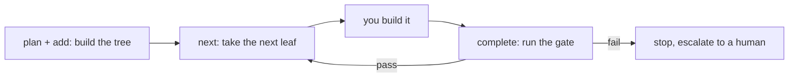

# Solera

Solera is a slim **harness**. It does not build anything itself — you (the agent)
do the building. Solera plans the work into a tree, hands you one leaf at a time,
and runs a deterministic **gate** to verify each leaf before moving on.

It works standalone, with or without Novel, over plain files under
`.noory/solera/` in the project directory.

## The tree

Work is one tree of **WorkItems** at any altitude — `initiative` / `epic` /
`story` / `action` (`level` is just a label). A **leaf** has a gate and no
children (the chunk you actually build, finishable in one context). A
**container** has children and no gate (it only rolls up their status). Size is
an altitude: the leaf stays one-context + one-gate, everything above is grouping.

## The loop

## MCP tools

Pass the current workspace as `project_root` to every tool.

| Tool | What it does |
|---|---|
| `plan_work` / `add_work_item` | Build a WorkItem tree. See **solera-plan**. |
| `next_work_item` | Mark the next open leaf `doing` and return its instruction. |
| `complete_current` | Run the active leaf's gate; pass means `done` plus rollup. |
| `workspace_status` | Return the pointer, items, and tree-integrity problems. |
| `import_spec` | Import a format-F service release under `specs/<label>/`. |
| `propose_spec_repin` / `apply_spec_repin` | Review, then apply stale-item reopens. |
| `write_retrospective` | Record what the design lacked after work. |
| `write_feedback` | Record a blocker for a human while work is blocked. |

## Rules

- One leaf = one chunk you can finish in a single context, with a gate that
  proves it is done. Bigger work is a container of smaller items.
- Never edit files under `.noory/solera/` by hand — use the commands, which keep
  the format valid.
- A gate that fails leaves the leaf stuck on purpose. Fix the work and re-run
  `complete`, or write `feedback` and stop for a human.
