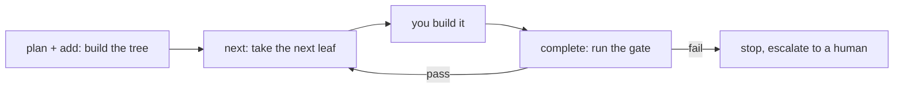

# Solera

Solera is a slim **harness**. It does not build anything itself — you (the agent)
do the building. Solera plans the work into a tree, hands you one leaf at a time,
and runs a deterministic **gate** for each agent-built result before moving on.

It works standalone, with or without Novel, over plain files under
`.noory/solera/` in the project directory.

## The tree

Work is one tree of **WorkItems**, split as deep as its results need. `level` is
a free label with no fixed names. A child is part of its parent's result; work
that only has to happen first is an `after` waiting link, not a child. A leaf
fits in one agent context when an agent builds it. Every item records how its
result is accepted: `gate` means a deterministic check command judges an
agent-built result; `children` rolls up the children's results; `person` waits
for a person to try and accept a promised result or make a choice only they can
make. Do not invent a gate for a `person` item or split it to make it gated.

## The loop

```mermaid
flowchart LR
  Plan[plan + add: build the tree] --> Next[next: take the next leaf]
  Next --> Work[you build it]
  Work --> Gate[complete: run the gate]
  Gate -->|pass| Next
  Gate -->|fail| Stop[stop, escalate to a human]
```

## MCP tools

Pass the current workspace as `project_root` to every tool.

| Tool | What it does |
|---|---|
| `plan_work` / `add_work_item` | Build a WorkItem tree. See **solera-plan**. |
| `next_work_item` | Mark the next open leaf `doing` and return its instruction. |
| `complete_current` | Run the active leaf's gate; pass means `done` plus rollup. |
| `workspace_status` | Return the pointer, items, completion percent per container, and tree-integrity problems. |
| `set_work_item_after` | Replace an item's order links (`after`); an empty list clears them. |
| `ready_work_items` | List `todo` leaves that can start now (safe to do together) and blocked leaves with what each waits for. |
| `import_spec` | Import a format-F service release under `specs/<label>/`. |
| `propose_spec_repin` / `apply_spec_repin` | Propose by ID, get approval, then apply that ID. |
| `write_retrospective` | Record what the design lacked after work. |
| `write_feedback` | Record a blocker for a human while work is blocked. |

`complete_current` also returns `conflict: true` when the item or progress pointer changes during its gate; nothing is written. Call `next_work_item` and continue.

## Rules

- An agent-built leaf is one chunk you can finish in a single context. Split
  larger results into children; link only real prerequisites with `after`.
- Never edit files under `.noory/solera/` by hand — use the commands, which keep
  the format valid.
- A gate that fails leaves the leaf stuck on purpose. Fix the work and re-run
  `complete`, or write `feedback` and stop for a human.
- Re-pin is approval-bound: show the proposal and its ID to the human, then pass
  that exact ID to `apply_spec_repin`. If the proposal changed, apply writes
  nothing; request and review a new proposal.

`accept` is required when creating an item without a gate: `children` rolls up finished children, `person` waits for that person's judgment, and agents never judge a person's result.
