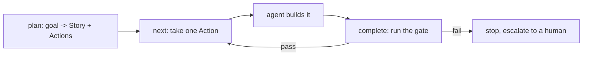

# Solera

**A slim harness for AI-driven work.**

Solera plans work into **Stories** and **Actions**, runs deterministic **gates**,
and orders the steps an external AI agent executes. It **supervises rather than
builds**: the agent (Claude Code, Codex) does the work; Solera plans it, hands it
over one chunk at a time, and verifies each chunk before moving on.

It works **standalone** over a plain-file `.noory/solera/` workspace, with or
without [Plot](https://github.com/noory-code/noory-ai/tree/main/plot).

## The loop



- **Story** — a goal, decomposed into an ordered list of Actions.
- **Action** — one chunk an agent can finish in a single context, carrying a
  **gate**: a command that exits 0 only when the chunk is genuinely done.
- **Gate** — deterministic verification (a test, a build, a content check). Not
  an LLM step — the harness must be able to trust the verdict.
- **Retrospective / Feedback** — neutral, ID-tagged notes a human folds back into
  the design.

## Install (Claude Code)

```
/plugin install solera
```

Then use the skills: **solera-plan**, **solera-run**, **solera-retro**,
**solera-feedback** (start with **solera-help**).

## CLI

The skills drive a small CLI. Run it from the project directory; `.noory/solera/`
lives under it and gates run there:

```bash
solera --root "$PWD" plan "Ship the feature."
solera --root "$PWD" add STORY-001 "Add the endpoint" --gate "pytest -q tests/test_api.py"
solera --root "$PWD" next        # mark the next Action doing, print its instruction
#   ... agent does the work ...
solera --root "$PWD" complete    # run the gate; pass -> done, fail -> stop
solera --root "$PWD" status      # pointer + integrity audit
solera --root "$PWD" retro STORY-001 "The plan under-sized the migration step."
solera --root "$PWD" feedback FB-001 "Blocked: the spec is ambiguous about auth."
```

## Design

- **Standalone first.** Solera never imports Plot and never path-references it.
  When the two connect, they share a neutral format and stable ids *by value*,
  never a code dependency (guarded by `tests/test_independence.py`).
- **Files are the state.** Stories, Actions, the progress pointer, and notes are
  Markdown with YAML frontmatter under `.noory/solera/`. Identity lives in the
  path; parsers fail fast on a malformed file.
- **Deterministic where it matters.** Planning helpers, the gate-runner, and the
  audit are plain code, not LLM steps, so the harness's mechanics are trustworthy.

Artifact-home rules are in [`docs/ARTIFACT_HOMES.md`](docs/ARTIFACT_HOMES.md).

## Development

```bash
cd solera
uv sync
uv run pytest      # tests
uv run mypy solera/ tests/
uv run ruff check solera/ tests/
```

MIT licensed.
