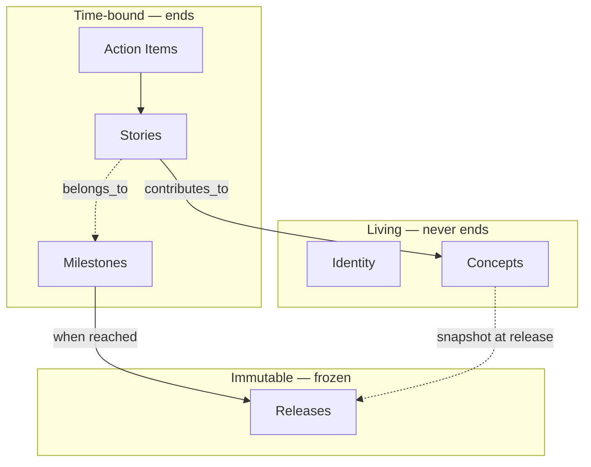

# Solera

**AI-driven project workflow + mindmap canvas.**
**Three-axis model — Concepts that live, Milestones that resolve, Releases that freeze.**
**Four canvases — Service / Plan / Build / Live.**

Like the solera aging method, where layers of work blend and deepen over time into something complete.

## Two ways to use

| Surface | Install | What you get |
|---|---|---|
| **Claude Code** | `/plugin install solera` | Skills + MCP server + browser canvas via `/map` |
| **VSCode** | Marketplace → "Solera" (publisher `noory-code`) | In-editor canvas panel + bundled MCP the VSCode AI host (Copilot, Claude extension, Gemini, etc.) can read |

Data format is shared — `.solera/` in your project root. Switching between surfaces requires no migration.

## Why Solera?

| | Plain todos | GitHub Issues | Notion / Linear | **Solera** |
|--|--|--|--|--|
| **Structure** | Ad-hoc, flat | Flat issue list | Custom hierarchy | **Three axes: Living / Time-bound / Immutable** |
| **Big-picture view** | None | None | Manual tagging | **Concepts (living) — the project map humans draw** |
| **Scope agreement** | None | Milestones (simple) | Cycles / targets | **AI analysis round before every Milestone — non-negotiable** |
| **AI-executable** | Human reads | Human reads | Human reads | **Claude drives each Workflow section deterministically** |
| **Past preserved** | Lost on edit | Closed issues | Archived | **Immutable Releases freeze Concept state at snapshot time** |
| **Context persistence** | Lost per session | Lost per session | Lost per session | **HANDOFF.md via `/solera-handoff`** |

## The three axes

Solera organizes everything into three orthogonal axes:



- **Living** (Identity, Concepts) — the picture humans draw. Concepts never "complete"; they evolve as Stories contribute.
- **Time-bound** (Milestones, Stories, Action Items) — agreed scope, executed work. Every Story declares which Concepts it contributes to.
- **Immutable** (Releases) — when a Milestone is reached, its in-scope Concepts are snapshotted as a frozen record.

## Four moments of human–AI collaboration

```
Moment 0 — Setup         Identity (one-time, human)
Moment 1 — Draw          Concepts (human-led; AI observes, never invents Intent)
Moment 2 — Agree         Milestones (human + AI; AI analysis round is non-negotiable)
Moment 3 — Work          Stories → Action Items (AI executes; human approves Current Shape at Wrap-up)
Moment 4 — Release       Freeze a reached Milestone into an immutable snapshot
```

The core flow is **계획 → 일 → 결과 확정** — Plan → Work → Confirm.

## Quick Start

Reference [docs/quick-start.md](docs/quick-start.md) for the full walkthrough. TL;DR:

**1. Initialize:**
> Initialize Solera for this project.

**2. Write identity:**
> Write the identity for this project.

**3. Draw a Concept:**
> Draw a Concept called `authentication`.

You provide the Intent (1–2 sentences) and Current Design; Claude writes the file and updates the Concept index.

**4. Agree on a Milestone (AI pushes back!):**
> Write a Milestone called `mvp` covering authentication and onboarding.

Claude reads each Concept's state and runs an analysis round — maturity, risks, dependencies, missing items. You revise. Loop until agreed.

**5. Run a Story:**
> Write Story US-001 `google-login` contributing to `authentication`, belonging to `mvp`.

Claude decomposes into Action Items (1 ACT = 1 commit), executes each, and at Wrap-up proposes Current Shape updates to each contributed Concept for your approval.

**6. Cut a Release:**
> Mark milestone mvp as released, then cut release v0.1-mvp.

The in-scope Concepts are snapshotted into `releases/v0.1-mvp/`. Future edits to Concepts never touch this directory.

## Skills

### Living Axis (human-led)

| Skill | Trigger phrase | Produces |
|-------|----------------|----------|
| `solera-write-identity` | "Define service identity" | `identity/mission.md`, `core-values.md`, `vision_1.md` |
| `solera-write-concept` | "Draw a Concept", "update Concept", "deprecate Concept" | `concepts/{id}.md` (Intent, Current Design, Current Shape, Contributions, Related Artifacts) |

### Time-bound Axis (human+AI agreement, AI execution)

| Skill | Trigger phrase | Produces |
|-------|----------------|----------|
| `solera-write-milestone` | "Agree on milestone", "write a milestone" | `milestones/{id}.md` (Scope, AI Analysis, Agreement Log, Exit Criteria) |
| `solera-write-story` | "Write a Story", "break Story into Action Items" | `stories/{id}-{name}/_story.md`, `ACT-NNN-{name}.md`, `RETROSPECTIVE.md` with Concept Contribution Summary |
| `solera-execute-action-item` | "Start an Action Item", "ACT-NNN" | Code/doc changes + one git commit per ACT (tagged with `[{concept}][{story_id}][ACT-NNN]`) |

### Immutable Axis

| Skill | Trigger phrase | Produces |
|-------|----------------|----------|
| `solera-release` | "Cut a release", "freeze milestone" | `releases/{tag}/` with `README.md`, `concepts-snapshot/`, `stories-manifest.md`, `.released` marker |

### Workflow

| Skill | Trigger phrase | Produces |
|-------|----------------|----------|
| `solera-manage-workflow` | "What should I work on", "show progress" | `progress.md` updates; reads and drives each work item's `## Workflow` section |
| `solera-create-pr` | "Open a PR for this Story" | GitHub PR via `gh pr create`, squash merge, branch deletion |
| `solera-publish-artifacts` | — *(not user-invocable; runs automatically at Story Wrap-up)* | Story artifacts promoted to `catalog/published/{type}/`; Concept Related Artifacts updated |
| `solera-handoff` | "Run handoff", "save handoff" | `HANDOFF.md` with full session context |

### Migration (from v2)

| Skill | Trigger phrase | Produces |
|-------|----------------|----------|
| `solera-migrate-v2` | "Migrate v2 to v3" | `_v2-archive/` freeze, v3 skeleton, Concept drafts from v2 Goals/Epics, Story flattening with `contributes_to` tags, `releases/v2-final/` |

### Meta

| Skill | Trigger phrase | Produces |
|-------|----------------|----------|
| `solera-init` | "Set up solera", "initialize solera" | `.claude/rules/solera-workflow.md`, v3 workspace, `progress.md`, `team-process.md` (kickoff interview), and project-tailored agent/skill proposals ([Step 6](docs/reference/tooling-catalog.md)) |
| `solera-help` | "Help", "what can solera do" | Skill overview and quick-start guidance |
| `solera-edit-skill` | "Create a skill", "edit a skill" | `.claude/skills/{name}/SKILL.md` |
| `solera-edit-rule` | "Create a rule" | `.claude/rules/{name}.md` |
| `solera-edit-command` | "Create a command" | `.claude/commands/{name}.md` |
| `solera-edit-agent` | "Create an agent" | `.claude/agents/{name}.md` |

## Team Workflow

Solera uses a flat branch-per-Story strategy: each Story gets a `story/{id}-{name}` branch off trunk. Action Items commit to the Story branch. At Wrap-up, `solera-create-pr` opens a Story-scoped PR and squash-merges it.

No Epic branch, no Goal branch, no Phase branch — those v2 layers were removed.

Run `/solera-handoff` before ending a session. The next contributor opens `HANDOFF.md`, tells Claude "resume where we left off", and work continues from the exact step it stopped at.

See [docs/team-workflow.md](docs/team-workflow.md) for parallel Story execution, Concept-level coordination, Milestone tracking, and contributor handoff.

## Upgrading from v2

If you have a v2 project (with `workspace/phase/`, `workspace/initiative/`, `_goal.md`, `_epic.md`):

> Migrate this v2 project to v3.

Solera invokes `solera-migrate-v2`, which:

1. Freezes v2 data to `_v2-archive/` (non-destructive).
2. Scaffolds the v3 structure.
3. Proposes Concept candidates from v2 Goals/Epics (AI analysis, human-approved).
4. Flattens completed Stories to `stories/{id}-{name}/` with `contributes_to` tags (AI inference, sample-reviewed by human before batch).
5. Creates `releases/v2-final/` as the first immutable snapshot recording the v2-era state.

Every step blocks for your approval. See [docs/migrate-v2-to-v3.md](docs/migrate-v2-to-v3.md) for details.

## Install

```
/plugin marketplace add noory-code/noory-ai
/plugin install solera
```

All skills become available immediately after install. Tell Claude to set up a Solera workspace and it will create the v3 folder structure and conduct the kickoff interview.

## Reference

| Document | Contents |
|----------|----------|
| [docs/quick-start.md](docs/quick-start.md) | End-to-end walkthrough: setup → Concept → Milestone → Story → Release |
| [docs/work-item-structure.md](docs/work-item-structure.md) | Three-axis model, items, folder layout, status conventions |
| [docs/architecture.md](docs/architecture.md) | Skill dependency graph, Workflow-as-SSOT rule, gate model |
| [docs/team-workflow.md](docs/team-workflow.md) | Branch strategy, parallel Stories, Concept coordination, handoff |
| [docs/migrate-v2-to-v3.md](docs/migrate-v2-to-v3.md) | Upgrading a v2 project via `solera-migrate-v2` |
| [docs/reference/axes-and-status.md](docs/reference/axes-and-status.md) | **SSOT** for the three-axis model, status values, and allowed transitions |
| [docs/reference/self-verification-schema.md](docs/reference/self-verification-schema.md) | Canonical schema every skill's `assets/self-verification.md` follows |
| [docs/reference/tooling-catalog.md](docs/reference/tooling-catalog.md) | Project-tailored agent/skill candidates proposed by `solera-init` Step 6 |
| [docs/reference/domain-model-template.md](docs/reference/domain-model-template.md) | Archived v2 "concept" template, now known as domain-model |

## License

MIT
