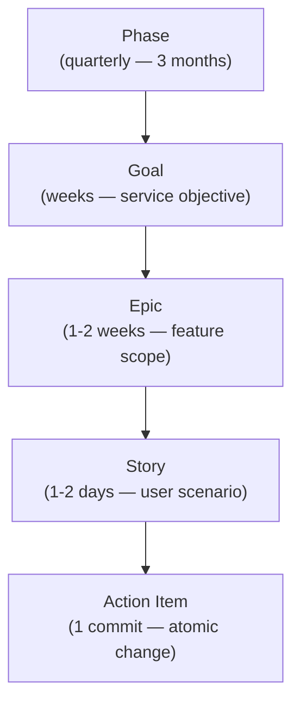

# Solera

**AI-executable project workflow for Claude Code — from quarterly Phase to single commit, with no context lost between sessions.**

Like the solera aging method, where layers of work blend and deepen over time into something complete.

## Why Solera?

| | Plain todos | GitHub Issues | Notion / Linear | **Solera** |
|--|--|--|--|--|
| **Structure** | Ad-hoc, flat | Flat issue list | Custom hierarchy | **Phase → Goal → Epic → Story → Action Item** |
| **AI-executable** | Human reads and interprets | Human reads and interprets | Human reads and interprets | **Claude executes deterministically from skill definitions** |
| **Context persistence** | Lost each session | Lost each session | Lost each session | **HANDOFF.md auto-updated on every session end** |
| **Artifact lifecycle** | None | None | Manual archiving | **Artifacts promoted to `published/` on Goal complete** |
| **Team handoff** | Verbal or manual notes | PR comments | Manual status update | **HANDOFF.md → async resume with zero coordination** |

After a Solera session ends, the next contributor — or the same developer the next morning — opens `HANDOFF.md`, tells Claude "resume where we left off", and work continues from the exact step it stopped at.

## How It Works



**Phase** defines the quarterly plan and groups Goals by strategic objective. **Goal** produces the design artifacts for one service capability — service map, personas, use cases, and domain concepts. **Epic** scopes one deliverable within a Goal and maps it to Stories on an independent git branch. **Story** implements one user-facing capability as a sequence of Action Items on its own branch. **Action Item** is the smallest unit: one concrete code or documentation change, one commit.

Every level owns its own procedure through a `## Workflow` section in its template file. The `workflow-manage` skill reads and executes those steps — it contains no hardcoded domain logic.

## Quick Start

Reference [docs/quick-start.md](docs/quick-start.md) for the full walkthrough with a concrete example project.

**Step 1 — Set up the workspace:**

> Set up the Solera workspace for this project. The initiative is `my-app 2026`. Create the folder structure and write the initiative roadmap.

Solera creates `progress.md`, `workspace/identity/`, and `workspace/initiative/2026/roadmap.md`.

**Step 2 — Write a Phase:**

> Write the Phase for Q1 2026. The phase ID is `2026-P1-foundation`.

Solera reads the roadmap, creates `workspace/phase/2026-P1-foundation/README.md`, and scaffolds the Goal folders.

**Step 3 — Write a Goal and its first Epic:**

> Write Goal G1 for Phase 2026-P1-foundation. The goal is `task-management`.

Solera produces the service map, persona, and journey, then maps journey steps to Epics. It creates the Epic branch (`epic-task-crud`) and writes `_epic.md` with Use Cases and domain concepts.

**Step 4 — Run Stories and Action Items:**

> Start Story US-001: create-task-form.

Solera creates the Story branch (`epic-task-crud/story-US-001-create-task-form`), writes `_story.md` with acceptance criteria and Action Items, then executes each Action Item as one commit: `[task-crud][US-001][ACT-001] Add Task model`.

**Step 5 — Complete the Epic:**

> The Epic is done. Create a PR for epic-task-crud.

Solera verifies all Stories are complete, runs `workflow-pr` to open the PR, handles the review cycle, and squash-merges into the target branch. On Goal completion, `catalog-transition` moves design artifacts from `artifacts/` to `workspace/catalog/published/`.

## Skills

| Skill | Trigger phrase | Produces |
|-------|---------------|----------|
| `writing-identity` | "Define identity", "write mission" | `identity/mission.md`, `core-values.md`, `vision_1.md`, `initiative/{year}/goals.md` |
| `writing-phase` | "Write the Phase for Q1", "quarterly planning" | `phase/{id}/README.md`, Goal folder structure, `RETRO.md` on close |
| `writing-goal` | "Write Goal G1", "decompose into Epics" | `_goal.md`, service map, persona(s), `RETRO.md` on close |
| `writing-epic` | "Start Epic 01-auth", "decompose into Stories" | `_epic.md`, use cases, domain concepts, `RETRO.md` on close |
| `writing-story` | "Start Story US-001", "decompose into Action Items" | `_story.md`, `ACT-NNN-{name}.md` files, `RETRO.md` on close |
| `writing-action-item` | "Execute ACT-001", "ACT-NNN" | Code/doc changes + one git commit per Action Item |
| `workflow-manage` | "Start work", "complete work", "what's next" | `progress.md` updates; reads and executes each work item's `## Workflow` |
| `workflow-pr` | "Create a PR", "Epic is done, open a PR" | GitHub PR via `gh pr create`, squash merge, branch deletion |
| `catalog-transition` | "Complete Goal G1", "Goal completion cleanup" | Artifacts moved from `artifacts/` to `published/` with version tags |
| `handoff` | "Run handoff", or automatic on session end | `HANDOFF.md` at project root with full session context |

### Meta

| Skill | Trigger phrase | Produces |
|-------|---------------|----------|
| `meta-skill` | "Create a skill", "review this skill", "improve the skill" | `.claude/skills/{name}/SKILL.md` + assets |
| `meta-rule` | "Create a rule", "review this rule", "write a coding rule" | `.claude/rules/{name}.md` |
| `meta-command` | "Create a command", "review this command", "new slash command" | `.claude/commands/{name}.md` |
| `meta-subagent` | "Create an agent", "review this agent", "new subagent" | `.claude/agents/{name}.md` |

## Team Workflow

Solera uses a branch-per-Epic strategy: each Epic gets an `epic-[name]` branch from `dev`/`main`, and each Story gets a `epic-[name]/story-[ID]-[name]` child branch. Solera creates all branches automatically when you start an Epic or Story. When the Epic is complete, `workflow-pr` opens a PR, manages the review cycle, and squash-merges to keep trunk history clean — one entry per Epic rather than dozens of implementation-detail commits. Because `HANDOFF.md` is regenerated on every session end, Contributor B can open the repository cold, read `HANDOFF.md`, and tell Claude to resume without any coordination with Contributor A.

| Level | Branch pattern | Created by |
|-------|---------------|------------|
| Trunk | `main` or `dev` | Team |
| Epic | `epic-[name]` | Solera on Epic start |
| Story | `epic-[name]/story-[ID]-[name]` | Solera on Story start |
| Action Item | commit only — no branch | Solera (committed to Story branch) |

See [docs/team-workflow.md](docs/team-workflow.md) for parallel Epic execution, rebase guidance, and recommended team setup.

## Hooks

| Event | Behavior |
|-------|----------|
| `Stop` | Automatically runs the `handoff` skill — overwrites `HANDOFF.md` with current session state: what was done, what is in progress, what to do next, and any open decisions |

## Install

```
/plugin marketplace add noory-code/noory-ai
/plugin install solera@noory-code/noory-ai
```

All skills become available immediately after install. No additional setup is required for basic use — tell Claude to set up a Solera workspace and it will create the folder structure and roadmap from your description.

## Reference

| Document | Contents |
|----------|----------|
| [docs/quick-start.md](docs/quick-start.md) | Full walkthrough: workspace setup → Goal → Epic → Story → merged PR |
| [docs/architecture.md](docs/architecture.md) | Skill dependency graph, folder layout, SSOT/lifecycle patterns, Stop hook |
| [docs/team-workflow.md](docs/team-workflow.md) | Branch strategy, PR workflow, parallel Epics, contributor handoff |
| [docs/work-item-structure.md](docs/work-item-structure.md) | Full hierarchy diagram: Identity → Action Item, folder layout, branch mapping, Human vs AI |

## License

MIT
