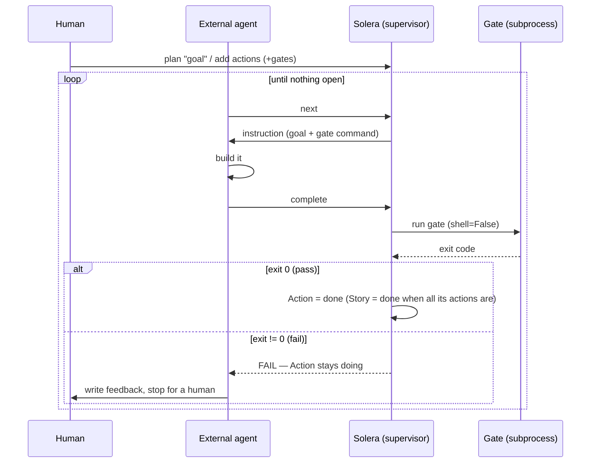
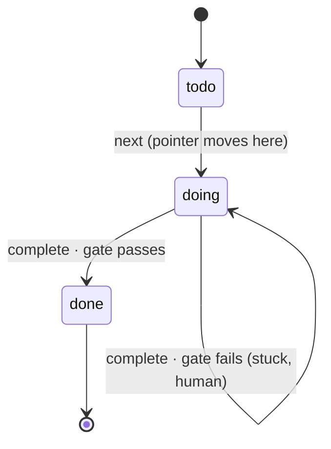
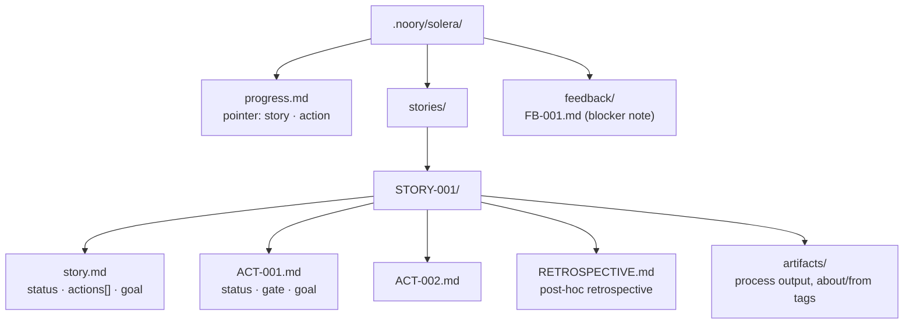

# How Solera works

The operational spec of the slim core. SSOT for *behaviour* is the code under
`solera/`; this document is the map. Concept/design rationale lives in the
harness notes (`repos-plot/docs/idea/harness/`).

## Essence

Solera does not build anything. It **plans** work, **hands** the agent one chunk
at a time, and **verifies** each chunk with a deterministic gate. The building is
done by an external agent (Claude Code / Codex). Solera is the harness around it
and runs standalone, with or without Plot.

## Components

| Module | Role | Harness axis |
|---|---|---|
| `formats` / `workspace` | read/write/validate the `.noory/solera/` files (id lives in the path) | state |
| `planning` | goal → Story → Actions (id allocation, format guaranteed) | S (plan) |
| `supervisor` | find the next open Action, transition status, branch on the gate | L (order) |
| `gate` | run one command with `shell=False`; exit 0 == pass | V (verify) |
| `audit` | cross-file referential-integrity check | guard |
| `cli` / `skills` | the surface the agent drives | — |

## The loop



A failed gate is **not** retried automatically. The Action stays `doing` and the
loop stops; a human intervenes. `next` will not skip a stuck Action — it resumes
it (single active Action at a time).

## Action state machine



A Story is `todo → done` (automatically, once all its Actions are done). The
`progress.md` pointer names the single active Action; `next` moves it and clears
it to `null` when nothing is open.

## File layout



Each file is YAML frontmatter (machine) + body (human goal). **Identity is not in
the frontmatter** — it is the file name / directory name (SSOT, no drift). A
malformed file is rejected immediately (`FormatError`, fail-fast).

## CLI

```text
solera --root <project> plan "goal"                     -> STORY-001
                        add STORY-001 "action" --gate "<cmd>"  -> ACT-001
                        next        # next Action -> doing, print its instruction
                        complete    # run the gate; pass -> done, fail -> stop
                        status      # pointer + integrity audit
                        retro STORY-001 "what was learned"
                        feedback FB-001 "blocker"
```

`--root` is the project directory; gates run there. Skills (`solera-help`,
`solera-plan`, `solera-run`, `solera-retro`, `solera-feedback`) wrap these.

## Invariants

1. **Standalone.** No Plot import or path reference (`tests/test_independence.py`).
   A connection, when it exists, shares a neutral format + stable ids *by value*.
2. **The gate is not an LLM step.** A deterministic subprocess, so the verdict is
   trustworthy.
3. **State is the files.** Solera holds none of its own; everything is under
   `.noory/solera/`.
4. **One active Action.** A gate failure leaves the Action `doing`; `next`
   resumes it rather than advancing past it.
