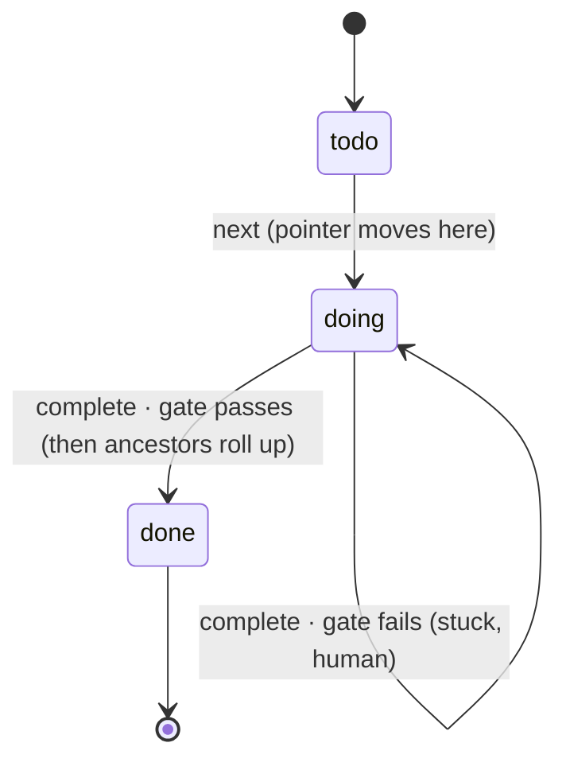
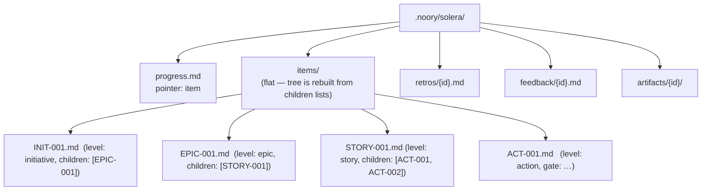

# How Solera works

The operational spec of the slim core. SSOT for *behaviour* is the code under
`solera/`; this document is the map. Concept/design rationale lives in the
harness notes (`noory-workspace/docs/idea/harness/`, esp. `06-boundaries-and-altitudes`).

## Essence

Solera does not build anything. It **plans** work into a tree, **hands** the
agent one leaf at a time, and **verifies** each leaf with a deterministic gate.
The building is done by an external agent (Claude Code / Codex). Solera is the
harness around it and runs standalone, with or without Novel.

## The WorkItem tree

Work is one tree of **WorkItems**. A WorkItem is any rung — `initiative`,
`epic`, `story`, or `action` (`level` is a free label, so depth and taxonomy are
not fixed). The executable invariant:

- a **leaf** carries a `gate` and no children — the unit an agent finishes in one
  context, verified by one command;
- a **container** carries children and no gate — it just rolls up their status;
- an item may have **neither** yet (a container awaiting decomposition), but never
  both.

Size is therefore an *altitude*, not a number: the leaf stays one-context +
one-gate, and everything above is grouping and rollup.

## Components

| Module | Role | Harness axis |
|---|---|---|
| `formats` / `workspace` | read/write/validate the `.noory/solera/` files (id in the path) | state |
| `planning` | create WorkItems at any level, append children | S (plan) |
| `supervisor` | walk the tree to the next open leaf, branch on the gate, roll up | L (order) |
| `gate` | run one command with `shell=False`; exit 0 == pass | V (verify) |
| `audit` | cross-file tree integrity | guard |
| `cli` / `skills` | the surface the agent drives | — |

## The loop

```mermaid
sequenceDiagram
    participant U as Human
    participant A as External agent
    participant S as Solera (supervisor)
    participant G as Gate (subprocess)

    U->>S: plan + add (build the tree)
    loop until no open leaf
        A->>S: next
        S->>A: instruction (the next leaf's goal + gate)
        A->>A: build it
        A->>S: complete
        S->>G: run the leaf's gate (shell=False)
        G-->>S: exit code
        alt exit 0 (pass)
            S->>S: leaf done; roll up ancestors (done when all children are)
        else exit != 0 (fail)
            S-->>A: FAIL — leaf stays doing
            A->>U: write feedback, stop for a human
        end
    end
```

`next` dives depth-first to the first open leaf and **resumes a stuck `doing`
leaf before starting any `todo`** — one active leaf at a time, never skipped.

## Leaf state machine



A container's status is **derived**: it becomes `done` when all its children
are. The `progress.md` pointer names the single active leaf; `next` moves it and
clears it to `null` when nothing is open.

## File layout



Each item is YAML frontmatter (machine) + body (goal). **Identity is the file
name**, not a frontmatter field (SSOT, no drift). Storage is flat; the tree is
reconstructed from each item's `children` list, so depth and re-parenting cost
nothing. A malformed file is rejected immediately (`FormatError`).

## CLI

```text
solera --root <project> plan "goal" [--level story]            -> STORY-001  (a root)
                        add <parent> "goal" [--level action] [--gate "<cmd>"]  -> ACT-001
                        next        # next open leaf -> doing, print its instruction
                        complete    # run the active leaf's gate; pass -> done + rollup
                        status      # pointer + tree-integrity audit
                        retro <item> "what was learned"
                        feedback <id> "blocker"
                        repin <old> <new> [--apply]   # diff two imported releases;
                                          #   reopen stale work only with --apply
```

`repin` reads two imported releases (`specs/{label}/service/manifest.json`),
runs the ID-diff, and surfaces which work items go **stale** (a `changed` slug
they realize → reopen candidate) or **escalate** (a `removed` slug → orphaned,
a human decides). Without `--apply` it only proposes; `--apply` reopens the
stale set (`status → todo`). `removed`/escalated items are never auto-reopened —
the human-in-the-loop gate (04-pipeline).

`--root` is the project directory; gates run there.

## Invariants

1. **Standalone.** No Novel import or path reference (`tests/test_independence.py`).
2. **The gate is not an LLM step.** A deterministic subprocess; the verdict is trustworthy.
3. **State is the files.** Solera holds none of its own.
4. **One active leaf.** A gate failure leaves the leaf `doing`; `next` resumes it.
5. **Leaf xor container.** A WorkItem never has both a gate and children — only
   leaves are executed, only containers roll up.
