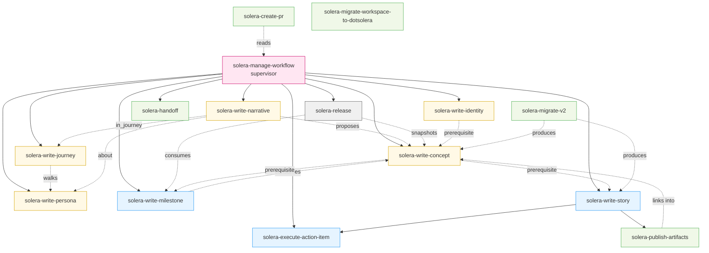
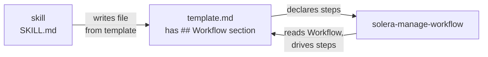

# Solera Architecture (v3)

## Overview

Solera v3 is built around three interlocking principles:

1. **Three orthogonal axes.** Work lives on exactly one of Living (Identity, Concepts), Time-bound (Milestones, Stories, Action Items), or Immutable (Releases). The axes have different relationships to time — Living never ends, Time-bound always does, Immutable is frozen at one moment and never modified again. See [work-item-structure.md](./work-item-structure.md) for the shape; this document covers the wiring.

2. **Workflow-as-SSOT.** Every work item that has a lifecycle (Concept, Milestone, Story, Action Item) declares its procedure in a `## Workflow` section of its **template**. The `solera-manage-workflow` supervisor reads that section and executes it. No skill hardcodes procedure it didn't declare. Release and `solera-publish-artifacts` are the two exceptions — they are hooks, not work items, and have no Workflow section.

3. **Collaboration is structural, not optional.** Four moments require explicit human–AI collaboration: Setup, Concept Drawing, Milestone Agreement, Work Wrap-up. Each moment has a BLOCKING step in the relevant skill that refuses to advance without human input. This is how Solera guarantees that scope and direction are never decided silently.

---

## Skill Dependency Graph



**Solid arrows** = direct skill invocation.
**Dashed arrows** = data dependency (reads/produces files the other skill consumes) without direct invocation.

---

## Axis Wiring

```mermaid
flowchart LR
    subgraph Living["Living Axis"]
        ID[identity/<br/>mission, values, vision]
        PE[personas/<br/>Identity, Goals, Pains,<br/>Triggers, Quotes]
        JO[journeys/<br/>Trigger, Steps table,<br/>Outcome — walks one Persona]
        NA[narratives/<br/>Statement, Context,<br/>Acceptance Cues — proposes Concepts]
        CO[concepts/<br/>Intent, Current Design,<br/>Current Shape, Contributions]
    end

    subgraph TimeBound["Time-bound Axis"]
        MS[milestones/<br/>Scope, Agreement Log,<br/>Exit Criteria]
        ST[stories/<br/>contributes_to, belongs_to,<br/>Input/Output Artifacts]
        AI[Action Items<br/>inside each Story]
    end

    subgraph Immutable["Immutable Axis"]
        RE[releases/{tag}/<br/>concepts-snapshot/,<br/>stories-manifest.md]
    end

    CAT[catalog/published/<br/>service-map, use-case,<br/>domain-model]

    ID --> CO
    JO -->|walks| PE
    NA -->|about| PE
    NA -.->|in_journey| JO
    NA -.->|proposes| CO
    CO -->|referenced by| MS
    CO -->|referenced by| ST
    MS -->|frames scope for| ST
    ST -->|updates at Wrap-up| CO
    ST -->|Story artifacts move to| CAT
    CAT -->|linked from| CO
    MS -->|when Exit Criteria met| RE
    CO -->|copied at release time| RE

    AI --> ST
```

Key flows:
- **Narrative → Concept (Propose):** human writes a Narrative, then either manually authors a Concept inspired by it OR uses the Service canvas's "Propose as Concept" action (creates a stub Concept whose `# Intent` is flagged "needs human review" — the Moment 1 collaboration rule still applies).
- **Story → Concept (Wrap-up):** AI proposes updates to each contributed Concept's `# Current Shape`; human approves.
- **Story artifacts → catalog → Concept (Story Wrap-up hook):** `solera-publish-artifacts` moves design artifacts from `stories/{id}/artifacts/` to `catalog/published/{type}/`, then registers wikilinks on each contributed Concept's `# Related Artifacts`. Note: `catalog/published/persona/` and `catalog/published/journey/` from v3.x are **deprecated** — Personas and Journeys are now first-class Living-axis files in `personas/` and `journeys/`, not catalog artifacts.
- **Milestone Exit Criteria met → Release:** `solera-release` reads the milestone's scope, snapshots each in-scope Concept, lists contributing Stories, freezes the result.

---

## `## Workflow` Section as SSOT

This is the most important architectural rule: **the procedure for any work item lives in that work item's template, not in the skill that creates it.**



- When `solera-write-story` creates `_story.md`, it copies the Workflow section from `story.md` template into the file.
- When `solera-manage-workflow` needs to drive that Story, it reads `_story.md`'s Workflow section and executes each step in order.
- If a skill wants to change the procedure, it **edits the template**. Never the supervisor.

This is why the supervisor has zero domain logic. It can drive any new work item type by simply reading its Workflow section — no code change needed.

### Four-phase pattern

Most Workflows are 4-phase:

```markdown
## Workflow

### Step 0. Setup
- [ ] Prerequisites; branch/folder/status initialization

### Step 1. Create
- [ ] Write the primary file from template

### Step 2. Execute
- [ ] Do the substantive work (often invokes child skills)

### Step 3. Wrap-up
- [ ] Gate checks; status → ✅; decide next
```

Action Items use 3-phase (no Create — the file already exists when the ACT runs). Concept and Milestone use mode-driven shapes (`create` / `update` / `deprecate` / `archive` for Concept; `create` / `update` / `mark-released` for Milestone).

### Repeat block pattern

When a work item loops over children (Story over Action Items, Milestone scope over Concepts):

```markdown
### Step 2. Execute
<!-- Repeat the block below for each Action Item in the Action Items table -->
#### Action Item: ACT-NNN — {title}
- [ ] Invoke solera-execute-action-item
- [ ] Confirm status ✅ before next ACT
<!-- /repeat -->
```

The write-* skill expands the block to match actual rows when it creates the document. The supervisor sees per-child checkboxes and can track progress.

---

## Folder Layout (SSOT view)

```
[project]/
└── .solera/
    ├── progress.md                         # current pointers on all three axes
    ├── HANDOFF.md                          # transient per-session state
    ├── identity/                           # Living — one-time
    ├── personas/                           # Living — who the service is for
    │   ├── _index.md
    │   └── {persona_id}.md
    ├── journeys/                           # Living — steps a Persona walks
    │   ├── _index.md
    │   └── {journey_id}.md
    ├── narratives/                         # Living — As a / I want / so that
    │   ├── _index.md
    │   └── {narrative_id}.md
    ├── concepts/                           # Living — evolves
    │   ├── _index.md
    │   └── {concept_id}.md
    ├── milestones/                         # Time-bound — agreement
    │   ├── _index.md
    │   └── {milestone_id}.md
    ├── stories/                            # Time-bound — execution
    │   └── {story_id}-{story_name}/
    │       ├── _story.md
    │       ├── ACT-NNN-{name}.md
    │       ├── RETROSPECTIVE.md
    │       └── artifacts/                  # staging before publish
    ├── releases/                           # Immutable
    │   ├── _index.md
    │   └── {release_tag}/
    │       ├── .released
    │       ├── README.md
    │       ├── concepts-snapshot/
    │       └── stories-manifest.md
    ├── team-process.md                     # gates, layers, arch rules
    └── catalog/
        └── published/                      # SSOT for promoted artifacts
            ├── service-map/
            ├── use-case/
            └── domain-model/
```

**SSOT invariants:**

- `.solera/progress.md` is the single source for "where this project is right now" — which Concepts are active, which Milestone is in flight, which Story and Action Item are current.
- `.solera/catalog/published/` is the only authoritative location for a promoted design artifact. The same file is never duplicated between `stories/{id}/artifacts/` and `catalog/published/` — `solera-publish-artifacts` moves (not copies).
- Each Concept owns its own `# Contributions` and `# Related Artifacts` — the single canonical record of "what advanced this Concept."
- A written Release is immutable. `.solera/releases/{tag}/.released` marks this for other skills and humans.
- **v3 → v4 migration**: projects with `workspace/` at the project root run `solera-migrate-workspace-to-dotsolera` once to relocate to `.solera/`. Backward compat in Solera v1.x reads both layouts; will be dropped in a future minor.

---

## Workflow Gates

Every team has policies Solera must enforce at specific points. These are declared in `team-process.md` under `workflow_gates`:

```yaml
workflow_gates:
  concept.align:          # before Story creation
  milestone.agree:        # at Milestone agreement
  story.execute:          # before Story execution
  story.wrap_up:          # before Story completion
  act.start:              # before Action Item execution
  act.done:               # after Action Item commit
```

Each gate may declare `checks[]`, a list of deterministic assertions. The execution model is identical across all six gates; see the **Gate check execution** section of `solera-write-story`, `solera-execute-action-item`, or `solera-write-milestone` for the dispatch table.

Available check types:

| Type | Purpose |
|------|---------|
| `glob_exists` | A file path pattern matches ≥1 file |
| `act_complete` | Named Action Items are all ✅ |
| `command_passes` | Shell command exits 0 |
| `grep_absent` | A pattern does NOT appear in a scope |
| `concept_exists` | Named (or inferred from `contributes_to`) Concepts exist and are `active` |
| `milestone_status` | A named Milestone has the expected status |

Gates with `checks[]` absent fall back to text-based evaluation of the `condition` field — the AI reads the human-written condition and judges. Falling back should be rare; prefer structured checks.

---

## `progress.md` vs `HANDOFF.md`

| Property | `progress.md` | `HANDOFF.md` |
|----------|---------------|--------------|
| **Scope** | Permanent project state (three axes) | Transient session state |
| **Update frequency** | After each state transition (Story complete, Milestone agreed, Release cut) | On `/solera-handoff` invocation (user-initiated) |
| **Content** | Active Concepts, active Milestone, current Story/ACT, latest Release | What was done this session, in progress, next steps, open decisions |
| **Audience** | All future sessions and contributors | The next session only |
| **Authoritative for** | "Where is this project right now?" | "What happened just before this session ended?" |
| **Lifespan** | Indefinite | Single session boundary |

`progress.md` must never contain session-specific narrative. `HANDOFF.md` must never be treated as a persistent record; it is overwritten each time `/solera-handoff` is invoked.

---

## Why no supervisor state machine?

A common urge in systems like this is to give `solera-manage-workflow` a state machine: "if in Moment 1, route to write-concept; if Concept has N artifacts, force a Milestone; …"

v3 deliberately doesn't do this. The supervisor surfaces the **current situation** and **available next steps** and lets the human pick. Reasons:

1. **The axes are not linear.** A team might draw a new Concept mid-Milestone (response to discovery). Forcing a state machine would block that.
2. **The human is the strategist.** Concept Drawing, Milestone Agreement, Release Approval — these are human decisions. A state machine would push AI into those.
3. **The Workflow-as-SSOT rule.** If the supervisor carried domain state, that state would duplicate what's already in templates and `progress.md`. SSOT violation.

The supervisor asks "what do you want to work on?" and drives the chosen work item's Workflow. Everything else is state-awareness, not state-control.
