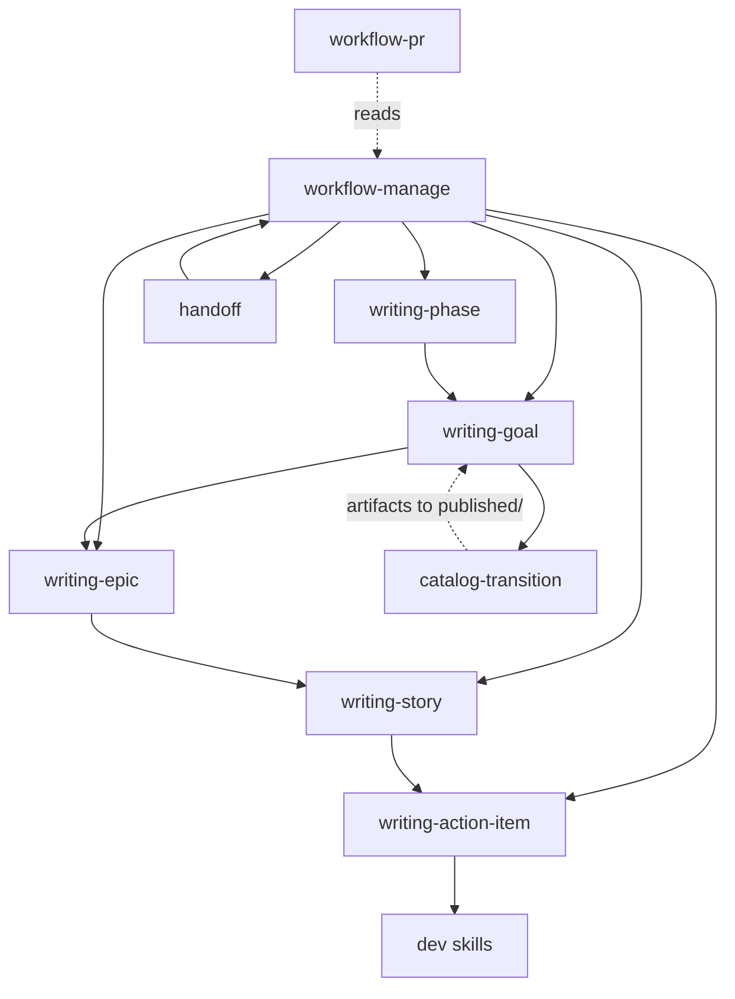
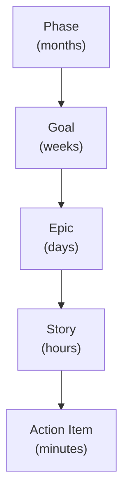

# Solera Architecture

## Overview

Solera is built around three interlocking principles. First, every skill is a thin orchestrator: it validates preconditions, delegates work to lower-level skills, and records outcomes — it contains no business logic of its own. Second, every work item (Phase, Goal, Epic, Story, Action Item) owns its own procedure through a `## Workflow` section in its template; the `workflow-manage` skill reads and executes those steps but never defines them. Third, SSOT is enforced structurally: `progress.md` is the single canonical source for the project's current position in the hierarchy, and the `catalog/published/` tree is the single authoritative location for promoted artifacts. Duplication is prevented by convention and by the `catalog-transition` skill, which moves artifacts out of goal-local directories into the shared catalog on Goal completion.

---

## Skill Dependency Graph



Solid arrows indicate direct invocation. Dashed arrows indicate a read or data dependency without direct skill invocation.

---

## Work Item Hierarchy



Each level of the hierarchy corresponds to a progressively shorter time scale and a progressively narrower scope. A Phase groups Goals that share a strategic objective. A Goal produces a coherent set of artifacts (service-map, personas, use-cases, concepts). An Epic groups the Stories needed to implement one deliverable within a Goal. A Story groups the Action Items that implement one user-facing capability. An Action Item produces exactly one atomic code or documentation change plus its git commit.

---

## Folder Layout

```
[project]/
├── progress.md                          # current Phase / Goal / Epic / Story / ACT pointers
├── HANDOFF.md                           # transient session state; regenerated each Stop
└── workspace/
    ├── initiative/[year]/
    │   └── roadmap.md                   # annual initiative and Phase list
    ├── phase/[phase-id]/
    │   ├── README.md                    # Phase definition and acceptance criteria
    │   ├── RETRO.md                     # Phase retrospective (written at Phase close)
    │   └── goals/[goal-id]/
    │       ├── _goal.md                 # Goal definition, scope, and Workflow steps
    │       ├── artifacts/               # working copies: service-map, persona, use-case, concept
    │       │   └── (promoted to published/ on Goal complete via catalog-transition)
    │       └── epics/[epic-name]/
    │           ├── _epic.md             # Epic definition and Workflow steps
    │           └── stories/[story-id]/
    │               ├── _story.md        # Story definition and Workflow steps
    │               └── action-items/
    │                   └── ACT-NNN-[name].md   # single Action Item; one commit per file
    └── catalog/
        └── published/                   # canonical artifact store (promoted from artifacts/)
            ├── service-map/
            ├── persona/
            ├── use-case/
            └── concept/
```

The `artifacts/` directory under each Goal is the in-progress working area. The `catalog/published/` subtree is the SSOT for all completed artifacts across all Goals. No artifact should exist in both locations simultaneously; `catalog-transition` enforces this by moving (not copying) files.

---

## SSOT / Lifecycle Pattern

### The Workflow Section

Every work item template contains a `## Workflow` section that lists the concrete procedural steps for that item type. This is the SSOT for procedure: the definition of "what to do" lives in the template, not in any skill.

`workflow-manage` acts as a supervisor: it reads the `## Workflow` section of the active item and executes each step in order. It has no hardcoded knowledge of what those steps are.

All workflows follow a four-phase structure:

| Phase | Purpose |
|-------|---------|
| **Setup** | Validate preconditions; locate or create the working directory |
| **Create** | Generate the item's primary output file(s) from the template |
| **Execute** | Do the substantive work: invoke child skills, produce artifacts |
| **Wrap-up** | Update `progress.md`, record completion, trigger any promotions |

### The Repeat Block Pattern

For items that own children (Phase owns Goals; Goal owns Epics; Epic owns Stories; Story owns Action Items), the `## Workflow` section contains a repeat block in the Execute phase. The repeat block specifies:

- The child skill to invoke
- The termination condition (all children complete, or explicit user stop)
- Any inter-child actions (e.g., update `progress.md` between Epics)

This means the looping logic is declared in the parent template, not implemented in `workflow-manage`. `workflow-manage` reads the repeat block and drives the loop; it does not decide when the loop ends.

### How workflow-manage Reads Procedures

On each invocation, `workflow-manage`:

1. Reads `progress.md` to identify the active item.
2. Locates the item's file (`_goal.md`, `_epic.md`, `_story.md`, etc.).
3. Parses the `## Workflow` section.
4. Executes each step; if a step names a child skill, it invokes that skill and awaits completion before proceeding.
5. On completion, updates `progress.md` and returns control to the caller.

`workflow-manage` does not contain any domain-specific logic about what Goals, Epics, Stories, or Action Items mean. All such logic is encoded in the templates.

---

## progress.md vs HANDOFF.md

| Property | `progress.md` | `HANDOFF.md` |
|----------|--------------|--------------|
| **Scope** | Permanent project state | Transient session state |
| **Update frequency** | Updated per Epic completion (and at major milestones) | Regenerated every session end via the Stop hook |
| **Content** | Current Phase ID, Goal ID, Epic ID, Story ID, Action Item ID; completion counts | What was done this session, what is in progress, what to do next, any open decisions |
| **Audience** | All future sessions and contributors | The next session only |
| **Authoritative for** | "Where is this project right now?" | "What happened just before this session ended?" |
| **Lifespan** | Indefinite | Single session boundary |

`progress.md` must never contain session-specific narrative. `HANDOFF.md` must never be treated as a persistent record; it is overwritten unconditionally on every Stop event.

---

## Stop Hook

When a Claude Code session ends, the `Stop` lifecycle event fires `hooks/handoff_hook.py`. The hook runs `claude -p` with a structured handoff prompt that instructs Claude to:

- Summarize what was completed during the session.
- Identify any work currently in progress and its state.
- List the next concrete steps.
- Record any open decisions or blockers.

The output is written to `HANDOFF.md`, overwriting any previous content. The hook runs unconditionally — it does not check whether any work was done during the session. This guarantees that `HANDOFF.md` always reflects the most recent session boundary, even if the session produced no changes.

The prompt used by the hook is the SSOT for what `HANDOFF.md` contains. The hook itself contains no handoff logic; it only assembles the prompt and invokes `claude -p`.
