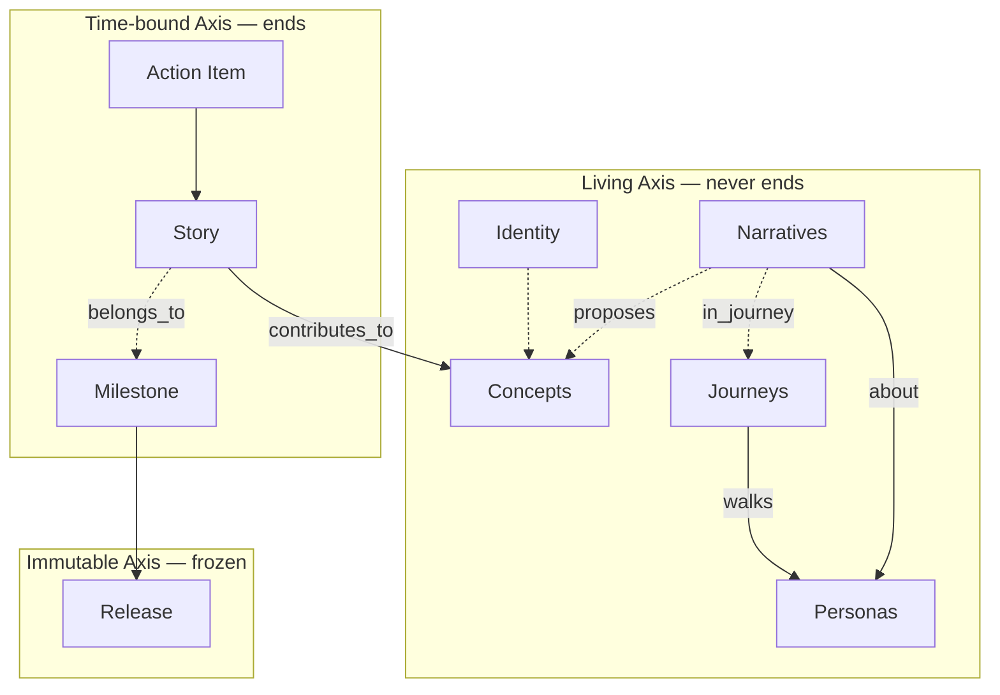

# Axes and Status — Canonical Reference

> **SSOT.** This file is the single source of truth for Solera's three-axis model, item ownership, and every status value used across skills and docs.
> If you are about to define an axis, a status value, or a status transition in another file — stop, and link here instead.

## The Three Axes

| Axis | Characteristic | Items |
|------|----------------|-------|
| **Living** | Never ends; evolves continuously | Identity, Concepts, Personas, Journeys, Narratives |
| **Time-bound** | Has a start and end | Milestone, Story, Action Item |
| **Immutable** | Frozen snapshot, write-once | Release |

The axes are orthogonal — every workspace item belongs to exactly one axis. This is what makes the model MECE.

The Living axis splits into two clusters by perspective: **product-side** (Identity, Concepts — what we're building) and **user-side** (Personas, Journeys, Narratives — who it's for and how they live with it). User-side items are upstream of Concepts: humans draw Personas, attach Journeys, write Narratives, and from those propose Concepts.



## Ownership

| Role | Owned items | Primary responsibility |
|------|-------------|------------------------|
| **Human** | Identity, Concepts, Personas, Journeys, Narratives, Milestone agreement, Release approval | Direction, Intent, who-the-user-is, scope agreement, final say |
| **AI** | Story, Action Item; drafts for Milestone analysis and Release notes | Decomposition, implementation, proposals |

Both collaborate at **Milestone Agreement** (Moment 2) and **Story Wrap-up** (결과 확정 of Moment 3).

## Status Values — Authoritative Table

Every skill must use exactly these values. Adding a new value means editing this file first, then propagating.

### Living Axis

| Item | Allowed values | Notes |
|------|----------------|-------|
| **Identity** | — | No status field. Identity is written once and edited in place. |
| **Concept** | `active` / `deprecated` / `archived` | Never "complete" — Concepts evolve until retired. |
| **Persona** | `active` / `deprecated` / `archived` | Same status grammar as Concept. AI may not invent who the user is. |
| **Journey** | `active` / `deprecated` / `archived` | Same status grammar as Concept. A Journey is walked by exactly one Persona. |
| **Narrative** | `active` / `deprecated` / `archived` | Same status grammar as Concept. May propose Concepts via the `proposes:` frontmatter field. |

### Time-bound Axis

| Item | Allowed values |
|------|----------------|
| **Milestone** | `proposed` / `agreed` / `in-progress` / `released` |
| **Story** | `⏳` / `🔄` / `✅` / `⏸️` / `❌` |
| **Action Item** | `⏳` / `🔄` / `✅` / `❌` |

### Immutable Axis

| Item | Allowed values | Notes |
|------|----------------|-------|
| **Release** | — | No mutable status field. The presence of `{release_tag}/.released` marks it frozen. |

### Status Icon Legend (Story / Action Item)

| Icon | Name | Meaning |
|------|------|---------|
| ⏳ | Pending | Not yet started |
| 🔄 | In Progress | Work in progress |
| ✅ | Complete | Work complete |
| ⏸️ | On Hold | Temporarily paused (Story only) |
| ❌ | Cancelled | Abandoned |

## Allowed Status Transitions

Skills **must** reject any transition not listed here.

### Concept (and Persona, Journey, Narrative — identical grammar)

```
active ──► deprecated ──► archived
active ──────────────────► archived
```

- `deprecated → active` and `archived → *` are **not allowed.** To resurrect intent, create a new item of that kind.
- Owner of each transition: **Human.** AI may propose via the relevant `solera-write-*` skill but must not write without approval.
- **Persona / Journey / Narrative** follow this exact grammar — there is no separate transition diagram for them.

### Milestone

```
proposed ──► agreed ──► in-progress ──► released
```

- Reverse transitions are **not allowed.**
- `proposed → agreed`: human + AI agree during Moment 2.
- `in-progress → released`: triggered by `solera-release` when all Exit Criteria pass.

### Story

```
⏳ ──► 🔄 ──► ✅
       ├───► ⏸️ ──► 🔄
       └───► ❌
⏳ ──► ❌
```

- `✅ → *` is **not allowed** (Story Wrap-up is terminal).

### Action Item

```
⏳ ──► 🔄 ──► ✅
       └───► ❌
```

- Action Items have no on-hold state; if paused, the parent Story goes to `⏸️` instead.
- `✅ → *` is **not allowed** (one commit, one outcome).

## Cross-axis Relations

| Relation | From | To | Cardinality | Required |
|----------|------|-----|-------------|----------|
| `parent` | Concept | Concept | Concept → 0 or 1 Concept | no |
| `parent` | Persona | Persona | Persona → 0 or 1 Persona | no |
| `parent` | Journey | Journey | Journey → 0 or 1 Journey | no |
| `walks` | Journey | Persona | Journey → exactly 1 Persona | **yes** |
| `about` | Narrative | Persona | Narrative → 1+ Personas | **yes** |
| `in_journey` | Narrative | Journey | Narrative → 0 or 1 Journey | no |
| `proposes` | Narrative | Concept | Narrative → 0+ Concepts | no |
| `contributes_to` | Story | Concept | Story → 1+ Concepts | **yes** |
| `belongs_to` | Story | Milestone | Story → 0 or 1 Milestone | no |
| `depends_on` | Action Item | Action Item | ACT → 0+ sibling ACTs | no |
| `in_scope` | Release | Concept | Release → 1+ Concepts | **yes** |

### `parent` (Concept → Concept, Persona → Persona, Journey → Journey)

A Concept may declare one `parent` — another active Concept it sits inside.
Top-level Concepts (no parent) represent the project's biggest regions
(products, shared foundations, top-level surfaces). Nesting is unbounded:
a parent can itself have a parent, all the way up until one without a parent.

- **Cycles are forbidden.** A → B → A must be rejected; skills and viewers
  walk the chain upward and halt if they revisit an ancestor.
- **Self-parenting is forbidden.** `parent == self.id` must be rejected.
- **The parent must be `active`** at the time it is set — archiving
  a parent that still has children is surfaced as a warning (children
  become orphaned / rise to top-level automatically).
- **Changing `parent`** is a normal Update — not an Intent rewrite. It
  doesn't trigger archive-and-new.

The same rules apply verbatim to **Persona → Persona** (sub-persona, e.g., "VIP buyer" under "buyer") and **Journey → Journey** (variant journey, e.g., "first-time onboarding" under "onboarding"). Cross-kind parents are forbidden — a Persona's `parent` may only point at another Persona, etc.

### `walks` (Journey → Persona)

A Journey is always walked by **exactly one** Persona. Multi-persona journeys must be split into one Journey per Persona. This keeps swimlane visualization unambiguous.

- The named Persona must be `active` at the time of the link.
- Deprecating a Persona surfaces a warning if Journeys still walk it; the Journeys are not auto-deprecated.

### `about` and `in_journey` (Narrative → Persona / Journey)

A Narrative names 1+ Personas it concerns (`about: [persona_id, ...]`, required) and may anchor to a single Journey (`in_journey: {journey_id}`, optional). Narratives without `in_journey` cluster as "loose narratives" in the canvas.

- All referenced Personas must be `active`. If `in_journey` is set, the Journey must be `active`.
- A Narrative with multiple `about` entries appears in each Persona's swimlane row.

### `proposes` (Narrative → Concept)

A Narrative may list `proposes: [concept_id, ...]` to record which Concepts grew out of it. The list is populated **either** by a human writing the Narrative manually **or** by the canvas's "Propose as Concept" action — which creates a stub Concept with `# Intent` flagged "needs human review" and adds the new ID to this list.

- This relation is informational, not enforced. A Narrative can have `proposes: []` indefinitely.
- The corresponding Concept gains a `# Proposed From Narratives` section with a wikilink back to the Narrative. The link is two-way for traceability.

## Scope Tag Invariant

Every Action Item commit carries: `[{primary_concept}][{story_id}][ACT-NNN] title`
where `{primary_concept}` = `contributes_to[0]` of the parent Story.

This makes git history searchable by Concept — the Living axis remains queryable through the Time-bound record of what actually happened.

## Downstream References

Files that rely on this SSOT and must be updated in lockstep if these tables change:

- `docs/work-item-structure.md` — narrative overview with links here
- `skills/solera-manage-workflow/assets/conventions.md` — operator-facing quick card
- `skills/solera-write-concept/SKILL.md` — uses Concept status values
- `skills/solera-write-persona/SKILL.md` — uses Persona status values
- `skills/solera-write-journey/SKILL.md` — uses Journey status values + `walks` relation
- `skills/solera-write-narrative/SKILL.md` — uses Narrative status values + `about` / `in_journey` / `proposes` relations
- `skills/solera-write-milestone/SKILL.md` — uses Milestone status values
- `skills/solera-write-story/SKILL.md` — uses Story status icons + transitions
- `skills/solera-execute-action-item/SKILL.md` — uses ACT status icons
- `skills/solera-release/SKILL.md` — uses Release `.released` marker
- `skills/solera-migrate-v2/SKILL.md` — maps v2 states to the values above
