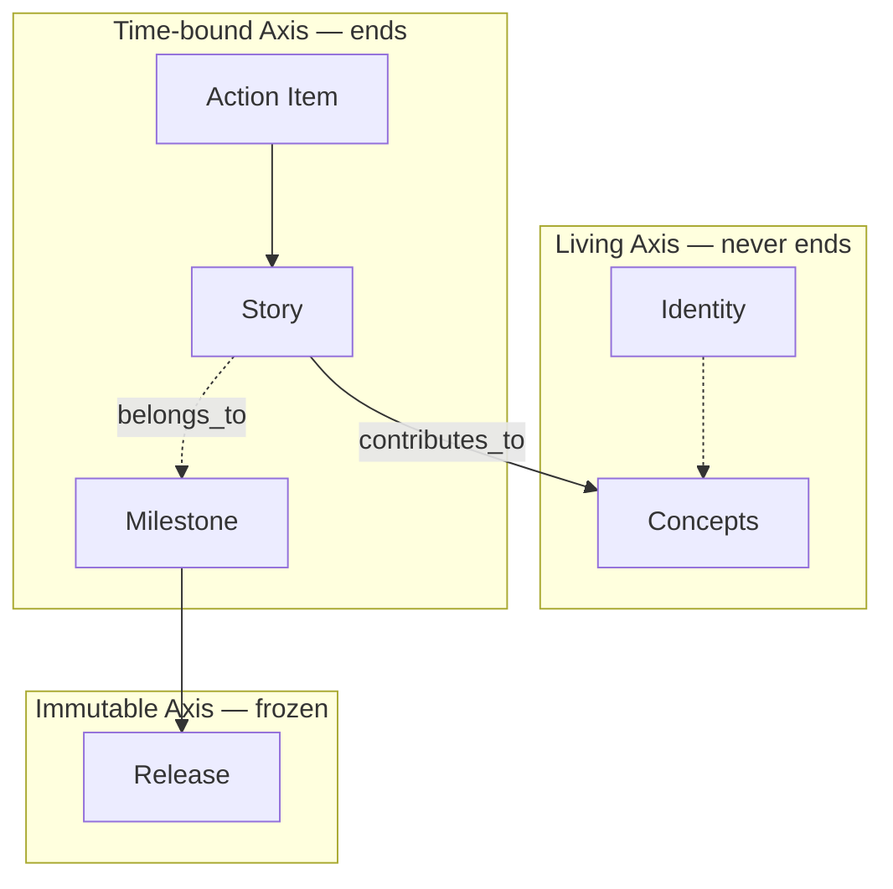

# Axes and Status — Canonical Reference

> **SSOT.** This file is the single source of truth for Solera's three-axis model, item ownership, and every status value used across skills and docs.
> If you are about to define an axis, a status value, or a status transition in another file — stop, and link here instead.

## The Three Axes

| Axis | Characteristic | Items |
|------|----------------|-------|
| **Living** | Never ends; evolves continuously | Identity, Concepts |
| **Time-bound** | Has a start and end | Milestone, Story, Action Item |
| **Immutable** | Frozen snapshot, write-once | Release |

The axes are orthogonal — every workspace item belongs to exactly one axis. This is what makes the model MECE.



## Ownership

| Role | Owned items | Primary responsibility |
|------|-------------|------------------------|
| **Human** | Identity, Concepts, Milestone agreement, Release approval | Direction, Intent, scope agreement, final say |
| **AI** | Story, Action Item; drafts for Milestone analysis and Release notes | Decomposition, implementation, proposals |

Both collaborate at **Milestone Agreement** (Moment 2) and **Story Wrap-up** (결과 확정 of Moment 3).

## Status Values — Authoritative Table

Every skill must use exactly these values. Adding a new value means editing this file first, then propagating.

### Living Axis

| Item | Allowed values | Notes |
|------|----------------|-------|
| **Identity** | — | No status field. Identity is written once and edited in place. |
| **Concept** | `active` / `deprecated` / `archived` | Never "complete" — Concepts evolve until retired. |

### Time-bound Axis

| Item | Allowed values |
|------|----------------|
| **Milestone** | `proposed` / `agreed` / `in-progress` / `released` |
| **Story** | `⏳` / `🔄` / `✅` / `⏸️` / `❌` |
| **Action Item** | `⏳` / `🔄` / `✅` / `❌` |

### Immutable Axis

| Item | Allowed values | Notes |
|------|----------------|-------|
| **Release** | — | No mutable status field. The presence of `{release_tag}/.released` marks it frozen. |

### Status Icon Legend (Story / Action Item)

| Icon | Name | Meaning |
|------|------|---------|
| ⏳ | Pending | Not yet started |
| 🔄 | In Progress | Work in progress |
| ✅ | Complete | Work complete |
| ⏸️ | On Hold | Temporarily paused (Story only) |
| ❌ | Cancelled | Abandoned |

## Allowed Status Transitions

Skills **must** reject any transition not listed here.

### Concept

```
active ──► deprecated ──► archived
active ──────────────────► archived
```

- `deprecated → active` and `archived → *` are **not allowed.** To resurrect intent, create a new Concept.
- Owner of each transition: **Human.** AI may propose via `solera-write-concept` but must not write without approval.

### Milestone

```
proposed ──► agreed ──► in-progress ──► released
```

- Reverse transitions are **not allowed.**
- `proposed → agreed`: human + AI agree during Moment 2.
- `in-progress → released`: triggered by `solera-release` when all Exit Criteria pass.

### Story

```
⏳ ──► 🔄 ──► ✅
       ├───► ⏸️ ──► 🔄
       └───► ❌
⏳ ──► ❌
```

- `✅ → *` is **not allowed** (Story Wrap-up is terminal).

### Action Item

```
⏳ ──► 🔄 ──► ✅
       └───► ❌
```

- Action Items have no on-hold state; if paused, the parent Story goes to `⏸️` instead.
- `✅ → *` is **not allowed** (one commit, one outcome).

## Cross-axis Relations

| Relation | From | To | Cardinality | Required |
|----------|------|-----|-------------|----------|
| `parent` | Concept | Concept | Concept → 0 or 1 Concept | no |
| `contributes_to` | Story | Concept | Story → 1+ Concepts | **yes** |
| `belongs_to` | Story | Milestone | Story → 0 or 1 Milestone | no |
| `depends_on` | Action Item | Action Item | ACT → 0+ sibling ACTs | no |
| `in_scope` | Release | Concept | Release → 1+ Concepts | **yes** |

### `parent` (Concept → Concept)

A Concept may declare one `parent` — another active Concept it sits inside.
Top-level Concepts (no parent) represent the project's biggest regions
(products, shared foundations, top-level surfaces). Nesting is unbounded:
a parent can itself have a parent, all the way up until one without a parent.

- **Cycles are forbidden.** A → B → A must be rejected; skills and viewers
  walk the chain upward and halt if they revisit an ancestor.
- **Self-parenting is forbidden.** `parent == self.id` must be rejected.
- **The parent Concept must be `active`** at the time it is set — archiving
  a Concept that still has children is surfaced as a warning (children
  become orphaned / rise to top-level automatically).
- **Changing `parent`** is a normal Update — not an Intent rewrite. It
  doesn't trigger archive-and-new.

## Scope Tag Invariant

Every Action Item commit carries: `[{primary_concept}][{story_id}][ACT-NNN] title`
where `{primary_concept}` = `contributes_to[0]` of the parent Story.

This makes git history searchable by Concept — the Living axis remains queryable through the Time-bound record of what actually happened.

## Downstream References

Files that rely on this SSOT and must be updated in lockstep if these tables change:

- `docs/work-item-structure.md` — narrative overview with links here
- `skills/solera-manage-workflow/assets/conventions.md` — operator-facing quick card
- `skills/solera-write-concept/SKILL.md` — uses Concept status values
- `skills/solera-write-milestone/SKILL.md` — uses Milestone status values
- `skills/solera-write-story/SKILL.md` — uses Story status icons + transitions
- `skills/solera-execute-action-item/SKILL.md` — uses ACT status icons
- `skills/solera-release/SKILL.md` — uses Release `.released` marker
- `skills/solera-migrate-v2/SKILL.md` — maps v2 states to the values above
