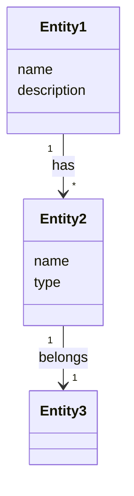

# Template: Domain Model (reference)

> **Archived from v2's `solera-write-epic/assets/concept.md`.**
>
> In v2 this was called a "concept" — a domain-modeling artifact capturing entities, attributes, and relationships. In v3 the word "Concept" is reserved for the living axis of the project map, so this artifact was renamed **domain-model** to avoid collision. This document is kept here as a reference template; write-story or other skills may still produce domain-model artifacts and promote them to `catalog/published/domain-model/`.

## Domain Overview Template

```markdown
# Domain: {domain name}

> Last updated: {YYYY-MM-DD}

## Core Entities

| Entity | Description | Relationship |
|--------|-------------|--------------|
| **{Entity1}** | {description} | {relationship summary} |
| **{Entity2}** | {description} | {relationship summary} |

## Relationship Diagram



## Entity Details

→ [entities/entity1.md](./entities/entity1.md)
→ [entities/entity2.md](./entities/entity2.md)

## Use Case Links

| Entity | Related Use Cases |
|--------|-------------------|
| Entity1 | UC-001, UC-002 |
| Entity2 | UC-002, UC-003 |
```

## Entity Detail Template

```markdown
# Entity: {entity name}

> Last updated: {YYYY-MM-DD}

## Purpose

{Why this Entity is needed.}

## Attributes

| Attribute | Description | Required | Example |
|-----------|-------------|----------|---------|
| `name` | Name | Y | "Glenfiddich 12 Year" |
| `description` | Description | N | "Speyside single malt" |

## Relationships

| Relationship | Target Entity | Cardinality | Description |
|--------------|---------------|-------------|-------------|
| belongs_to | {Entity} | N:1 | {description} |
| has_many | {Entity} | 1:N | {description} |

## Business Rules

- {rule 1}
- {rule 2}

## Data Example

```json
{
  "name": "Glenfiddich 12 Year",
  "description": "Speyside representative single malt whisky",
  "abv": 40.0
}
```

## Related Use Cases

- UC-001: {Use Case title}
- UC-002: {Use Case title}
```

## Quality Criteria

### Domain Overview

- [ ] Are all core entities listed?
- [ ] Are all relationships represented in the class diagram?
- [ ] Are entities linked to Use Cases?

### Entity Detail

- [ ] Is the purpose clearly stated?
- [ ] Do all attributes have descriptions and examples?
- [ ] Is cardinality specified in relationships?
- [ ] Are business rules defined?
- [ ] Does the data example reflect the actual domain?

## Example

### liquor-db — Liquor Entity

```markdown
# Entity: Liquor

## Purpose

Stores and provides information about liquor products.

## Attributes

| Attribute | Description | Required | Example |
|-----------|-------------|----------|---------|
| `name` | Product name (Korean) | Y | "Glenfiddich 12 Year" |
| `nameEn` | Product name (English) | N | "Glenfiddich 12 Year" |
| `categoryMain` | Main category | Y | "distilled" |
| `categorySub` | Sub-category | Y | "whisky" |
| `abv` | Alcohol by volume (%) | Y | 40.0 |
| `age` | Age statement (years) | N | 12 |

## Relationships

| Relationship | Target Entity | Cardinality | Description |
|--------------|---------------|-------------|-------------|
| belongs_to | Brand | N:1 | Belongs to brand |
| belongs_to | Producer | N:1 | Belongs to producer |
| has_one | TastingNote | 1:1 | Has tasting note |

## Business Rules

- abv must be between 0 and 100
- If age is null, the product is NAS (No Age Statement)
- categoryMain and categorySub must use only defined enum values
```

## Historical Note

This template lived at `solera/skills/solera-write-epic/assets/concept.md` in v2. The Epic level was removed in v3.0.0. Domain-model authoring is now the responsibility of a Story when it declares a domain-model output — see `solera-publish-artifacts` for how domain-model files are promoted to `catalog/published/domain-model/` at Story Wrap-up.
