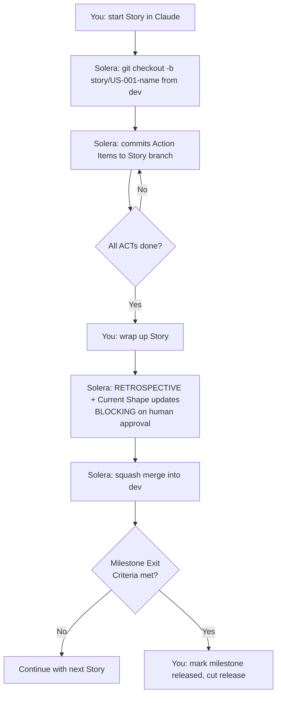

# Solera Team Workflow Guide (v3)

A practical guide for using Solera in a small team (2–5 contributors).

---

## Overview

In v3, Solera work happens on three axes: **Living** (Concepts you draw and evolve), **Time-bound** (Milestones you agree on and Stories you execute), **Immutable** (Releases you freeze). Each Story gets its own branch off trunk; Action Items commit to that branch. When a Story is complete, Solera squash-merges it into trunk and, at Wrap-up, updates the relevant Concepts' Current Shape (with your approval). Run `/solera-handoff` before ending a session to write `HANDOFF.md` so the next contributor resumes exactly where you stopped.

There is no Epic branch, no Goal branch, no Phase branch in v3. Stories are the only branching unit.

---

## Branch Strategy

### Branch hierarchy

| Level | Branch pattern | Created by |
|---|---|---|
| Trunk | `main` or `dev` | Team (pre-existing) |
| Story | `story/{story_id}-{story_name}` | Solera automatically on Story start |
| Action Item | commit only, no branch | Solera (committed to Story branch) |

### Merge direction

```
main / dev
  ├── story/US-001-capture-flow           ← squash merge at Story Wrap-up
  ├── story/US-002-task-list              ← squash merge at Story Wrap-up
  └── story/TS-014-fts5-index             ← squash merge at Story Wrap-up
```

Every Story branch diverges directly from trunk and squash-merges back. No intermediate branches.

### What Solera does automatically vs. what you do



**Solera creates automatically:** Story branch, Action Item commits, squash merge of Story into trunk, Current Shape update drafts (pending your approval), Release directory structure.

**You trigger:** Story start, ACT execution, Story Wrap-up, Current Shape approval, Milestone agreement and release marking, Release cut.

---

## Commit Message Format

Every commit from Solera follows:

```
[{primary_concept}][{story_id}][ACT-NNN] title

- change description
```

Where `{primary_concept}` = the Story's `contributes_to[0]`. If the Story contributes to multiple Concepts, the body includes:

```
- contributes also to: {other_concept_ids}
```

This keeps `git log --grep="[authentication]"` searchable by Concept — even across many Milestones and Releases.

---

## Handing Off Between Contributors

### Normal flow

**Contributor A — ending a session:**

When A runs `/solera-handoff` before ending:

1. Solera runs `git status --short`, `git diff --stat`, `git log --oneline -5`.
2. Reads `progress.md` to get the current state on all three axes.
3. Overwrites `HANDOFF.md` at the project root.

**Contributor B — starting a session:**

1. `git pull`
2. Open `HANDOFF.md`.
3. Tell Claude: "Read HANDOFF.md and resume where A left off."

Claude reads the file, checks out the correct branch, and continues from the exact step A stopped at.

### Example HANDOFF.md

```markdown
# Handoff

## Current work
Implementing capture flow (Story US-001 contributing to `quick-capture` and
`task-lifecycle`, belongs_to mvp). ACT-003 (local persistence) is in progress —
Drift repository interface done, Hive adapter not yet registered.

## Skill status
- Skill: solera-execute-action-item
- Step: Execute (3 of 4 Action Items committed)

## Completed this session
- ACT-001: Task entity + state enum
- ACT-002: CaptureUseCase with tests
- Squash-merged nothing yet — Story still in progress

## Next steps
- Register Hive adapter in ACT-003 (see `lib/data/task/local_store.dart:42`)
- Run `flutter test packages/data` — should pass after adapter registered
- Commit ACT-003 with `[quick-capture][US-001][ACT-003]` format
- Then ACT-004 (float button + form)

## Key decisions
- Chose Hive over SharedPreferences for persistence — acceptance criterion "1-second
  save" requires sync write and Hive's typed boxes are faster.
- Kept the form in a `showModalBottomSheet` rather than a full route — matches
  Current Design's "float button" framing.

## Reference files
- lib/domain/task/capture_use_case.dart  (committed in ACT-002)
- lib/data/task/local_store.dart         (current work)
- story/US-001-capture-flow              (current branch)

## Caveats
- `flutter analyze` shows 2 warnings about null-safety in legacy files — unrelated
  to this Story; do not fix them here.

> Last updated: 2026-04-17 14:32:07
```

### Triggering handoff manually mid-session

> "Run handoff"

Claude executes `solera-handoff` immediately and writes `HANDOFF.md`. Commit or push if the team keeps it in git (see team setup below).

---

## PR Workflow

In v3 each **Story** is the PR unit — not Epic, because Epic no longer exists.

### When to use `solera-create-pr`

Trigger it when:

- All Action Items in the Story are marked ✅ in `_story.md`.
- Build and tests pass locally.
- The Story has been wrapped up (RETROSPECTIVE written, Current Shape updates approved).

Do not trigger it mid-Story. The skill blocks if any ACT is unfinished.

### How to trigger

> "Create a PR for this Story."

### What Solera does

1. Verifies all ACTs in the Story are ✅ and the Story status is ✅.
2. Verifies build and tests pass.
3. Runs: `gh pr create --base dev --head story/US-001-capture-flow --title "[quick-capture][US-001] capture-flow" --body "..."`
4. PR body includes: Story summary, acceptance criteria with status, Action Items list with commit hashes, Concept Contribution Summary from RETROSPECTIVE, Test results.
5. Monitors the PR for review comments.
6. Applies requested fixes as additional commits on the Story branch.
7. Once approved: squash-merges into `dev`, deletes `story/US-001-capture-flow`.

### Why squash merge

Each Story branch accumulates many small ACT commits (one per atomic change). Squash merge collapses them into a single commit on trunk — history reads as one entry per Story, tagged with the Concept. The full per-ACT history remains on the Story branch until deletion; the final squash commit on trunk preserves the ACT list in its body.

---

## Parallel Work Across Stories

Two contributors can work on separate Stories at the same time because each Story is an independent branch off trunk.

**Example:**

- Contributor A: `story/US-001-capture-flow` (contributes to `quick-capture`, `task-lifecycle`)
- Contributor B: `story/US-002-task-list` (contributes to `task-list-view`, `task-lifecycle`)

Both branches diverge from `dev` independently. Neither blocks the other.

### Concept-level coordination

Both Stories contribute to `task-lifecycle`. At Wrap-up, **whichever Story wraps up first updates `concepts/task-lifecycle.md`'s Current Shape first**. The second Story's Wrap-up sees the already-updated Current Shape as its starting point and proposes a further update.

If two Stories produce contradictory Current Shape updates (A says "states are inbox → active → done → archived", B says "states are captured → scheduled → done"), this will be caught at B's Wrap-up — Claude shows the current Current Shape (A's) alongside B's proposal, and you decide whether to merge, refine, or flag as drift in RETROSPECTIVE.md.

This is Solera's drift-detection mechanism. It only works if both contributors honor the BLOCKING approval step — do not rubber-stamp.

### `progress.md` and `HANDOFF.md` in parallel work

- `progress.md` tracks the single canonical project state (active Concepts, active Milestone, current Story, latest Release). Committed to git and shared. Each contributor reads it to understand where the project is.
- `HANDOFF.md` is per-session and per-contributor. If both A and B write to it concurrently they overwrite each other — expected if kept out of git.

### Merge order

Whichever Story wraps up first squash-merges into trunk first. The other Story may need to rebase:

```bash
git checkout story/US-002-task-list
git rebase dev
```

Solera does not auto-rebase — do this manually before `solera-create-pr` on the second Story.

---

## Milestone-Level Coordination

A Milestone defines scope. Several Stories may `belongs_to` the same Milestone and run in parallel or sequence.

When a Milestone Exit Criterion asks for something specific (e.g., "Current Shape of `task-lifecycle` reflects all four states working end-to-end"), Stories in that Milestone collectively drive toward it. No single Story needs to satisfy the criterion — multiple Stories each advance a piece of the Current Shape, and the criterion becomes true cumulatively.

Use `solera-manage-workflow` to see progress:

> "What's the status of mvp?"

Claude reads the Milestone's Exit Criteria, compares each to the current Concept Current Shape, and reports what's satisfied / still open.

---

## Recommended Team Setup

- [ ] Keep `workspace/identity/`, `workspace/concepts/`, `workspace/milestones/`, `workspace/releases/`, `workspace/team-process.md` in git — these are the shared project truth.
- [ ] Commit `progress.md` after each significant state change (Story complete, Milestone agreed, Release cut).
- [ ] Decide on `HANDOFF.md` handling:
  - Add `HANDOFF.md` to `.gitignore` if each contributor's handoff is private (most teams).
  - Commit `HANDOFF.md` if the team wants shared session state (single active contributor at a time).
- [ ] Add trunk branch protection: require PR review before merging Story PRs into `dev`/`main`.
- [ ] Run the project's test command (`flutter test`, `uv run pytest`, …) locally before `solera-create-pr` — Solera checks this but catching early saves a round-trip.
- [ ] Name Stories consistently: lowercase kebab-case (`story/US-001-capture-flow`, not `story/US-001-CaptureFlow`).
- [ ] Standardize `contributes_to` values in the team — when multiple contributors might tag work against a Concept, agree on the exact concept_ids up front. A typo creates a second ghost Concept.

---

## Anti-Patterns

- **Rubber-stamping Current Shape updates at Wrap-up.** The BLOCKING approval exists because Concept evolution has to be deliberate. Auto-approving defeats the point.
- **Skipping `contributes_to` ("I'll tag it later").** The `concept.align` gate blocks this. Don't disable it.
- **Writing Stories for a Milestone that's still `proposed`.** Agree the Milestone first. The `belongs_to` field on Stories rejects non-`agreed` Milestones.
- **Editing a file inside `releases/{tag}/` after the release is cut.** Never. Cut a new release with a different tag instead.
- **Using `git commit --no-verify` to bypass failing hooks.** Investigate the hook. Solera's `act.done` gate uses commit hooks; bypassing them bypasses the check.
- **Adding Concepts mid-Story without a pause.** If you discover a new Concept while executing a Story, **pause the Story**, draw the Concept via `solera-write-concept`, then resume. Don't retrofit it into the Story's `contributes_to` silently.

---

## Reference

| Document | Contents |
|----------|----------|
| [quick-start.md](./quick-start.md) | End-to-end walkthrough: setup → Concept → Milestone → Story → Release |
| [work-item-structure.md](./work-item-structure.md) | Three-axis model, folder layout, status conventions |
| [architecture.md](./architecture.md) | Skill graph, Workflow-as-SSOT rule, gate model |
| [migrate-v2-to-v3.md](./migrate-v2-to-v3.md) | Upgrading a v2 project via `solera-migrate-v2` |
