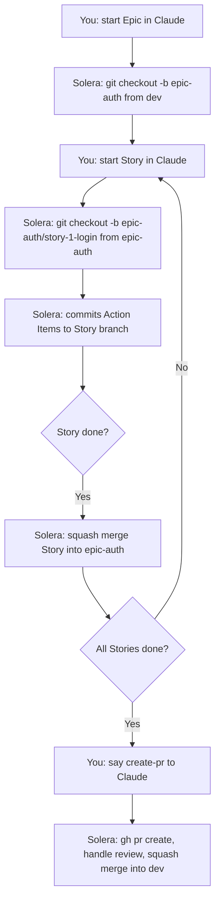

# Solera Team Workflow Guide

A practical guide for using Solera in a small team (2–5 contributors).

---

## Overview

Solera structures work as Phase → Goal → Epic → Story → Action Item, where each Epic gets its own branch and each Story gets a child branch off that Epic. When an Epic is done, the `create-pr` skill opens a pull request against `dev` or `main`, handles review cycles on the Epic branch, and squash-merges to keep history clean. The `handoff` skill runs automatically at session end and writes `HANDOFF.md` with exactly where work stands — what was done, what is next, and any blockers. This means Contributor B can open the repo cold and know precisely what to do without asking Contributor A, and the same developer returning from a break can resume without reconstructing context from scratch.

---

## Branch Strategy

### Branch hierarchy

| Level | Branch name pattern | Created by |
|---|---|---|
| Trunk | `main` or `dev` | Team (pre-existing) |
| Epic | `epic-[name]` | Solera automatically on Epic start |
| Story | `epic-[name]/story-[ID]-[name]` | Solera automatically on Story start |
| Action Item | commit only, no branch | Solera (committed to Story branch) |

### Merge direction

```
main / dev
  └── epic-auth                        ← squash merge via PR (create-pr skill)
        ├── epic-auth/story-1-login    ← squash merge into epic-auth (create-pr skill)
        └── epic-auth/story-2-logout   ← squash merge into epic-auth (create-pr skill)
```

### What Solera does automatically vs. what you do



**Solera creates automatically:** Epic branch, Story branches, Action Item commits, squash merges of Stories into Epic.

**You trigger:** Epic start, Story start, `create-pr` when Epic is complete.

---

## Handing Off Between Contributors

### Normal flow

**Contributor A — ending a session:**

When A's Claude Code session ends (or A runs the `handoff` skill manually), Solera:

1. Runs `git status --short`, `git diff --stat`, `git log --oneline -5`
2. Reads `progress.md` to get current Phase / Goal / Epic / Story
3. Overwrites `HANDOFF.md` at the project root

**Contributor B — starting a session:**

1. Pull the latest changes: `git pull`
2. Open `HANDOFF.md` at the project root
3. Tell Claude: "Read HANDOFF.md and resume where A left off"

Claude reads the file, checks out the correct branch, and continues from the exact step A stopped at.

### Example HANDOFF.md

```markdown
# Handoff

## Current work
Implementing OAuth login flow (Epic: auth). Story 2 (logout) is in progress —
session token invalidation is done, redirect after logout is not yet implemented.

## Skill status
- Skill: write-story
- Step: Execute (2 of 4 Action Items committed)

## Completed this session
- story-1-login: squash-merged into epic-auth
- Action items: add login endpoint, add JWT issuance, add session middleware

## Next steps
- Implement redirect-after-logout (Action Item 3 of story-2-logout)
- Add logout integration test (Action Item 4)
- Run `uv run pytest` before committing

## Key decisions
- Used httpOnly cookies instead of localStorage for token storage (XSS mitigation)
- Skipped refresh token for now — deferred to epic-auth-v2

## Reference files
- src/auth/logout.py
- tests/test_auth.py
- epic-auth/story-2-logout (current branch)

## Caveats
- `pytest tests/test_auth.py` has one flaky test (`test_concurrent_logout`) — skip it for now with `-k "not test_concurrent_logout"`

> Last updated: 2026-03-02 14:32:07
```

### Triggering handoff manually mid-session

If Contributor A needs to hand off before the session naturally ends:

> "Run handoff"

Claude executes the `handoff` skill immediately and writes `HANDOFF.md`. A can then commit or push the file if the team keeps it in git (see team setup section below).

---

## PR Workflow

### When to use `create-pr`

Trigger `create-pr` when:

- All Stories in the Epic are marked ✅ in `progress.md`
- Build and tests pass locally

Do not trigger it mid-Epic or mid-Story. The skill checks that all Stories are complete before opening the PR and will block if any are unfinished.

### How to trigger it

Tell Claude:

> "Run create-pr"

or, equivalently:

> "The epic is done, open a PR"

### What Solera does

1. Verifies all Stories in the Epic are ✅
2. Verifies build and tests pass (`uv run pytest` or equivalent)
3. Runs: `gh pr create --base dev --head epic-auth --title "[Epic] auth: add OAuth login and logout" --body "..."`
4. PR body includes: Stories list with status, key changes, test results
5. Monitors the PR for review comments
6. Applies requested fixes as additional commits on the Epic branch
7. Once approved: squash-merges into `dev`, deletes `epic-auth`

### What the reviewer does in GitHub

- Reviews the PR as normal (comments, request changes, approve)
- Does not need to touch branches directly — Solera handles fix commits
- Clicks "Merge" only if the team skips Solera's auto-merge; otherwise Solera merges after approval

### Why squash merge

Each Epic branch accumulates many small Action Item commits (one per atomic change). Squash merge collapses them into a single commit on `dev`/`main`, so the trunk history reads as one entry per Epic rather than dozens of implementation-detail commits. The full commit history remains on the Epic branch until it is deleted.

---

## Parallel Work Across Epics

Two contributors can work on separate Epics at the same time because each Epic is an independent branch.

**Example:**

- Contributor A: working on `epic-auth` (login / logout)
- Contributor B: working on `epic-dashboard` (metrics UI)

Both branches diverge from `dev` independently. Neither blocks the other.

**`progress.md` and `HANDOFF.md` in parallel work:**

- `progress.md` tracks the single canonical project state (Phase / Goal / Epic / Story). It is committed to git and shared. Each contributor reads it to understand where they are in the overall plan.
- `HANDOFF.md` is per-session and per-contributor. It reflects only one contributor's session. If both A and B write `HANDOFF.md` at the same time, they overwrite each other — this is expected if `HANDOFF.md` is kept out of git (see team setup below).

**Merge order:**

Whichever Epic finishes first runs `create-pr` and merges first. The other Epic may need to rebase onto `dev` afterward if there are conflicts:

```bash
git checkout epic-dashboard
git rebase dev
```

Solera does not auto-rebase — do this manually before running `create-pr` on the second Epic.

---

## Recommended Team Setup

- [ ] Keep `workspace/initiative/` in git — roadmap (`progress.md`), identity docs, and shared context that all contributors read
- [ ] Commit `progress.md` after each Epic is merged — it reflects permanent project state
- [ ] Decide on `HANDOFF.md` handling:
  - Add `HANDOFF.md` to `.gitignore` if each contributor's handoff is private (most teams)
  - Commit `HANDOFF.md` if the team wants shared session state (single active contributor at a time)
- [ ] Add Epic branch protection: require PR review before merging into `dev`/`main`
- [ ] Run `uv run pytest` (or equivalent) locally before triggering `create-pr` — Solera checks this but catching it early saves a round-trip
- [ ] Name Epics and Stories consistently: lowercase, hyphen-separated, no spaces (`epic-user-auth`, not `epic-UserAuth`)
