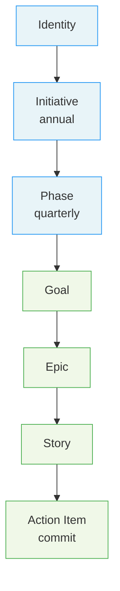

# Work Item Structure

## Overview

Solera organizes all project work into a seven-level hierarchy: Identity, Initiative, Phase, Goal, Epic, Story, and Action Item. The top three levels (Identity through Phase) are owned by humans and represent strategic decisions that cannot be automated — who the team is, what the annual objectives are, and what the quarterly plan delivers. The bottom four levels (Goal through Action Item) are owned by AI and represent the systematic decomposition of strategic intent into executable, traceable units of work down to individual commits. Every level produces a canonical artifact with its own `## Workflow` section, which `manage-workflow` reads and executes — no domain logic is hardcoded in the supervisor skill itself.

## Full Hierarchy Diagram



Blue nodes (Identity, Initiative, Phase) are created by humans. Green nodes (Goal, Epic, Story, Action Item) are created and executed by AI.

## Level Reference Table

| Level | Cadence | Responsibility | Skill | Produces |
|---|---|---|---|---|
| Identity | Once | Human | `write-identity` | `mission.md`, `core-values.md`, `vision_1.md` |
| Initiative | Annual | Human | (manual) | `initiative/{year}/goals.md` rough list |
| Phase | Quarterly | Human | `write-phase` | `phase/{id}/README.md` |
| Goal | Per goal | AI | `write-goal` | `_goal.md`, service map, persona(s) |
| Epic | Per epic | AI | `write-epic` | `_epic.md`, use cases, domain concepts |
| Story | Per story | AI | `write-story` | `_story.md`, `ACT-NNN-{name}.md` files |
| Action Item | Per commit | AI | `execute-action-item` | Code or doc changes + one git commit |

## Folder Layout

```
{project}/
├── progress.md                              <- overall tracking
└── workspace/
    ├── identity/                            <- Identity
    │   ├── mission.md
    │   ├── core-values.md
    │   └── vision_1.md
    ├── initiative/{year}/                   <- Initiative
    │   └── goals.md
    ├── phase/{phase}/                       <- Phase
    │   └── goals/{goal}/                    <- Goal
    │       ├── _goal.md
    │       ├── artifacts/                   <- working artifacts
    │       └── epics/                       <- Epic, Story, Action Item
    └── catalog/
        └── published/                       <- promoted artifacts
```

## Git Branch Strategy

| Level | Branch | Branch From |
|---|---|---|
| Epic | `epic-[name]` | parent branch |
| Story | `epic-[name]/story-[ID]-[name]` | epic branch |
| Action Item | — (commit only) | story branch |

Solera creates Epic and Story branches automatically when you start each level. Action Items are committed directly to the active Story branch with no additional branch created.

## Human vs AI Responsibilities

| | Human | AI |
|---|---|---|
| Levels | Identity, Initiative, Phase | Goal, Epic, Story, Action Item |
| Role | Strategic decisions, approval | Decomposition, document generation, implementation |
| Skills | `write-identity`, `write-phase` | `write-goal`, `write-epic`, `write-story`, `execute-action-item` |

## Lifecycle: Artifact Promotion

Artifacts are promoted incrementally as work completes, not in bulk at Goal completion:

- **Working:** `workspace/phase/{phase}/goals/{goal}/artifacts/`
- **Promoted:** `workspace/catalog/published/{type}/`

Promotion happens at two points via `transition-catalog`:

1. **After Goal Create** — Goal-level artifacts (service-map, persona, journey) are promoted immediately, making them available for the first Epic
2. **At each Epic Wrap-up** — Epic-level artifacts (use-case, concept) are promoted before the PR is created

By Goal Wrap-up, `artifacts/` should be empty. This incremental approach ensures each Epic can reference previously promoted artifacts and reduces the blast radius of any transition failure.
