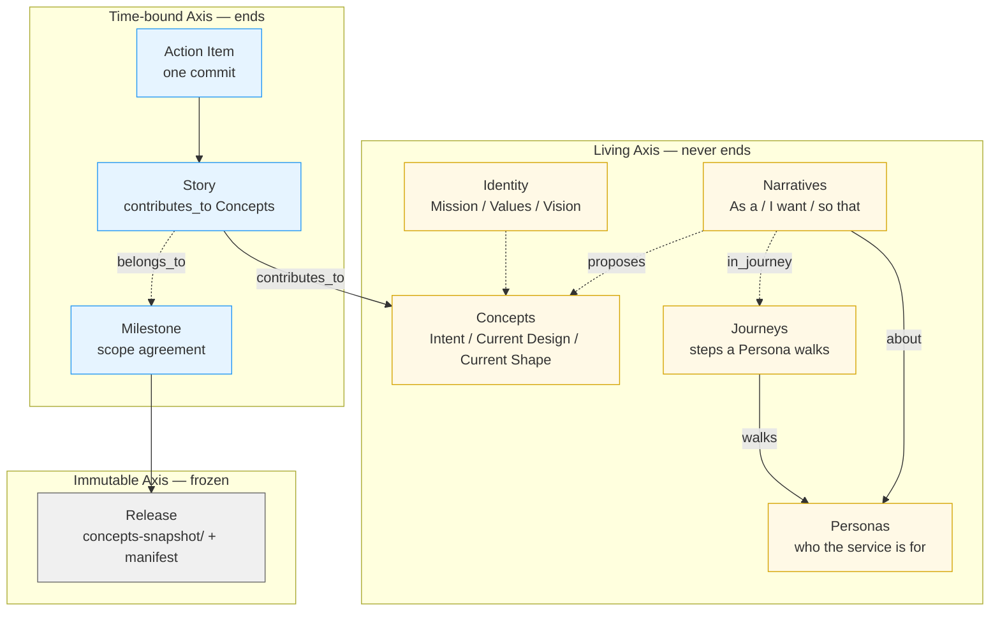
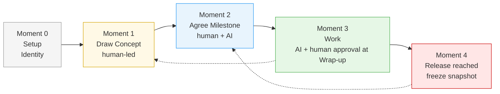

# Work Item Structure (v3)

<!-- SSOT: docs/reference/axes-and-status.md — do not redefine axes or status values here -->

## Overview

Solera organizes a project on **three axes** rather than a single time-ordered hierarchy. The axes are orthogonal — an item belongs to exactly one of them — and each has a different relationship to time.

**→ See [reference/axes-and-status.md](reference/axes-and-status.md) for the canonical axis and status definitions.** This document focuses on folder layout, branches, and the v2→v3 diff.

Humans own the Living axis (the drawing of the project map). AI executes the Time-bound axis (decomposing Stories into commit-sized Action Items). Human and AI collaborate at two critical moments: **Milestone Agreement** (scope) and **Story Wrap-up** (Concept Current Shape updates). Releases freeze the state of in-scope Concepts so the past stays retrievable.

## Three-Axis Diagram



**The Living axis splits into two clusters:**
- **User-side** (Personas, Journeys, Narratives) — who the service is for, how they live with it. **Upstream of Concepts.**
- **Product-side** (Identity, Concepts) — what we're building. Concepts grow out of Narratives or are drawn directly by humans.

## Items by Axis

Status values, transitions, and ownership tables live in [reference/axes-and-status.md](reference/axes-and-status.md). The cadence + skill mapping below is the only thing this file owns.

### Living Axis

| Item | Cadence | Skill |
|------|---------|-------|
| **Identity** | Once | `solera-write-identity` |
| **Persona** | Drawn upfront, evolves as understanding deepens | `solera-write-persona` |
| **Journey** | Drawn alongside Personas, evolves with each redesign | `solera-write-journey` |
| **Narrative** | Written ad-hoc, may propose Concepts | `solera-write-narrative` |
| **Concept** | Always active, evolves per Story Wrap-up | `solera-write-concept` |

A Concept never enters a "Complete" state. When it is no longer pursued, it is **deprecated** (kept visible for history) or **archived** (hidden from the active index, file preserved). The only path to "change the Intent" is archive-and-new. **Personas, Journeys, and Narratives follow the same lifecycle** — they never "complete," they evolve or get deprecated/archived.

Narratives `propose:` Concepts: a human writes "As a [Persona] I want [goal] so that [benefit]" and surfaces a candidate Concept from it. The Service canvas's "Propose as Concept" action creates a stub Concept whose `# Intent` is explicitly flagged "needs human review" — preserving the Moment 1 rule that AI may not invent Intent.

### Time-bound Axis

| Item | Cadence | Skill |
|------|---------|-------|
| **Milestone** | Per release cycle | `solera-write-milestone` |
| **Story** | Days | `solera-write-story` |
| **Action Item** | One commit | `solera-execute-action-item` |

Stories carry two mandatory relations:
- `contributes_to: [concept_id, …]` — at least one active Concept must be named. This is how Stories advance the Living map.
- `belongs_to: {milestone_id}` — optional. Stories may run outside any Milestone (exploration, research, bug fixes).

Action Items belong to exactly one Story. Their commit messages carry the Story's primary Concept as a tag: `[{primary_concept}][{story_id}][ACT-NNN] title`.

### Immutable Axis

| Item | Cadence | Skill |
|------|---------|-------|
| **Release** | When a Milestone is reached | `solera-release` |

A Release is a directory at `releases/{tag}/` containing:

- `README.md` — release notes (AI draft, human-approved, human has final word on wording).
- `concepts-snapshot/*.md` — verbatim copies of every in-scope Concept file at release time, each with a ❄️ immutability marker.
- `stories-manifest.md` — every Story that contributed, sorted by Story ID, with commit ranges.
- `.released` — machine-readable marker that tells other skills "do not edit anything here."

No skill edits files inside a written Release. Ever. To correct a mistake, cut a new release with a different tag.

## The Four Moments of Collaboration

Solera's core flow is **계획 → 일 → 결과 확정** (Plan → Work → Confirm). It expands into four moments where humans and AI meet:



| Moment | What happens | Who decides |
|--------|--------------|-------------|
| **0 — Setup** | Identity is written once | Human |
| **1 — Draw Concept** | Human provides Intent and Current Design; AI offers observations, never invents Intent | Human (AI assists) |
| **2 — Agree Milestone** | Human proposes scope; AI runs an analysis round (maturity, risks, dependencies, missing items); loop until agreed | Human + AI (AI analysis is non-negotiable) |
| **3 — Work** | Story is decomposed into Action Items; each commits; at Wrap-up, AI proposes Current Shape updates to each contributed Concept; human approves | AI drafts, human approves at Wrap-up |
| **4 — Release reached** | All Milestone Exit Criteria met → freeze Concepts into immutable snapshot + release notes | Human approves notes |

## Folder Layout

```
{project}/
└── .solera/
    ├── progress.md                       # current state on all three axes
    ├── HANDOFF.md                        # transient session state
    ├── identity/                         # Mission / Values / Vision
    ├── personas/                         # Living — who the service is for
    │   ├── _index.md
    │   └── {persona_id}.md
    ├── journeys/                         # Living — how a Persona moves
    │   ├── _index.md
    │   └── {journey_id}.md
    ├── narratives/                       # Living — As a / I want / so that
    │   ├── _index.md
    │   └── {narrative_id}.md
    ├── concepts/                         # Living — one file per Concept
    │   ├── _index.md
    │   └── {concept_id}.md
    ├── milestones/                       # Time-bound — agreements
    │   ├── _index.md
    │   └── {milestone_id}.md
    ├── stories/                          # Time-bound — flattened
    │   └── {story_id}-{story_name}/
    │       ├── _story.md
    │       ├── ACT-NNN-{name}.md
    │       ├── RETROSPECTIVE.md
    │       └── artifacts/                # staging for Story-produced design artifacts
    ├── releases/                         # Immutable snapshots
    │   ├── _index.md
    │   └── {release_tag}/
    │       ├── .released
    │       ├── README.md
    │       ├── concepts-snapshot/
    │       └── stories-manifest.md
    ├── team-process.md                   # gates, layers, architecture rules
    └── catalog/
        └── published/                    # promoted design artifacts (SSOT)
            ├── service-map/
            ├── use-case/
            └── domain-model/

**Note:** `catalog/published/persona/` and `catalog/published/journey/` from v3.x are removed in v4. Personas and Journeys are now first-class Living-axis files at `personas/` and `journeys/`, not catalog artifacts. Existing v3.x projects migrate via `solera-migrate-workspace-to-dotsolera` (which also relocates the workspace into `.solera/`).
```

**No `phase/`, no `initiative/`, no `goals/`, no `epics/`** — those v2 layers are removed. A v2 project migrates via `solera-migrate-v2`, which freezes the old data to `_v2-archive/` and proposes Concepts from the existing Goals/Epics.

## Git Branches

| Level | Branch pattern | Branched from |
|-------|----------------|---------------|
| Trunk | `main` or `dev` | — |
| Story | `story/{story_id}-{story_name}` | trunk |
| Action Item | **commit only, no branch** | — |

Epic branches (`epics/{name}`) and Story-under-Epic branches (`epics-{name}/story-{id}-{name}`) from v2 are gone. Stories branch directly from trunk.

## Status Values

See [reference/axes-and-status.md](reference/axes-and-status.md) for the authoritative status tables, transition rules, and icon legend. Short version: Stories/Action Items use emoji icons (⏳🔄✅⏸️❌), Concepts use `active`/`deprecated`/`archived`, Milestones use `proposed`/`agreed`/`in-progress`/`released`. These schemes differ deliberately — the Living axis has no "complete"; the Time-bound axis has no "active forever."

## What Changed from v2

| v2 | v3 |
|----|----|
| Single 7-layer hierarchy: Identity → Initiative → Phase → Goal → Epic → Story → Action Item | Three orthogonal axes: Living / Time-bound / Immutable |
| All layers below Identity were time-bound and completable | Identity **and** Concepts are living; only Stories / Milestones / Action Items are time-bound |
| Artifact promotion at Goal Create + Epic Wrap-up (two hooks) | Artifact promotion at Story Wrap-up (one hook), wired into contributed Concepts' Related Artifacts |
| No immutable past snapshots | Releases freeze Concepts at Milestone completion |
| `[epic-name][US-NNN][ACT-NNN] title` commit format | `[{primary_concept}][{story_id}][ACT-NNN] title` — history searchable by Concept |
| Goal produces domain "concept" artifacts | Artifact renamed to **domain-model** to free the word "Concept" for the living axis |

For migrating v2 data, see the migration guide at [migrate-v2-to-v3.md](./migrate-v2-to-v3.md) and the `solera-migrate-v2` skill.
