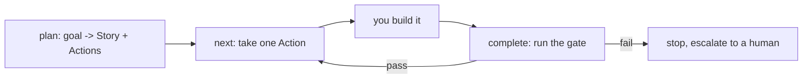

# Solera

Solera is a slim **harness**. It does not build anything itself — you (the agent)
do the building. Solera plans the work, hands you one chunk at a time, and runs a
deterministic **gate** to verify each chunk before moving on.

It works standalone, with or without Plot, over plain files under
`.noory/solera/` in the project directory.

## The loop



## Commands

Run the CLI from the project directory (gates run there):

```bash
uv run --directory "${CLAUDE_PLUGIN_ROOT}" solera --root "$PWD" <command>
```

| Command | What it does |
|---|---|
| `plan "<goal>"` | Create a Story; prints its id. See **solera-plan**. |
| `add <story> "<goal>" --gate "<cmd>"` | Add one gated Action to a Story. |
| `next` | Mark the next Action `doing` and print its instruction. See **solera-run**. |
| `complete` | Run the current Action's gate; pass -> `done`, fail -> stop. |
| `status` | Show the pointer and any integrity problems. |
| `retro <story> "<text>"` | Record what the design lacked. See **solera-retro**. |
| `feedback <id> "<text>"` | Record a blocker for a human. See **solera-feedback**. |

## Rules

- One Action = one chunk you can finish in a single context, with a gate that
  proves it is done.
- Never edit files under `.noory/solera/` by hand — use the commands, which keep
  the format valid.
- A gate that fails leaves the Action stuck on purpose. Fix the work and re-run
  `complete`, or write `feedback` and stop for a human.
