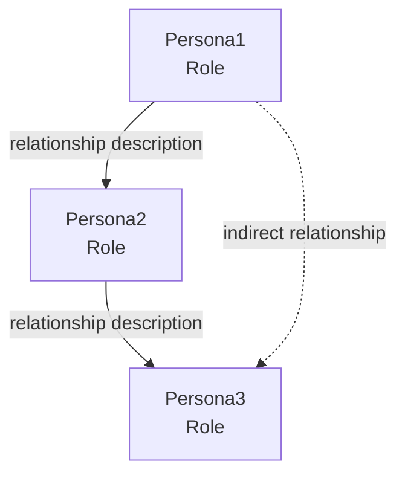
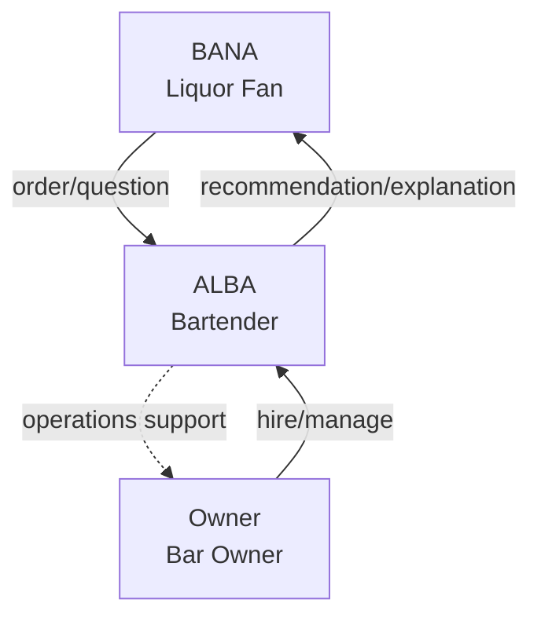

# Template: Persona Relationship

Defines the relationship map among personas.

## Template

```markdown
# Persona Relationship

> Last updated: [YYYY-MM-DD]

## Persona Summary

| Persona | Role | Core Goal |
|---------|------|-----------|
| [Persona1] | [role] | [goal] |
| [Persona2] | [role] | [goal] |

## Relationship Map



## Relationship Details

### [Persona1] ↔ [Persona2]

| Item | Details |
|------|---------|
| **Relationship Type** | [direct/indirect, mutual/one-way] |
| **Interaction** | [how they interact] |
| **Service Touchpoint** | [where they meet in the service] |

### [Persona2] ↔ [Persona3]

| Item | Details |
|------|---------|
| **Relationship Type** | [direct/indirect, mutual/one-way] |
| **Interaction** | [how they interact] |
| **Service Touchpoint** | [where they meet in the service] |

## Shared Journeys

| Journey | Related Personas | Description |
|---------|-----------------|-------------|
| [journey1] | P1, P2 | [reason they participate together] |

## Conflict Points

| Persona | Conflict | Resolution |
|---------|----------|-----------|
| P1 vs P2 | [conflict situation] | [service's resolution approach] |
```

## Quality Criteria

- [ ] Are all personas included in the relationship map?
- [ ] Are relationship types (direct/indirect) specified?
- [ ] Are service touchpoints defined?
- [ ] Are conflict points and resolutions included (when applicable)?
- [ ] Does the Mermaid diagram render correctly?

## Example

### BANAS Persona Relationship

```markdown
## Relationship Map



## Relationship Details

### BANA ↔ ALBA

| Item | Details |
|------|---------|
| **Relationship Type** | Direct, mutual |
| **Interaction** | Customer-bartender relationship, orders and recommendations |
| **Service Touchpoint** | Liquor information sharing, recommendation features |
```
