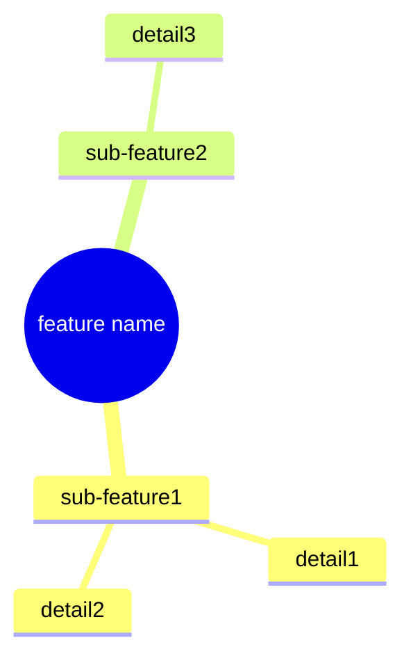
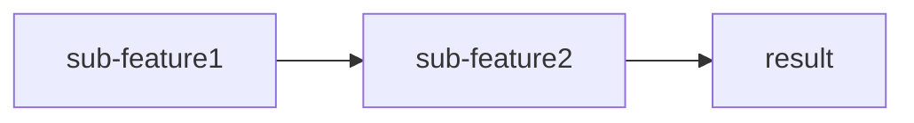
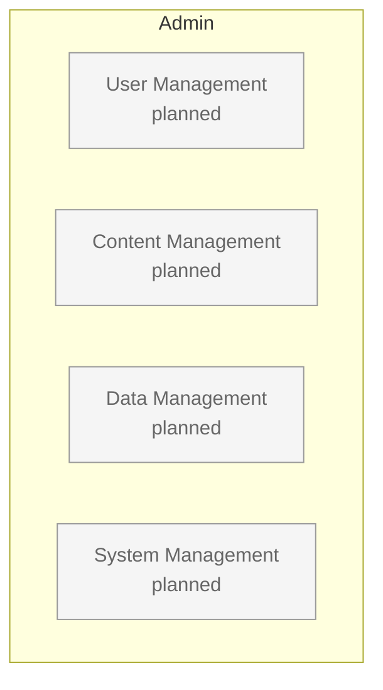

# Template: Service Map — Feature & Admin

> Parent: [service-map.md](service-map.md)

## Template: feature.md (sub-map)

```markdown
# Service Map: [feature name]

> Parent: [service name](../index.md)
> Last updated: [YYYY-MM-DD]

## Feature Definition

| Item | Details |
|------|---------|
| **Purpose** | [value this feature provides] |
| **Target** | [persona] |

## Feature Structure



## Feature Flow (when flow definition is needed)



## Sub-features

| Sub-feature | Description | Related Journey |
|-------------|-------------|----------------|
| [sub-feature 1] | [description] | [journey-name] |

## Admin Management Points

| Management Item | Description |
|----------------|-------------|
| **[management item 1]** | [description] |
| **[management item 2]** | [description] |

> Detail: [admin](../admin/)

## Related Documents

| Type | Document |
|------|----------|
| Journey | [journey-name](../../journey/planned/journey-name.md) |
| Use Case | [UC-001](../../use-case/UC-001.md) |
```

## Quality Criteria: feature.md

- [ ] Is there a parent map link (breadcrumb)?
- [ ] Is the feature purpose clearly stated?
- [ ] Is there an **Admin Management Points** section?
- [ ] Are related Journey and Use Case links present?

---

## Template: admin/index.md (admin index)

```markdown
# Service Map: Admin

> Parent: [service name](../index.md)
> Last updated: [YYYY-MM-DD]

## Admin Definition

| Item | Details |
|------|---------|
| **Purpose** | Back-office for service operations and management |
| **Target** | Operators |

## Management Areas



## Management Point Index

### User Management

| Management Point | Related Feature | Detail |
|-----------------|----------------|--------|
| [management point] | [feature](../platform/feature.md) | [description] |

### Content Management

| Management Point | Related Feature | Detail |
|-----------------|----------------|--------|
| [management point] | [feature](../platform/feature.md) | [description] |

### Data Management (by vertical)

| Vertical | Managed Data | Detail |
|---------|-------------|--------|
| [vertical name] | [data](../vertical/name/feature.md) | [description] |

### System Management

| Management Point | Description |
|-----------------|-------------|
| Announcements | Global/vertical-specific announcements |
| FAQ | Frequently asked questions |
| Terms/Policies | Terms of service, privacy policy |

## Automation Principles

| Principle | Description |
|-----------|-------------|
| **Minimal input** | Admins enter only essential values |
| **Auto-derivation** | The system calculates everything else |
| **Exception handling** | Manual intervention is reserved for edge cases |

> See the "Admin Management Points" section of each feature document for detailed management points

## Related Documents

| Type | Document |
|------|----------|
| Platform | [features...](../platform/) |
| Vertical | [verticals...](../vertical/) |
```

## Quality Criteria: admin/index.md

- [ ] Are all management areas represented in the diagram?
- [ ] Are management points linked to their related features?
- [ ] Are automation principles defined?
