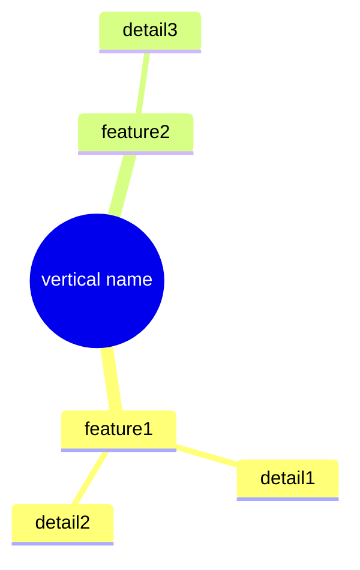

# Template: Service Map — Vertical

> Parent: [service-map.md](service-map.md)

## Template: vertical/[name]/index.md

```markdown
# Service Map: [vertical name] (Vertical)

> Parent: [service name](../../index.md)
> Last updated: [YYYY-MM-DD]

## Vertical Definition

| Item | Details |
|------|---------|
| **Purpose** | [value this vertical provides] |
| **Target** | [persona] |

## Feature Structure



## Feature Flow (when flow definition is needed)


## Feature List

| Feature | Description | Status | Version | Detail |
|---------|-------------|--------|---------|--------|
| **[feature1]** | [description] | not implemented | - | [→](./feature1.md) |

## [Persona] Membership Policy

> A period-based policy that applies equally to all verticals

### Base Policy

| Join Timing | Membership | Description |
|-------------|-----------|-------------|
| **Recruitment period** (first 3 months after vertical open) | **1 year free** | Early bird benefit |
| **Normal operation** (thereafter) | **Lowest store subscription price** | Anti-abuse |

### Admin Management Points

| Management Item | Description | Automation |
|----------------|-------------|-----------|
| **Vertical open date** | Set as start of recruitment period | Manual |
| **Recruitment period end date** | Automatically calculated as open date + 3 months | Automatic |
| **Recruitment period status** | Recruiting / Normal operation | Auto-transition |
| **Membership assignment** | Auto-assign membership based on join timing | Automatic |

> Only the vertical open date needs to be set; everything else is handled automatically
>
> Detail: [admin](../../admin/)

## Related Documents

| Type | Document |
|------|----------|
| Persona | [persona](../../persona/name.md) |
| Journey | [journey](../../journey/planned/journey.md) |
```

## Quality Criteria: vertical/index.md

- [ ] Is the vertical definition clearly stated?
- [ ] Is the membership policy defined?
- [ ] Are admin management points defined?
- [ ] Are status and version annotated in the feature list?
