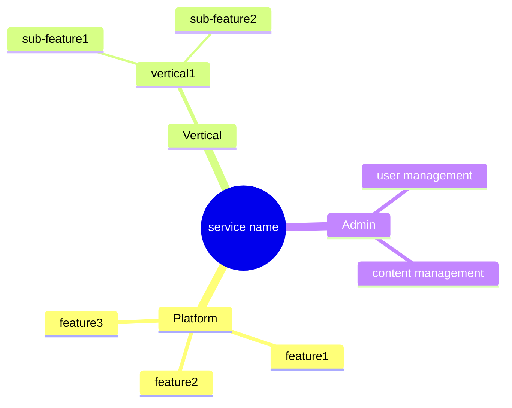
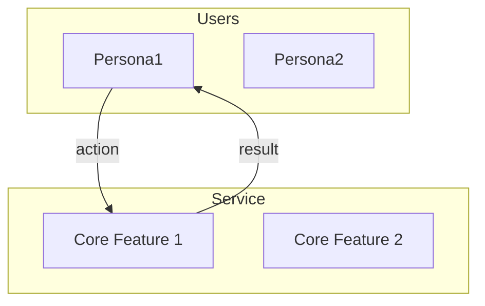

# Template: Service Map

Defines the overall picture of the service from a business and user perspective, not a technical one.

## Structure

The Service Map is maintained as a **hierarchical structure**.

```
catalog/service-map/
├── index.md              # Overall picture (top level)
├── admin/                # Admin (operations/management)
│   └── index.md          # Management point index
├── platform/             # Platform common features
│   ├── [feature].md
│   └── ...
└── vertical/             # Vertical-specific features
    └── [vertical-name]/
        ├── index.md      # Vertical overview
        └── [feature].md
```

### Expandable Folder Structure

When a feature grows large enough, expand the file into a folder:

| Before | After |
|--------|-------|
| `feature.md` | `feature/index.md` |
| - | `feature/sub-feature.md` |

## Cross-Hierarchy Links

| Document | Contents |
|----------|----------|
| **Parent map** | Sub-map list + links |
| **Sub-map** | Reference to parent map (breadcrumb) |

## Diagram Usage Principles

| Purpose | Diagram | Description |
|---------|---------|-------------|
| **Structure/hierarchy** | mindmap | Conveys the overall structure at a glance |
| **Flow/relationships** | flowchart | Expresses connections, dependencies, and data flows |
| **Status/version** | table | Tracks implementation status and version info |

> mindmap = **structural overview**, flowchart = **relationship/flow expression**, detailed info = **managed in tables**
> Mermaid authoring rules: [references/mermaid-service-map.md](../references/mermaid-service-map.md)

## Template: index.md (top level)

```markdown
# Service Map: [service name]

> Last updated: [YYYY-MM-DD]

## Service One-liner

A service that provides [what] for [whom]

## Service Structure



## User Flow



## Core Features

### Platform Common

| Feature | Description | Target | Detail |
|---------|-------------|--------|--------|
| **[Feature 1]** | [description] | [persona] | [→](./platform/feature1.md) |

### Vertical: [vertical name]

| Feature | Description | Target | Detail |
|---------|-------------|--------|--------|
| **[Feature 1]** | [description] | [persona] | [→](./vertical/name/feature1.md) |

## Value Delivered

| Persona | Core Value | Description |
|---------|-----------|-------------|
| [Persona1] | [value] | [description] |

## Service Boundaries

### In Scope

- [included feature 1]
- [included feature 2]

### Out of Scope

| Item | Reason |
|------|--------|
| [excluded feature 1] | [reason] |
```

## Quality Criteria: index.md

- [ ] Is the service one-liner clear?
- [ ] Are all personas included?
- [ ] Are the core features organized into 3–7 items?
- [ ] Does each feature have a sub-map link?
- [ ] Are admin items included in the core features?
- [ ] Are the service boundaries (In/Out Scope) clearly stated?

## Sub-map Templates

| Type | File |
|------|------|
| Feature/Admin | [service-map-sub.md](service-map-sub.md) |
| Vertical | [service-map-vertical.md](service-map-vertical.md) |
