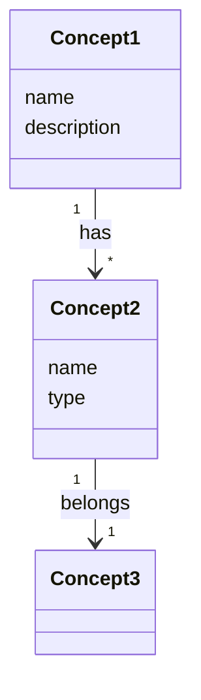

# Template: Concept

Defines domain concepts (Entity, attributes, relationships).

## Domain Overview Template

```markdown
# Domain: [domain name]

> Last updated: [YYYY-MM-DD]

## Core Concepts

| Concept | Description | Relationship |
|---------|-------------|-------------|
| **[Concept1]** | [description] | [relationship summary] |
| **[Concept2]** | [description] | [relationship summary] |

## Relationship Diagram



## Concept Details

→ [entities/concept1.md](./entities/concept1.md)
→ [entities/concept2.md](./entities/concept2.md)

## Use Case Links

| Concept | Related Use Cases |
|---------|------------------|
| Concept1 | UC-001, UC-002 |
| Concept2 | UC-002, UC-003 |
```

## Entity Detail Template

```markdown
# Entity: [entity name]

> Last updated: [YYYY-MM-DD]

## Purpose

[Why is this Entity needed?]

## Attributes

| Attribute | Description | Required | Example |
|-----------|-------------|----------|---------|
| `name` | Name | Y | "Glenfiddich 12 Year" |
| `description` | Description | N | "Speyside single malt" |

## Relationships

| Relationship | Target Entity | Cardinality | Description |
|-------------|--------------|-------------|-------------|
| belongs_to | [Entity] | N:1 | [description] |
| has_many | [Entity] | 1:N | [description] |

## Business Rules

- [rule 1]
- [rule 2]

## Data Example

```json
{
  "name": "Glenfiddich 12 Year",
  "description": "Speyside representative single malt whisky",
  "abv": 40.0
}
```

## Related Use Cases

- UC-001: [Use Case title]
- UC-002: [Use Case title]
```

## Quality Criteria

### Domain Overview

- [ ] Are all core concepts listed?
- [ ] Are all relationships represented in the Class Diagram?
- [ ] Are concepts linked to Use Cases?

### Entity Detail

- [ ] Is the purpose clear?
- [ ] Do all attributes have descriptions and examples?
- [ ] Is cardinality specified in relationships?
- [ ] Are business rules defined?
- [ ] Does the data example reflect the actual domain?

## Example

### liquor-db - Liquor Entity

```markdown
# Entity: Liquor

## Purpose

Stores and provides information about liquor products.

## Attributes

| Attribute | Description | Required | Example |
|-----------|-------------|----------|---------|
| `name` | Product name (Korean) | Y | "Glenfiddich 12 Year" |
| `nameEn` | Product name (English) | N | "Glenfiddich 12 Year" |
| `categoryMain` | Main category | Y | "distilled" |
| `categorySub` | Sub-category | Y | "whisky" |
| `abv` | Alcohol by volume (%) | Y | 40.0 |
| `age` | Age statement (years) | N | 12 |

## Relationships

| Relationship | Target Entity | Cardinality | Description |
|-------------|--------------|-------------|-------------|
| belongs_to | Brand | N:1 | Belongs to brand |
| belongs_to | Producer | N:1 | Belongs to producer |
| has_one | TastingNote | 1:1 | Has tasting note |

## Business Rules

- abv must be a value between 0 and 100
- If age is null, the product is NAS (No Age Statement)
- categoryMain and categorySub must use only defined enum values
```
