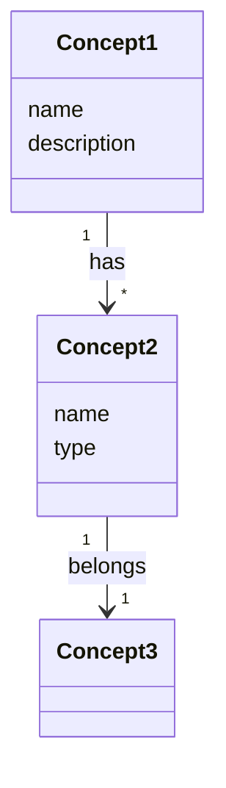

# Template: Concept

도메인 개념(Entity, 속성, 관계)을 정의합니다.

## 도메인 개요 템플릿

```markdown
# Domain: [도메인명]

> 마지막 업데이트: [YYYY-MM-DD]

## 핵심 개념

| 개념 | 설명 | 관계 |
|------|------|------|
| **[Concept1]** | [설명] | [관계 요약] |
| **[Concept2]** | [설명] | [관계 요약] |

## 관계 다이어그램



## 개념별 상세

→ [entities/concept1.md](./entities/concept1.md)
→ [entities/concept2.md](./entities/concept2.md)

## Use Case 연결

| 개념 | 관련 Use Case |
|------|--------------|
| Concept1 | UC-001, UC-002 |
| Concept2 | UC-002, UC-003 |
```

## Entity 상세 템플릿

```markdown
# Entity: [Entity명]

> 마지막 업데이트: [YYYY-MM-DD]

## 목적

[왜 이 Entity가 필요한가?]

## 속성

| 속성 | 설명 | 필수 | 예시 |
|------|------|------|------|
| `name` | 이름 | Y | "글렌피딕 12년" |
| `description` | 설명 | N | "스페이사이드 싱글몰트" |

## 관계

| 관계 | 대상 Entity | 카디널리티 | 설명 |
|------|------------|-----------|------|
| belongs_to | [Entity] | N:1 | [설명] |
| has_many | [Entity] | 1:N | [설명] |

## 비즈니스 규칙

- [규칙 1]
- [규칙 2]

## 데이터 예시

```json
{
  "name": "글렌피딕 12년",
  "description": "스페이사이드 대표 싱글몰트 위스키",
  "abv": 40.0
}
```

## 관련 Use Case

- UC-001: [Use Case 제목]
- UC-002: [Use Case 제목]
```

## 품질 기준

### 도메인 개요

- [ ] 모든 핵심 개념이 나열되어 있는가?
- [ ] Class Diagram에 모든 관계가 표현되어 있는가?
- [ ] Use Case와 연결되어 있는가?

### Entity 상세

- [ ] 목적이 명확한가?
- [ ] 모든 속성에 설명과 예시가 있는가?
- [ ] 관계에 카디널리티가 명시되어 있는가?
- [ ] 비즈니스 규칙이 정의되어 있는가?
- [ ] 데이터 예시가 실제 도메인을 반영하는가?

## 예시

### liquor-db - Liquor Entity

```markdown
# Entity: Liquor

## 목적

주류 제품의 정보를 저장하고 제공한다.

## 속성

| 속성 | 설명 | 필수 | 예시 |
|------|------|------|------|
| `name` | 제품명 (한글) | Y | "글렌피딕 12년" |
| `nameEn` | 제품명 (영문) | N | "Glenfiddich 12 Year" |
| `categoryMain` | 대분류 | Y | "distilled" |
| `categorySub` | 중분류 | Y | "whisky" |
| `abv` | 도수 (%) | Y | 40.0 |
| `age` | 숙성연수 | N | 12 |

## 관계

| 관계 | 대상 Entity | 카디널리티 | 설명 |
|------|------------|-----------|------|
| belongs_to | Brand | N:1 | 브랜드 소속 |
| belongs_to | Producer | N:1 | 제조사 소속 |
| has_one | TastingNote | 1:1 | 테이스팅 노트 |

## 비즈니스 규칙

- abv는 0~100 사이의 값이어야 함
- age가 null이면 NAS(No Age Statement)
- categoryMain과 categorySub는 정해진 enum 값만 허용
```
