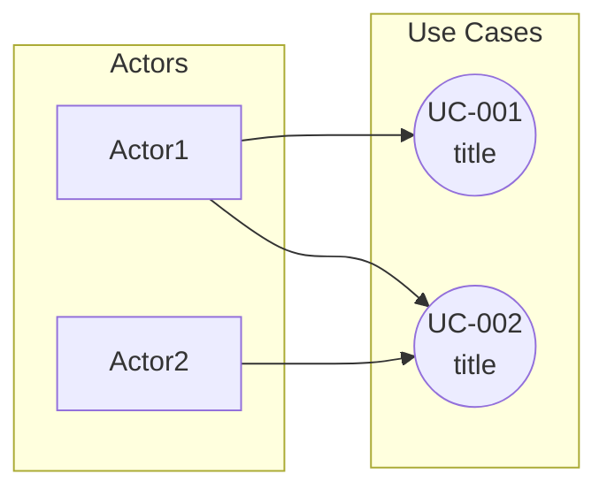

# Template: Use Case

Defines API/feature usage scenarios.

## Template

```markdown
# Use Case: [UC-ID] [title]

> Last updated: [YYYY-MM-DD]

## Overview

| Item | Details |
|------|---------|
| **ID** | UC-[NNN] |
| **Title** | [Use Case title] |
| **Actor** | [user/system] |
| **Goal** | [goal to achieve] |

## Preconditions

- [condition 1]
- [condition 2]

## Basic Flow

1. [Actor] [action]
2. System [response]
3. [Actor] [action]
4. System [returns result]

## Alternative Flow

### When [condition]

1. [alternative action]
2. [alternative result]

## Exception Flow

### [error condition]

1. System displays [error message]
2. [recovery method]

## Postconditions

- [result state 1]
- [result state 2]

## Required Data

| Data | Entity | Attributes |
|------|--------|-----------|
| [data1] | [entity name] | [attribute list] |
| [data2] | [entity name] | [attribute list] |

## Related Journey

- [Journey name] Step [N]
```

## Use Case List Template

```markdown
# Use Cases

> Last updated: [YYYY-MM-DD]

## List

| ID | Title | Actor | Priority | Status |
|----|-------|-------|----------|--------|
| UC-001 | [title] | [Actor] | High | defined |
| UC-002 | [title] | [Actor] | Medium | defined |

## Use Case Diagram



## Detail

→ [UC-001.md](./UC-001.md)
→ [UC-002.md](./UC-002.md)
```

## Quality Criteria

- [ ] Is the Actor clearly defined? (person/system)
- [ ] Is the Goal measurable?
- [ ] Are preconditions defined?
- [ ] Is the basic flow defined step by step?
- [ ] Is the exception flow defined?
- [ ] Is required data linked to Entities?

## Example

### liquor-db - Liquor Search Use Case

```markdown
# Use Case: UC-001 Liquor Search

## Overview

| Item | Details |
|------|---------|
| **ID** | UC-001 |
| **Title** | Liquor Search |
| **Actor** | API consumer (service) |
| **Goal** | Retrieve a list of liquors matching given conditions |

## Preconditions

- API authentication complete (if applicable)

## Basic Flow

1. Consumer calls API with search conditions (name, category, tags)
2. System searches for liquors matching the conditions
3. System returns the liquor list (with pagination)

## Alternative Flow

### When no search results are found

1. System returns an empty array
2. Meta information includes total: 0

## Exception Flow

### Invalid parameters

1. System returns 400 Bad Request
2. Error message specifies the invalid parameter

## Required Data

| Data | Entity | Attributes |
|------|--------|-----------|
| Liquor info | Liquor | name, category, tags, abv |
| Brand info | Brand | name |
```
