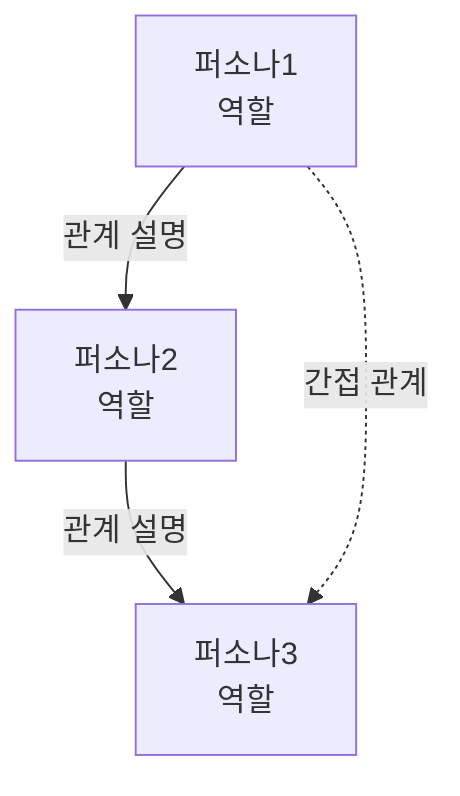
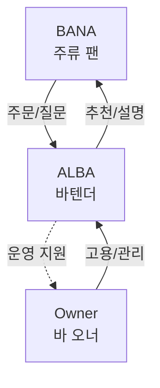

# Template: Persona Relationship

퍼소나 간 관계도를 정의합니다.

## 템플릿

```markdown
# Persona Relationship

> 마지막 업데이트: [YYYY-MM-DD]

## 퍼소나 요약

| 퍼소나 | 역할 | 핵심 목표 |
|--------|------|----------|
| [퍼소나1] | [역할] | [목표] |
| [퍼소나2] | [역할] | [목표] |

## 관계도



## 관계 상세

### [퍼소나1] ↔ [퍼소나2]

| 항목 | 내용 |
|------|------|
| **관계 유형** | [직접/간접, 상호/일방향] |
| **상호작용** | [어떻게 상호작용하는가] |
| **서비스 내 접점** | [서비스에서 만나는 지점] |

### [퍼소나2] ↔ [퍼소나3]

| 항목 | 내용 |
|------|------|
| **관계 유형** | [직접/간접, 상호/일방향] |
| **상호작용** | [어떻게 상호작용하는가] |
| **서비스 내 접점** | [서비스에서 만나는 지점] |

## 공통 Journey

| Journey | 관련 퍼소나 | 설명 |
|---------|------------|------|
| [journey1] | P1, P2 | [함께 참여하는 이유] |

## 갈등 포인트

| 퍼소나 | 갈등 | 해결 방안 |
|--------|------|----------|
| P1 vs P2 | [갈등 상황] | [서비스의 해결 방안] |
```

## 품질 기준

- [ ] 모든 퍼소나가 관계도에 포함되어 있는가?
- [ ] 관계 유형(직접/간접)이 명시되어 있는가?
- [ ] 서비스 내 접점이 정의되어 있는가?
- [ ] 갈등 포인트와 해결 방안이 있는가? (있는 경우)
- [ ] Mermaid 다이어그램이 렌더링되는가?

## 예시

### BANAS Persona Relationship

```markdown
## 관계도



## 관계 상세

### BANA ↔ ALBA

| 항목 | 내용 |
|------|------|
| **관계 유형** | 직접, 상호 |
| **상호작용** | 손님-바텐더 관계, 주문 및 추천 |
| **서비스 내 접점** | 주류 정보 공유, 추천 기능 |
```
