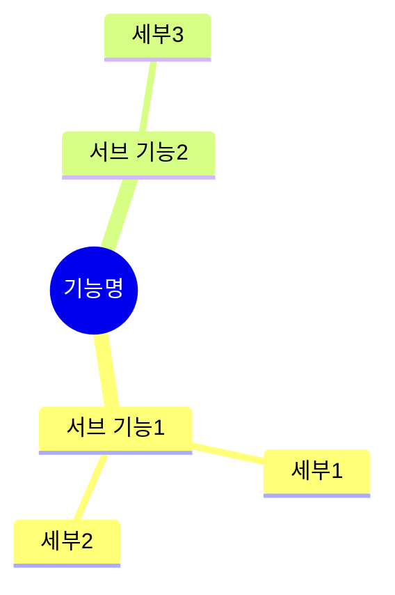
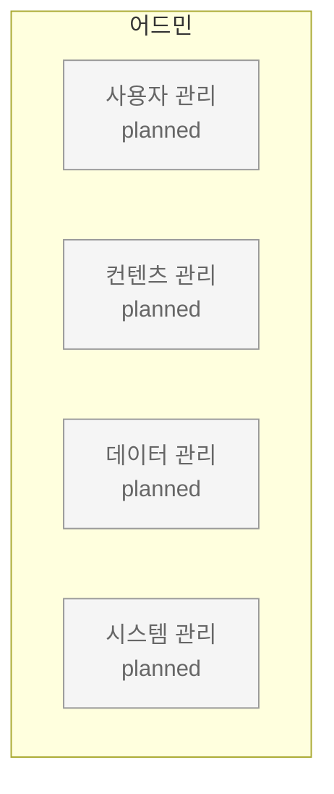

# Template: Service Map — Feature & Admin

> 상위: [service-map.md](service-map.md)

## 템플릿: feature.md (하위 맵)

```markdown
# Service Map: [기능명]

> 상위: [서비스명](../index.md)
> 마지막 업데이트: [YYYY-MM-DD]

## 기능 정의

| 항목 | 내용 |
|------|------|
| **목적** | [이 기능이 제공하는 가치] |
| **대상** | [퍼소나] |

## 기능 구조



## 기능 흐름 (흐름 정의가 필요한 경우)


## 서브 기능

| 서브 기능 | 설명 | 관련 Journey |
|----------|------|-------------|
| [서브 기능 1] | [설명] | [journey-name] |

## 어드민 관리 포인트

| 관리 항목 | 설명 |
|----------|------|
| **[관리 항목 1]** | [설명] |
| **[관리 항목 2]** | [설명] |

> 상세: [어드민](../admin/)

## 관련 문서

| 유형 | 문서 |
|------|------|
| Journey | [journey-name](../../journey/planned/journey-name.md) |
| Use Case | [UC-001](../../use-case/UC-001.md) |
```

## 품질 기준: feature.md

- [ ] 상위 맵 링크(breadcrumb)가 있는가?
- [ ] 기능 목적이 명확한가?
- [ ] **어드민 관리 포인트** 섹션이 있는가?
- [ ] 관련 Journey/Use Case 링크가 있는가?

---

## 템플릿: admin/index.md (어드민 인덱스)

```markdown
# Service Map: 어드민

> 상위: [서비스명](../index.md)
> 마지막 업데이트: [YYYY-MM-DD]

## 어드민 정의

| 항목 | 내용 |
|------|------|
| **목적** | 서비스 운영 및 관리를 위한 백오피스 |
| **대상** | 운영자 |

## 관리 영역



## 관리 포인트 인덱스

### 사용자 관리

| 관리 포인트 | 관련 기능 | 상세 |
|------------|----------|------|
| [관리 포인트] | [기능](../platform/feature.md) | [설명] |

### 컨텐츠 관리

| 관리 포인트 | 관련 기능 | 상세 |
|------------|----------|------|
| [관리 포인트] | [기능](../platform/feature.md) | [설명] |

### 데이터 관리 (버티컬별)

| 버티컬 | 관리 데이터 | 상세 |
|--------|-----------|------|
| [버티컬명] | [데이터](../vertical/name/feature.md) | [설명] |

### 시스템 관리

| 관리 포인트 | 설명 |
|------------|------|
| 공지사항 | 전체/버티컬별 공지 |
| FAQ | 자주 묻는 질문 |
| 약관/정책 | 이용약관, 개인정보처리방침 |

## 자동화 원칙

| 원칙 | 설명 |
|------|------|
| **최소 입력** | 관리자는 핵심 값만 입력 |
| **자동 파생** | 나머지는 시스템이 계산 |
| **예외 처리** | 수동 개입은 예외 케이스만 |

> 세부 관리 포인트는 각 기능 문서의 "어드민 관리 포인트" 섹션 참조

## 관련 문서

| 유형 | 문서 |
|------|------|
| 플랫폼 | [기능들...](../platform/) |
| 버티컬 | [버티컬들...](../vertical/) |
```

## 품질 기준: admin/index.md

- [ ] 모든 관리 영역이 다이어그램에 표시되어 있는가?
- [ ] 관리 포인트가 관련 기능과 연결되어 있는가?
- [ ] 자동화 원칙이 정의되어 있는가?
