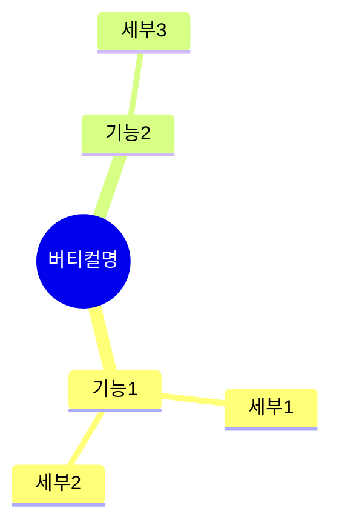
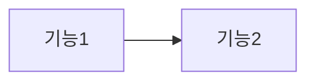

# Template: Service Map — Vertical

> 상위: [service-map.md](service-map.md)

## 템플릿: vertical/[name]/index.md

```markdown
# Service Map: [버티컬명] (버티컬)

> 상위: [서비스명](../../index.md)
> 마지막 업데이트: [YYYY-MM-DD]

## 버티컬 정의

| 항목 | 내용 |
|------|------|
| **목적** | [이 버티컬이 제공하는 가치] |
| **대상** | [퍼소나] |

## 기능 구조



## 기능 흐름 (흐름 정의가 필요한 경우)



## 기능 목록

| 기능 | 설명 | 상태 | 버전 | 상세 |
|------|------|------|------|------|
| **[기능1]** | [설명] | 미구현 | - | [→](./feature1.md) |

## [퍼소나] 멤버십 정책

> 모든 버티컬에 동일하게 적용되는 기간 기준 정책

### 기본 정책

| 가입 시점 | 멤버십 | 설명 |
|----------|--------|------|
| **모집기** (버티컬 오픈 후 3개월) | **1년 무료** | 얼리버드 혜택 |
| **정상 운영** (이후) | **스토어 최저가 구독** | 어뷰징 방지 |

### 어드민 관리 포인트

| 관리 항목 | 설명 | 자동화 |
|----------|------|--------|
| **버티컬 오픈일** | 모집기 시작 기준일 설정 | 수동 |
| **모집기 종료일** | 오픈일 + 3개월 자동 계산 | 자동 |
| **모집기 상태** | 모집 중 / 정상 운영 | 자동 전환 |
| **멤버십 적용** | 가입 시점에 따른 멤버십 자동 부여 | 자동 |

> 버티컬 오픈일만 설정하면 나머지는 자동 처리
>
> 상세: [어드민](../../admin/)

## 관련 문서

| 유형 | 문서 |
|------|------|
| Persona | [퍼소나](../../persona/name.md) |
| Journey | [journey](../../journey/planned/journey.md) |
```

## 품질 기준: vertical/index.md

- [ ] 버티컬 정의가 명확한가?
- [ ] 멤버십 정책이 정의되어 있는가?
- [ ] 어드민 관리 포인트가 정의되어 있는가?
- [ ] 기능 목록에 상태/버전이 표기되어 있는가?
