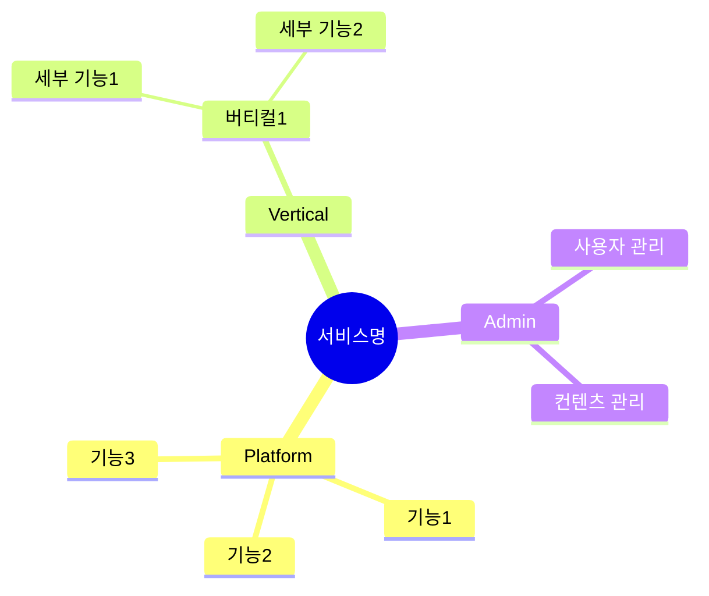
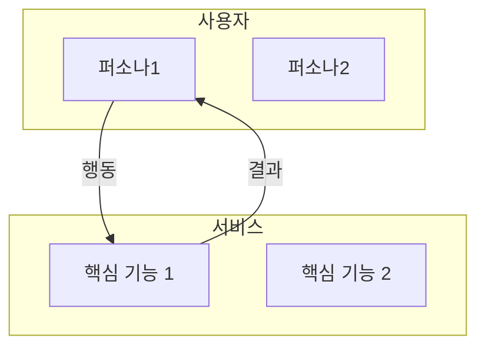

# Template: Service Map

서비스 전체 그림을 정의합니다. (기술적 X, 비즈니스/사용자 관점)

## 구조

Service Map은 **계층 구조**로 관리됩니다.

```
catalog/service-map/
├── index.md              # 전체 그림 (최상위)
├── admin/                # 어드민 (운영/관리)
│   └── index.md          # 관리 포인트 인덱스
├── platform/             # 플랫폼 공통 기능
│   ├── [feature].md
│   └── ...
└── vertical/             # 버티컬 특화 기능
    └── [vertical-name]/
        ├── index.md      # 버티컬 개요
        └── [feature].md
```

### 확장 가능한 폴더 구조

기능이 커지면 파일을 폴더로 확장합니다:

| 전 | 후 |
|---|---|
| `feature.md` | `feature/index.md` |
| - | `feature/sub-feature.md` |

## 계층 간 연결

| 문서 | 포함 내용 |
|------|----------|
| **상위 맵** | 하위 맵 목록 + 링크 |
| **하위 맵** | 상위 맵 참조 (breadcrumb) |

## 다이어그램 사용 원칙

| 용도 | 다이어그램 | 설명 |
|------|-----------|------|
| **구조/계층** | mindmap | 전체 구조를 한눈에 파악 |
| **흐름/관계** | flowchart | 연결, 의존성, 데이터 흐름 표현 |
| **상태/버전** | 표 | 구현 상태, 버전 정보 관리 |

> mindmap은 **구조 파악용**, flowchart는 **관계/흐름 표현용**, 상세 정보는 **표로 관리**
> Mermaid 작성 규칙: [references/mermaid-service-map.md](../references/mermaid-service-map.md)

## 템플릿: index.md (최상위)

```markdown
# Service Map: [서비스명]

> 마지막 업데이트: [YYYY-MM-DD]

## 서비스 한 줄 정의

[누구]를 위한 [무엇]을 제공하는 서비스

## 서비스 구조



## 사용자 흐름



## 핵심 기능

### 플랫폼 공통

| 기능 | 설명 | 대상 | 상세 |
|------|------|------|------|
| **[기능 1]** | [설명] | [퍼소나] | [→](./platform/feature1.md) |

### 버티컬: [버티컬명]

| 기능 | 설명 | 대상 | 상세 |
|------|------|------|------|
| **[기능 1]** | [설명] | [퍼소나] | [→](./vertical/name/feature1.md) |

## 제공 가치

| 퍼소나 | 핵심 가치 | 설명 |
|--------|----------|------|
| [퍼소나1] | [가치] | [설명] |

## 서비스 경계

### 포함 (In Scope)

- [포함 기능 1]
- [포함 기능 2]

### 제외 (Out of Scope)

| 항목 | 이유 |
|------|------|
| [제외 기능 1] | [이유] |
```

## 품질 기준: index.md

- [ ] 서비스 한 줄 정의가 명확한가?
- [ ] 모든 퍼소나가 포함되어 있는가?
- [ ] 핵심 기능이 3~7개로 정리되어 있는가?
- [ ] 각 기능에 하위 맵 링크가 있는가?
- [ ] 어드민 항목이 핵심 기능에 포함되어 있는가?
- [ ] 서비스 경계(In/Out Scope)가 명확한가?

## 하위 맵 템플릿

| 유형 | 파일 |
|------|------|
| Feature/Admin | [service-map-sub.md](service-map-sub.md) |
| Vertical | [service-map-vertical.md](service-map-vertical.md) |
