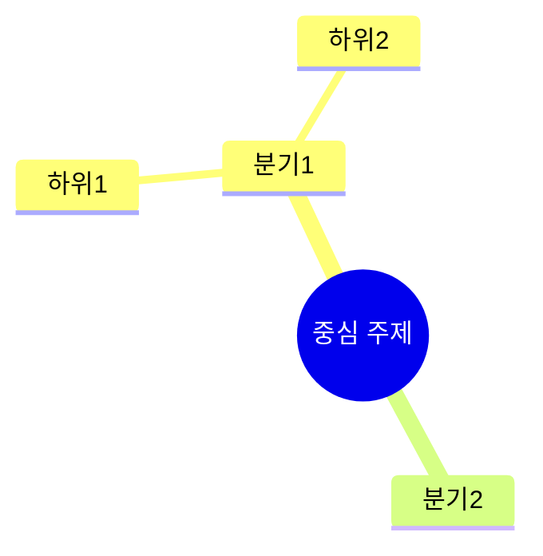
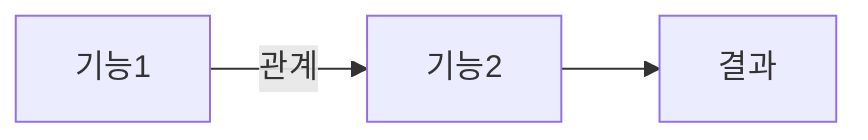
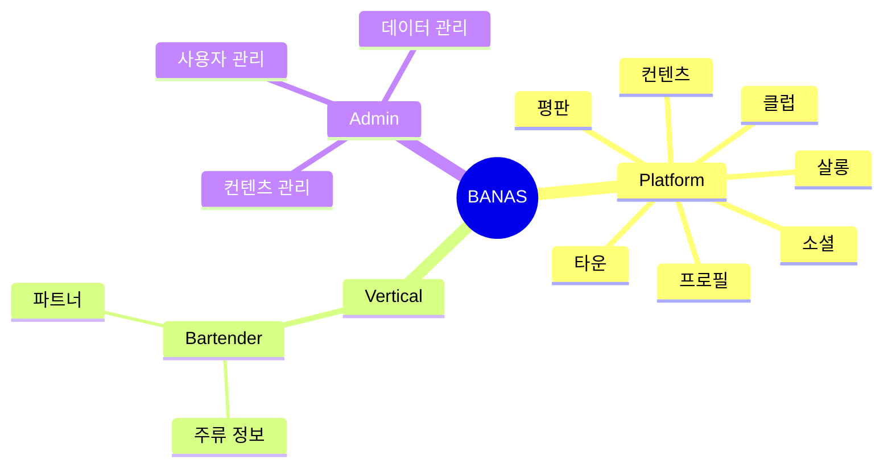
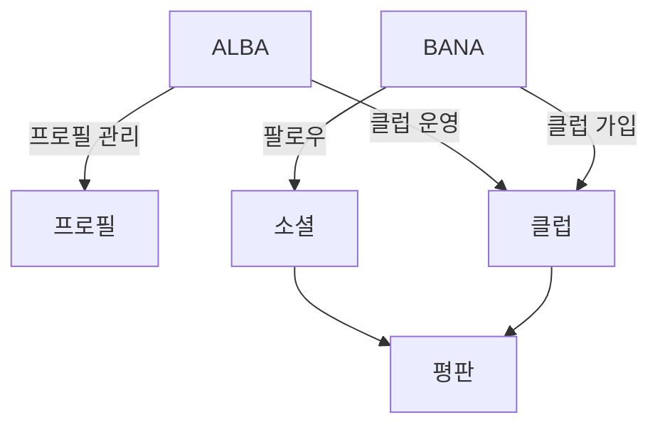

# Mermaid 작성 규칙: Service Map

> Service Map 문서에서 사용하는 Mermaid 다이어그램 규칙

## Mindmap (구조/계층)



| 문법 | 형태 | 용도 |
|------|------|------|
| `((텍스트))` | 원형 | 루트 노드 |
| `텍스트` | 기본 | 일반 노드 |
| `(텍스트)` | 둥근 사각형 | 강조 노드 |
| `[텍스트]` | 사각형 | 구분 노드 |

> 2칸 스페이스로 계층 구분

## Flowchart (흐름/관계)



| 색상 | classDef | 의미 |
|------|----------|------|
| 회색 | `planned` | 미구현 |
| 초록 | `v1` | v1.x 구현됨 |
| 파랑 | `v2` | v2.x 구현됨 |

## 버전/상태 표기

flowchart에서 상태를 표시하고, **표에서도 관리**합니다.

```markdown
| 기능 | 설명 | 상태 | 버전 |
|------|------|------|------|
| **기능1** | 설명 | 미구현 | - |
| **기능2** | 설명 | 구현됨 | v1.0 |
```

> mindmap = **구조 파악**, flowchart = **흐름/상태 표현**, 표 = **상세 정보**

---

## 예시: BANAS

### 구조 (mindmap)



### 흐름 (flowchart)



### BANAS Service Map 폴더 구조

```
catalog/service-map/
├── index.md                    # BANAS 전체 그림
├── admin/                      # 어드민
│   └── index.md                # 관리 포인트 인덱스
├── platform/                   # 플랫폼 공통
│   ├── profile.md              # 프로필
│   ├── social.md               # 팔로우/좋아요
│   ├── content.md              # 컨텐츠
│   ├── club.md                 # 클럽
│   ├── salon.md                # 살롱
│   ├── town.md                 # 타운
│   └── reputation.md           # 평판
└── vertical/                   # 버티컬 특화
    └── bartender/
        ├── index.md            # 바텐더 버티컬 개요
        ├── liquor.md           # 주류 정보
        └── partner.md          # 파트너
```
