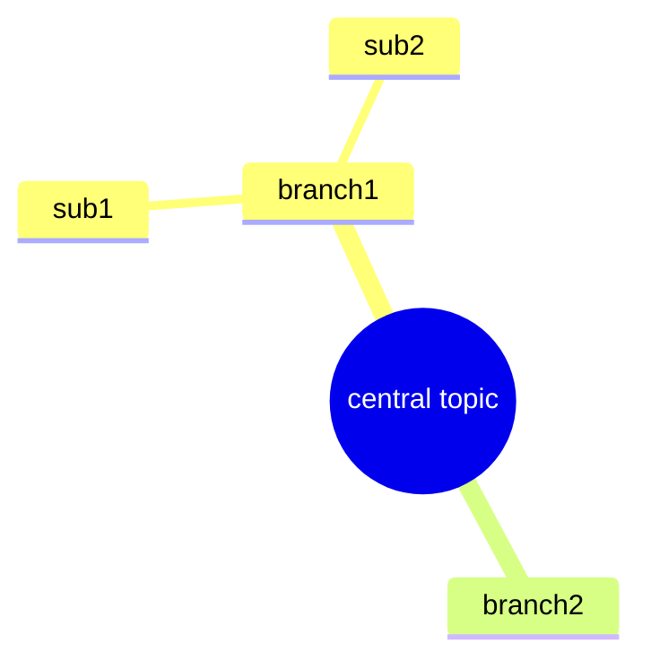
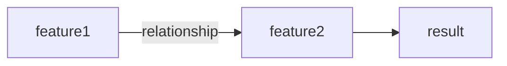
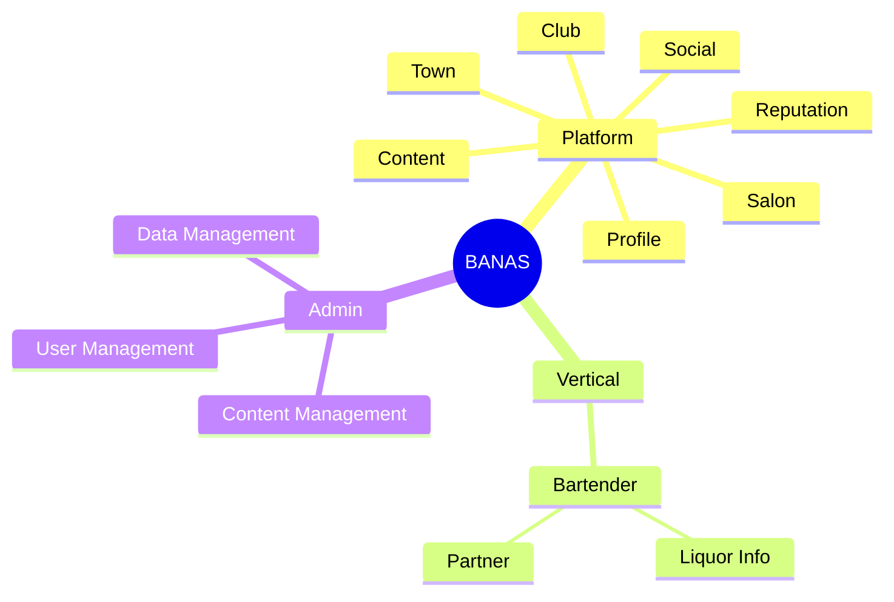
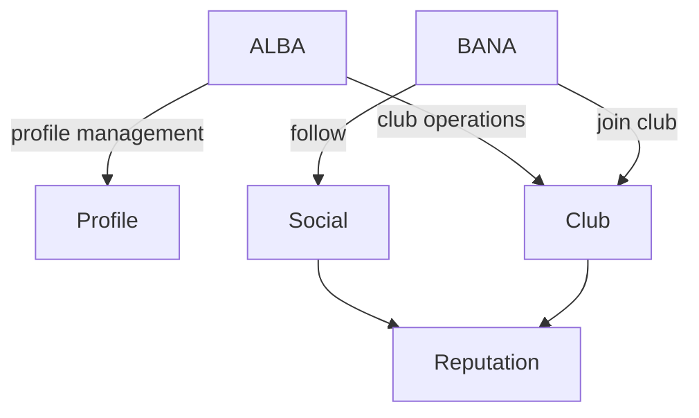

# Mermaid Authoring Rules: Service Map

> Mermaid diagram rules used in Service Map documents

## Mindmap (structure/hierarchy)



| Syntax | Shape | Purpose |
|--------|-------|---------|
| `((text))` | Circle | Root node |
| `text` | Default | General node |
| `(text)` | Rounded rectangle | Emphasis node |
| `[text]` | Rectangle | Separator node |

> Use 2-space indentation to denote hierarchy levels

## Flowchart (flow/relationships)



| Color | classDef | Meaning |
|-------|----------|---------|
| Gray | `planned` | Not implemented |
| Green | `v1` | Implemented in v1.x |
| Blue | `v2` | Implemented in v2.x |

## Version/Status Notation

Display status in flowchart, and **also manage in a table**.

```markdown
| Feature | Description | Status | Version |
|---------|-------------|--------|---------|
| **feature1** | description | not implemented | - |
| **feature2** | description | implemented | v1.0 |
```

> mindmap = **structural overview**, flowchart = **flow/status expression**, table = **detailed information**

---

## Example: BANAS

### Structure (mindmap)



### Flow (flowchart)



### BANAS Service Map Folder Structure

```
catalog/service-map/
├── index.md                    # BANAS overall picture
├── admin/                      # Admin
│   └── index.md                # Management point index
├── platform/                   # Platform common
│   ├── profile.md              # Profile
│   ├── social.md               # Follow/likes
│   ├── content.md              # Content
│   ├── club.md                 # Club
│   ├── salon.md                # Salon
│   ├── town.md                 # Town
│   └── reputation.md           # Reputation
└── vertical/                   # Vertical-specific
    └── bartender/
        ├── index.md            # Bartender vertical overview
        ├── liquor.md           # Liquor info
        └── partner.md          # Partner
```
